# SensoVibe — AI Powered Industrial Vibration Intelligence Platform
## Software Design & Technical Documentation (SDD)

| Field | Value |
|-------|-------|
| Document Title | SensoVibe Platform — Complete Technical Documentation |
| Repository | `VibrationMonitoring` |
| Backend Version | `1.1.0` (declared in `backend/app/main.py`) |
| Frontend Version | `1.0.0` (declared in `frontend/package.json`) |
| Database Schema Version | Alembic revision `011` |
| Active Git Branch | `laxman-dev` |
| Document Scope | Frontend + Backend + Database + Configuration + Assets + APIs + Project Structure |
| Source of Truth | Extracted exclusively from the source code in this repository |

> **Reading note.** Every statement in this document is derived from code that exists in the repository. Where a feature is declared but not implemented (for example the Change Password screen), this document says so explicitly rather than describing intended behaviour.

---

# 1.0 Project Overview

## 1.1 Project Name

**SensoVibe — AI Powered Industrial Vibration Intelligence Platform.**

The name appears in three places in the code:

| Location | Value |
|----------|-------|
| `frontend/index.html` → `<title>` | `SensoVibe — AI Powered Industrial Vibration Intelligence Platform` |
| `backend/app/main.py` → `FastAPI(title=...)` | `AI Vibration Intelligence Platform` |
| `frontend/src/components/layout/Sidebar.tsx` → `TAGLINE` | `AI Powered Vibration Intelligence` |

The npm package is `vibration-platform-frontend`; the Docker Compose project deploys containers named `vibration_platform_db`, `vibration_platform_pgadmin`, `vibration_platform_backend`, `vibration_platform_frontend`.

## 1.2 Purpose

The platform is a **condition-monitoring system for rotating industrial machinery**. It performs four things:

1. **Asset master data management** — captures a complete "digital twin" record of every machine (plant hierarchy, mechanical specification, rotating components, operating envelope, lubrication history, sensor mounting layout).
2. **Vibration measurement ingestion** — accepts raw multi-channel time-series captures as CSV or PDF, parses them into per-channel sample arrays, and stores both the original bytes and parsed arrays in PostgreSQL.
3. **Signal processing and diagnostics** — computes five diagnostic plot types (time waveform, circular time waveform, FFT spectrum, envelope spectrum, trend plot) and ten scalar vibration features per channel, with per-segment trend series for each feature.
4. **Health evaluation against baselines and thresholds** — compares each capture against a stored reference "baseline" capture and against configurable threshold rules to classify every feature as `normal`, `warning`, `critical`, or `no_baseline`.

## 1.3 Business Problem

Rotating equipment (pumps, motors, fans, compressors, gearboxes, turbines) fails progressively. The mechanical degradation signature appears in vibration long before functional failure. The business problems the code solves are:

| Problem | How the code addresses it |
|---------|---------------------------|
| Asset context is scattered across CMMS, drawings, and tribal knowledge, so vibration data cannot be interpreted | `equipment_masters` stores 40 attributes including `rated_rpm`, `bearing_number_de/nde`, `gear_teeth`, `motor_pole_count`, `fan_blades`, `pump_vanes` — the exact inputs required to compute shaft and bearing defect frequencies |
| Raw sensor exports (CSV/PDF) are unusable without processing | `app/services/pdf_parser.py` normalises heterogeneous exports into `{timestamps, channels: {ch0..chN}}` |
| Recomputing FFTs on every page view is expensive | `plot_results` / `baseline_plot_results` cache computed x/y arrays in JSONB, keyed by a `config_fingerprint` SHA-256 hash of the processing parameters |
| "Is this vibration level bad?" cannot be answered without a reference | `sensor_baselines` stores append-only reference captures; `feature_threshold_rules` stores absolute, range, percent-of-RMS, and percent-of-baseline rules |
| Machine data must be traceable and auditable | Baselines are **never deleted or overwritten** — `create_baseline` only inserts; `is_primary` is a display flag, not a retention flag |
| Different plant roles need different capabilities | Three roles (`super_admin`, `admin`, `user`) with read/write separation enforced by a FastAPI dependency and mirrored in the React router |

## 1.4 Objectives

Derived from the code structure and docstrings:

1. **O-1 — Single source of asset truth.** One `Equipment` row per machine, with cascade-owned `SensorConfiguration` children.
2. **O-2 — Deterministic, reproducible signal processing.** Every stored plot carries the fingerprint of the configuration that produced it (`compute_config_fingerprint`, `ALGORITHM_VERSION = "v1"`).
3. **O-3 — Append-only historical record for future machine learning.** `sensor_baselines` is documented in code as *"Historical baseline records — all rows kept (append-only) for RAG / learning."*
4. **O-4 — Edge-device interoperability.** `/api/v1/measurements/acquisition` returns a Sensovibe-compatible acquisition JSON for UDP acquisition scripts, keyed by MAC-style `device_id`.
5. **O-5 — Industrial-standard visualisation.** `lib/industrial-viz-standards.ts` cites *Condition Monitoring with Vibration Signals* (Randall/Antoni), *The Scientist and Engineer's Guide to DSP* (Smith), and ISO 10816 as the basis for axis conventions, Nyquist markers, harmonic markers, and alarm-zone colour coding.
6. **O-6 — Role-based access control.** Read for all authenticated users; write restricted to `super_admin` and `admin`.

## 1.5 Feature Inventory

| # | Feature | Frontend entry point | Backend endpoints |
|---|---------|----------------------|-------------------|
| F-01 | Email/password login with JWT access + opaque refresh tokens | `pages/Login.tsx` | `POST /api/v1/auth/login`, `/token` |
| F-02 | Silent token refresh with request queueing | `api/client.ts` interceptor | `POST /api/v1/auth/refresh` |
| F-03 | Logout with server-side refresh-token revocation | `contexts/AuthContext.tsx` | `POST /api/v1/auth/logout` |
| F-04 | Session bootstrap from `sessionStorage` | `AuthContext` `bootstrap()` | `GET /api/v1/auth/me` |
| F-05 | Role-guarded routes and nav items | `components/auth/ProtectedRoute.tsx`, `nav-config.ts` | `require_write_access` dependency |
| F-06 | Equipment register with search, type/criticality filters, pagination | `pages/EquipmentMasterList.tsx` | `GET /api/v1/equipment/` |
| F-07 | 6-step equipment creation/edit wizard with live completeness scoring | `components/equipment/EquipmentForm.tsx` | `POST`/`PATCH /api/v1/equipment/` |
| F-08 | Equipment image upload / fetch / delete | `tabs/BasicDetailsTab.tsx` | `POST|GET|DELETE /api/v1/equipment/{id}/image` |
| F-09 | Sensor configuration CRUD (nested under equipment) | `tabs/SensorsOrientationTab.tsx` | `/api/v1/equipment/{id}/sensors...` |
| F-10 | AI readiness scoring (5 checks → percentage) | `AssetHealthPanel.tsx` (client-side), backend endpoint | `GET /api/v1/equipment/{id}/ai-readiness` |
| F-11 | Dropdown lookup catalogue (18 lists) | `api/equipment.ts` `getLookup` | `GET /api/v1/lookups/` |
| F-12 | Plot configuration upsert per sensor | `DetailedAnalysisTab.tsx` | `POST|GET|PUT /api/v1/measurements/configure` |
| F-13 | Edge acquisition JSON generation | — (machine-facing) | `GET /api/v1/measurements/acquisition` |
| F-14 | CSV/PDF measurement upload with synchronous parse → plots → features pipeline | `pages/VibrationAnalysis.tsx` | `POST /api/v1/measurements/upload` |
| F-15 | Capture timeline browser with date-range filter and day chips | `analysis/CaptureTimeline.tsx` | `GET /api/v1/measurements/uploads` |
| F-16 | Five diagnostic plot types with zoom/pan/crosshair/threshold overlays/PNG export/fullscreen | `charts/GraphWorkspace.tsx` + `EchartsDiagnosticChart.tsx` | `GET /uploads/{id}/plots` |
| F-17 | Ten-feature health dashboard with summary cards and category-grouped tables | `health/StatusHealthTab.tsx` | `GET /uploads/{id}/features` |
| F-18 | Feature comparison versus baseline with % difference | `health/FeatureComparisonSection.tsx` | `GET /uploads/{id}/features/compare` |
| F-19 | Per-feature 32-segment trend cards | `health/FeatureTrendCardsSection.tsx` | `GET /uploads/{id}/factor-trends` |
| F-20 | Baseline management: list, search, filter, set-primary, load-for-analysis | `baseline/BaselineManagementPanel.tsx` | `/api/v1/baselines...` |
| F-21 | Create baseline from an existing upload | `analysis/SaveBaselineModal.tsx` | `POST /api/v1/baselines/from-upload/{id}` |
| F-22 | Direct baseline file upload | — (API only) | `POST /api/v1/baselines/upload` |
| F-23 | Statistics tab (12 statistical parameters) | `workspace/StatisticsTab.tsx` | reuses `/plots` |
| F-24 | Vibration Settings: 8-channel mapping + threshold matrix (localStorage-backed) | `settings/vibration/VibrationSettingsModule.tsx` | none (client-only) |
| F-25 | Light/dark theme toggle scaffolding | `contexts/ThemeContext.tsx` | none |
| F-26 | Toast notification system | `components/ui/Toast.tsx` | none |
| F-27 | Collapsible sidebar + plant selector + user menu | `layout/Sidebar.tsx`, `layout/TopNav.tsx` | none |

### 1.5.1 Declared-but-not-implemented features

Documented here because the code shows them explicitly:

| Item | Evidence |
|------|----------|
| Change Password | `pages/ChangePassword.tsx` renders the text *"Password change API is not yet available. Contact your administrator."* No backend endpoint exists. |
| Operations Dashboard | `pages/Dashboard.tsx` renders `<ComingSoon>` and four KPI tiles whose values are literal `"—"`. |
| Platform Settings module | `settings/SettingsTabNav.tsx` marks the `platform` tab `available: false`. |
| Trend Analysis tab | `workspace/TrendAnalysisTab.tsx` renders a notice that factor trends moved to Status (Health). |
| Global search box | `layout/TopNav.tsx` renders an input with no submit handler. |
| Notification bell | `layout/TopNav.tsx` shows a hard-coded count of `3`. |
| Plant selector | `layout/nav-config.ts` `PLANTS` is a hard-coded array; selection updates `LayoutContext` only and filters nothing. |
| `useHistoricalTrendData` hook | Fully implemented (`hooks/useHistoricalTrendData.ts`) but not imported by any component. |
| `AssetHealthPanel`, `CompletenessEngine`, `AssetIntelligencePanel`, `StatusHealthSection`, `BaselineSelectionPanel`, `IndustrialEmptyState`, `CriticalityIndicator`, `SectionCard`-based review helpers | Present and functional but not currently wired into the active render tree (verified by import graph). |

## 1.6 Technologies Used

### 1.6.1 Backend runtime (`backend/requirements.txt`)

| Package | Version | Role in this project |
|---------|---------|----------------------|
| `fastapi` | 0.115.0 | HTTP framework, dependency injection, OpenAPI generation |
| `uvicorn[standard]` | 0.30.6 | ASGI server (`uvicorn app.main:app`) |
| `sqlalchemy` | 2.0.35 | ORM; declarative models, session management |
| `alembic` | 1.13.3 | Schema migrations (11 revisions) |
| `psycopg2-binary` | 2.9.9 | PostgreSQL driver |
| `python-multipart` | 0.0.12 | `multipart/form-data` parsing for file uploads |
| `python-dotenv` | 1.0.1 | `.env` loading inside `alembic/env.py` |
| `pillow` | 10.4.0 | Installed for image handling (equipment images are written with plain `open()`; Pillow is not imported anywhere in `app/`) |
| `pydantic` | 2.9.2 | Request/response schemas, validators |
| `pydantic-settings` | 2.5.2 | `Settings(BaseSettings)` env binding |
| `aiofiles` | 24.1.0 | Declared; not imported in `app/` |
| `python-jose[cryptography]` | 3.3.0 | JWT encode/decode (HS256) |
| `passlib[bcrypt]` | 1.7.4 | Password hashing context |
| `bcrypt` | 4.0.1 | bcrypt backend for passlib |
| `email-validator` | 2.2.0 | Backs Pydantic `EmailStr` |
| `numpy` | 1.26.4 | Array maths for all DSP |
| `scipy` | 1.13.1 | `scipy.fft.fft`, `fftfreq`, `scipy.signal.hilbert` |
| `pdfplumber` | 0.11.4 | PDF table/text extraction |

### 1.6.2 Frontend runtime (`frontend/package.json`)

| Package | Version | Role in this project |
|---------|---------|----------------------|
| `react` / `react-dom` | ^18.3.1 | UI runtime |
| `react-router-dom` | ^6.27.0 | Routing, nested layout routes, `Navigate` guards |
| `@tanstack/react-query` | ^5.59.20 | Server state: `useQuery`, `useQueries`, `useMutation`, cache invalidation |
| `axios` | ^1.7.7 | HTTP client + request/response interceptors |
| `echarts` | ^6.1.0 | Charting engine |
| `echarts-for-react` | ^3.0.6 | React wrapper exposing the ECharts instance |
| `react-hook-form` | ^7.53.2 | Equipment wizard form state, `useFieldArray` for sensors |
| `@hookform/resolvers` | ^3.9.0 | Bridges Zod to react-hook-form |
| `zod` | ^3.23.8 | `equipmentSchema`, `sensorSchema` validation |
| `framer-motion` | ^12.40.0 | Card entrance animations, sidebar width transition, toast transitions |
| `lucide-react` | ^0.454.0 | Icon set (all icons in the app) |
| `tailwindcss` | ^3.4.14 | Utility-first styling |
| `tailwindcss-animate` | ^1.0.7 | Tailwind animation plugin |
| `clsx` + `tailwind-merge` | ^2.1.1 / ^2.5.4 | `cn()` class merge helper |
| `class-variance-authority` | ^0.7.0 | Declared; not imported by any source file |
| `date-fns` | ^4.1.0 | `format`, `parseISO`, `subDays` for capture timeline and date ranges |
| `@radix-ui/*` (dialog, dropdown-menu, label, popover, select, separator, slot, toast) | ^1.x/^2.x | Declared; no Radix import exists in `src/` — modals/menus are hand-rolled |
| `vite` | ^5.4.10 | Dev server + bundler |
| `@vitejs/plugin-react` | ^4.3.3 | React fast refresh + JSX transform |
| `typescript` | ^5.6.3 | Type checking (`tsc && vite build`) |
| `postcss`, `autoprefixer` | ^8.4.47 / ^10.4.20 | CSS pipeline |
| `@types/node`, `@types/react`, `@types/react-dom` | — | Type definitions |

### 1.6.3 Infrastructure

| Component | Version / image | Notes |
|-----------|-----------------|-------|
| PostgreSQL | `postgres:16` | Host port `5433` → container `5432` |
| pgAdmin 4 | `dpage/pgadmin4:latest` | Host port `5050` |
| Backend image | `python:3.11-slim` | Installs `gcc`, `libjpeg-dev`, `zlib1g-dev` |
| Frontend image | `node:20-alpine` (build) → `nginx:alpine` (preview) | Multi-stage: `base` → `dev` / `build` → `preview` |
| Web server (prod) | nginx | `try_files $uri $uri/ /index.html` SPA fallback on port 4173 |

## 1.7 Software Architecture

The system is a **three-tier layered architecture** with an optional fourth edge tier.

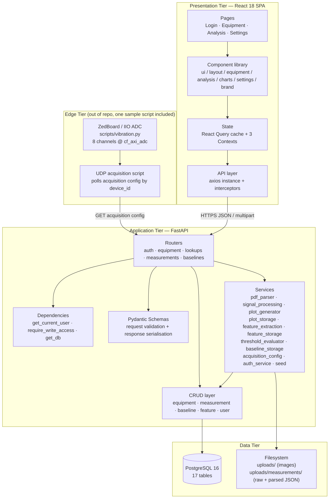

### 1.7.1 Architectural decisions and their rationale

| Decision | Where | Why the code does this |
|----------|-------|------------------------|
| **Router → Service → CRUD → ORM** rather than fat controllers | `app/routers/*` | Routers only handle HTTP concerns (status codes, `HTTPException`); business rules live in `services/`; SQL lives in `crud/` |
| **Pydantic schemas separate from ORM models** | `app/schemas/` vs `app/models/` | Enables `EquipmentUpdate` partial semantics (`exclude_unset=True`) and prevents accidental exposure of internal columns such as `file_content` |
| **Computed plots persisted as JSONB, not recomputed** | `plot_results`, `baseline_plot_results` | FFT/Hilbert on 100k+ samples is expensive; caching is keyed by `config_fingerprint` so a config change automatically invalidates |
| **Fingerprint instead of TTL cache invalidation** | `services/plot_storage.py::compute_config_fingerprint` | Deterministic: the hash covers `algorithm_version`, `sampling_rate_hz`, `fft_lines`, `frequency_max_hz`, `data_type`, sorted `enabled_plots` |
| **Original file bytes stored in the DB** (`LargeBinary`) as well as on disk | `measurement_upload_data.file_content`, `sensor_baselines.file_content` | Guarantees a baseline can be reproduced even if the filesystem volume is lost; `create_baseline_from_upload` reads bytes from the DB, not disk |
| **Append-only baselines** | `crud/baseline.py::create_baseline` | Only `INSERT`; `set_baseline_primary` merely flips a boolean. No delete path exists in the API |
| **Opaque refresh tokens hashed with SHA-256, JWT only for access** | `services/auth_service.py` | Refresh tokens are revocable server-side (`revoked_at`); access tokens stay stateless and short-lived (30 min default) |
| **Two axios instances** | `api/client.ts` | `authClient` has no interceptors, which structurally prevents an infinite refresh loop when `/auth/refresh` itself returns 401 |
| **Frontend-generated time axis for waveforms** | `lib/waveform-time-axis.ts` | Sensor exports frequently place a Unix-epoch batch ID in the timestamp column; the frontend regenerates `t[i] = i/fs × 1000` ms for display while leaving amplitudes untouched |
| **`display:none` tab panels instead of unmounting** | `EquipmentForm.tsx`, `VibrationAnalysis.tsx` | Keeps uncontrolled inputs and chart instances alive so values and zoom state survive tab switches |
| **Client-only Vibration Settings** | `hooks/useVibrationSettings.ts` | Persisted to `localStorage` under `sensovibe-vibration-settings`; no server endpoint exists for it yet |

## 1.8 High-Level Workflow

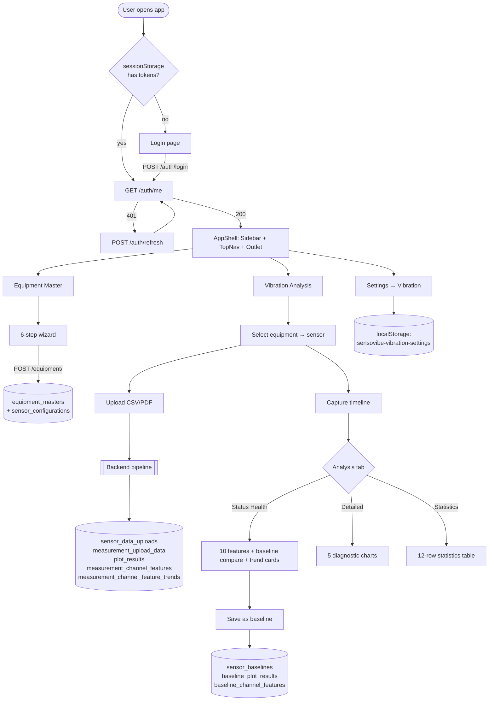

### 1.8.1 The upload pipeline in detail

`POST /api/v1/measurements/upload` executes **eight sequential stages inside one request** (`routers/measurements.py:184-260`):

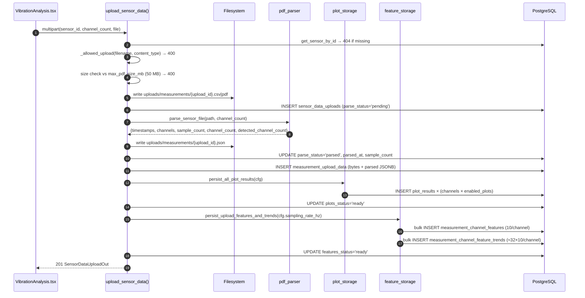

**Failure semantics.** Plot failure and feature failure are caught independently (`mark_upload_plots_failed`, `mark_upload_features_failed`) and do **not** abort the request — the upload still returns `201` with the failure recorded on the row. Parse failure is fatal: `mark_upload_failed` is called and the endpoint raises `422`.

## 1.9 Complete Folder Structure

```
VibrationMonitoring/
├── .env                              # Single env file consumed by compose, backend, and Vite
├── .gitignore                        # Excludes .env, __pycache__, node_modules, dist, uploads
├── START.md                          # 4-step local bring-up guide
├── docker-compose.yml                # postgres + pgadmin + backend + frontend
├── package-lock.json                 # Empty root lockfile (no root package.json)
│
├── backend/
│   ├── .dockerignore
│   ├── Dockerfile                    # python:3.11-slim, runs alembic upgrade head then uvicorn
│   ├── alembic.ini                   # script_location=alembic; url overridden in env.py
│   ├── requirements.txt              # 18 pinned dependencies
│   ├── setup_and_run.bat             # Windows venv bootstrap + migrate + serve
│   │
│   ├── alembic/
│   │   ├── env.py                    # Loads ../../.env, injects DATABASE_URL, imports app.models
│   │   ├── script.py.mako            # Migration template
│   │   └── versions/
│   │       ├── 001_initial_schema.py            # equipment_masters, sensor_configurations
│   │       ├── 002_machine_id_nullable.py       # machine_id → NULL allowed
│   │       ├── 003_measurement_tables.py        # plot_configurations, sensor_data_uploads
│   │       ├── 004_auth_tables.py               # roles, users, user_roles, refresh_tokens (+5 seed roles)
│   │       ├── 005_sensor_device_id.py          # sensor_configurations.device_id (unique)
│   │       ├── 006_plot_results.py              # plot_results + 3 plots_* columns on uploads
│   │       ├── 007_upload_data_and_baselines.py # measurement_upload_data, sensor_baselines, baseline_plot_results
│   │       ├── 008_add_user_role_column.py      # users.role + CHECK constraint + role backfill
│   │       ├── 009_upload_history_fields.py     # original_filename, source, (sensor_id, created_at) index
│   │       ├── 010_channel_features_and_trends.py # feature_definitions, feature_threshold_rules,
│   │       │                                      # measurement_channel_features, baseline_channel_features
│   │       │                                      # + 3 features_* columns + 10 definition & 10 rule seeds
│   │       └── 011_feature_trends_table.py      # measurement_channel_feature_trends
│   │
│   ├── app/
│   │   ├── __init__.py               # empty package marker
│   │   ├── config.py                 # Settings(BaseSettings) — 16 settings + effective_jwt_secret
│   │   ├── database.py               # engine, SessionLocal, Base, get_db() generator
│   │   ├── main.py                   # FastAPI app, lifespan seeding, CORS, custom OpenAPI, /health
│   │   │
│   │   ├── dependencies/
│   │   │   ├── __init__.py
│   │   │   └── auth.py               # HTTPBearer, get_current_user, require_write_access, WRITE_ROLES
│   │   │
│   │   ├── models/                   # SQLAlchemy declarative models
│   │   │   ├── __init__.py           # Re-exports all models so Alembic autogenerate sees them
│   │   │   ├── equipment.py          # Equipment (equipment_masters)
│   │   │   ├── sensor.py             # SensorConfiguration
│   │   │   ├── measurement.py        # 9 models: PlotConfiguration, SensorDataUpload, PlotResult,
│   │   │   │                         #   MeasurementUploadData, SensorBaseline, FeatureDefinition,
│   │   │   │                         #   FeatureThresholdRule, MeasurementChannelFeature,
│   │   │   │                         #   MeasurementChannelFeatureTrend, BaselineChannelFeature,
│   │   │   │                         #   BaselinePlotResult
│   │   │   └── user.py               # Role, User, UserRole, RefreshToken
│   │   │
│   │   ├── schemas/                  # Pydantic v2 models
│   │   │   ├── __init__.py           # Re-exports equipment schemas
│   │   │   ├── acquisition.py        # EdgeAcquisitionConfigOut + 2 nested models
│   │   │   ├── auth.py               # LoginRequest, TokenResponse, RefreshRequest, LogoutRequest, UserMeResponse
│   │   │   ├── baseline.py           # BaselineOut, BaselineListOut, BaselineCreateFromUpload, BaselineSetPrimary
│   │   │   ├── equipment.py          # Equipment* + SensorConfig* + AIReadinessOut + PaginatedEquipment
│   │   │   ├── feature.py            # 8 feature/compare/trend response models
│   │   │   └── measurement.py        # PLOT_TYPES, PlotConfig*, SensorDataUploadOut, PlotSeriesOut, AllPlotsOut
│   │   │
│   │   ├── crud/                     # Data-access functions (no HTTP awareness)
│   │   │   ├── __init__.py           # Re-exports equipment CRUD as app.crud.*
│   │   │   ├── baseline.py           # upload-data + baseline + baseline-plot queries
│   │   │   ├── equipment.py          # equipment + sensor CRUD + compute_ai_readiness
│   │   │   ├── feature.py            # threshold rules, definitions, feature/trend reads & deletes
│   │   │   ├── measurement.py        # plot config, upload lifecycle, plot result queries, config dicts
│   │   │   └── user.py               # user/role/refresh-token queries, primary_role resolution
│   │   │
│   │   ├── routers/                  # HTTP layer
│   │   │   ├── __init__.py
│   │   │   ├── auth.py               # 5 endpoints
│   │   │   ├── baselines.py          # 8 endpoints
│   │   │   ├── equipment.py          # 13 endpoints
│   │   │   ├── lookups.py            # 2 endpoints + LOOKUPS dictionary (18 lists)
│   │   │   └── measurements.py       # 14 endpoints
│   │   │
│   │   └── services/                 # Business logic
│   │       ├── __init__.py
│   │       ├── acquisition_config.py # Edge JSON builder + acquisition formula maths
│   │       ├── auth_service.py       # bcrypt hashing, JWT issue/decode, refresh lifecycle
│   │       ├── baseline_storage.py   # Baseline plot persistence + row→schema mapping
│   │       ├── feature_extraction.py # 10 scalar features + 32-segment trends (numpy/scipy)
│   │       ├── feature_storage.py    # Threshold evaluation, persistence, baseline copy, summaries
│   │       ├── pdf_parser.py         # CSV/PDF → {timestamps, channels}
│   │       ├── plot_generator.py     # PLOT_COMPUTERS registry, channel resolution, JSON I/O
│   │       ├── plot_storage.py       # Fingerprinting, persistence, cache-or-compute reads
│   │       ├── seed.py               # Idempotent super_admin/admin/user seeding at startup
│   │       ├── signal_processing.py  # 5 DSP routines + timestamp heuristics
│   │       └── threshold_evaluator.py# 5 rule types → normal/warning/critical/no_baseline
│   │
│   └── scripts/
│       ├── create_sample_sensor_pdf.py  # Generates a 512-sample 2-channel test PDF (needs reportlab)
│       └── test_auth_phase1.py          # TestClient smoke test of the full auth cycle
│
├── frontend/
│   ├── .dockerignore
│   ├── Dockerfile                    # base → dev | build → preview(nginx)
│   ├── index.html                    # SPA shell, <html class="light">, #root
│   ├── nginx.conf                    # listen 4173, SPA fallback
│   ├── package.json                  # 3 scripts, 25 deps, 9 devDeps
│   ├── package-lock.json
│   ├── postcss.config.js             # tailwindcss + autoprefixer
│   ├── setup_and_run.bat             # npm install && npm run dev
│   ├── tailwind.config.js            # darkMode:class, full design-token theme extension
│   ├── tsconfig.json                 # strict, bundler resolution, @/* → ./src/*
│   ├── tsconfig.node.json            # composite config for vite.config.ts
│   ├── vite.config.ts                # react plugin, @ alias, port 5173, /api proxy → :8000
│   │
│   ├── public/
│   │   └── favicon.svg
│   │
│   └── src/
│       ├── main.tsx                  # ReactDOM root, QueryClient, BrowserRouter
│       ├── App.tsx                   # Provider stack + 8 routes
│       ├── index.css                 # 1015 lines: tokens, base, 100+ component classes, keyframes
│       ├── vite-env.d.ts             # Vite client types + image module declarations
│       │
│       ├── api/                      # 5 files — every network call in the app
│       ├── components/
│       │   ├── analysis/             # 12 root + charts/(4) + baseline/(3) + health/(13) + workspace/(7)
│       │   ├── auth/                 # ProtectedRoute
│       │   ├── brand/                # 5 decorative SVG/animation backdrops
│       │   ├── charts/               # 6 reusable chart-shell components + barrel index
│       │   ├── equipment/            # 9 root + industrial/(3) + tabs/(6)
│       │   ├── layout/               # AppShell, Sidebar, TopNav, PageHero, ComingSoon, nav-config
│       │   ├── settings/             # 3 root + vibration/(7)
│       │   └── ui/                   # Button, FormField, GlassCard, MultiSelect, SectionCard, Toast
│       │                             #   + CARD_HOVER.md, CARD_SIZING.md design contracts
│       ├── contexts/                 # AuthContext, LayoutContext, ThemeContext
│       ├── hooks/                    # 6 custom hooks
│       ├── images/                   # 6 assets + typed barrel index.ts
│       ├── lib/                      # 30 pure-function modules (no JSX except baseline-utils.tsx)
│       ├── pages/                    # 9 page components
│       └── types/                    # 9 type/constant modules
│
└── scripts/
    └── vibration.py                  # Standalone libiio 8-channel ADC reader for a ZedBoard at 192.168.1.34
```

### 1.9.1 File-count summary

| Area | Files | Notes |
|------|-------|-------|
| Backend Python (`app/`) | 41 | 5 routers, 12 services, 6 CRUD, 5 model modules, 8 schema modules |
| Alembic | 13 | `env.py`, template, 11 revisions |
| Backend scripts | 2 | Both standalone utilities |
| Frontend source | ~185 | `.tsx`/`.ts` under `src/` |
| Frontend assets | 7 | 5 SVG, 1 JPEG, 1 public favicon |
| Configuration | 14 | Root + backend + frontend config files |

---

# 2.0 System Architecture

## 2.1 Overall Architecture

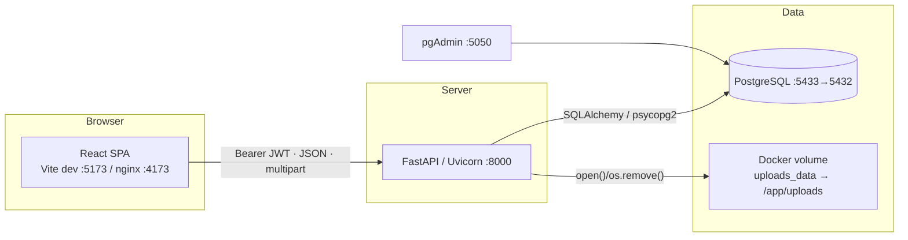

**Deployment topology** (`docker-compose.yml`):

| Service | Container | Host port | Depends on | Volume |
|---------|-----------|-----------|------------|--------|
| `postgres` | `vibration_platform_db` | 5433 | — | `postgres_data:/var/lib/postgresql/data` |
| `pgadmin` | `vibration_platform_pgadmin` | 5050 | `postgres` | `pgadmin_data:/var/lib/pgadmin` |
| `backend` | `vibration_platform_backend` | 8000 | `postgres` (healthcheck `service_healthy`) | `uploads_data:/app/uploads` |
| `frontend` | `vibration_platform_frontend` | 4173 | `backend` | — |

The Postgres healthcheck runs `pg_isready -U $POSTGRES_USER -d $POSTGRES_DB` every 10 s (5 s timeout, 5 retries), and the backend will not start until it passes. This matters because the backend's `lifespan` hook writes seed users to the database on the very first request cycle.

## 2.2 Client–Server Communication

### 2.2.1 Transport contract

| Aspect | Value | Defined in |
|--------|-------|-----------|
| Base URL | `import.meta.env.VITE_API_BASE_URL` else `http://localhost:8000` | `api/client.ts:6` |
| Default content type | `application/json` | `axios.create` headers |
| Upload content type | `multipart/form-data` (set per-request) | `uploadSensorPdf`, `uploadEquipmentImage` |
| Auth header | `Authorization: Bearer <access_token>` | request interceptor |
| Credentials | `allow_credentials=True` on the server; the client does **not** set `withCredentials` — tokens travel in the header, not cookies | `main.py`, `client.ts` |
| Long-running reads | `timeout: 120_000` ms on `/features` and `/factor-trends` | `api/measurements.ts` |

### 2.2.2 CORS

`main.py` registers `CORSMiddleware` with an explicit six-entry origin allow-list:

```
http://localhost:5173   http://127.0.0.1:5173     (Vite dev)
http://localhost:4173   http://127.0.0.1:4173     (Vite/nginx preview)
http://localhost:3000   http://127.0.0.1:3000     (reserved)
```
with `allow_methods=["*"]`, `allow_headers=["*"]`, `allow_credentials=True`.

### 2.2.3 Two development paths to the API

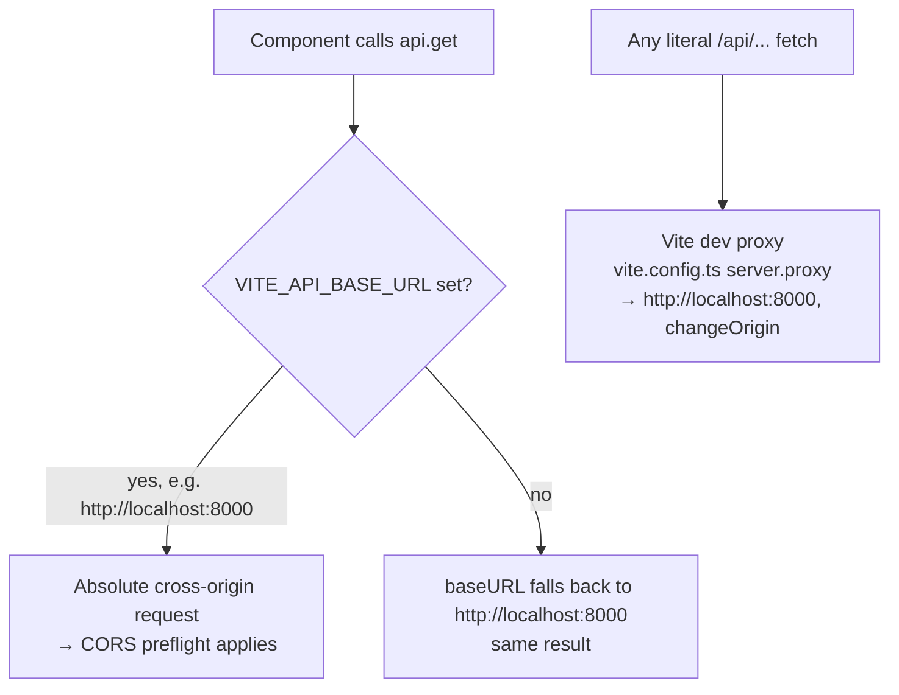
In practice every call in `src/api/*` uses the axios instance with an absolute `baseURL`, so the Vite `/api` proxy is a convenience path that the current code does not exercise.

## 2.3 Frontend Architecture

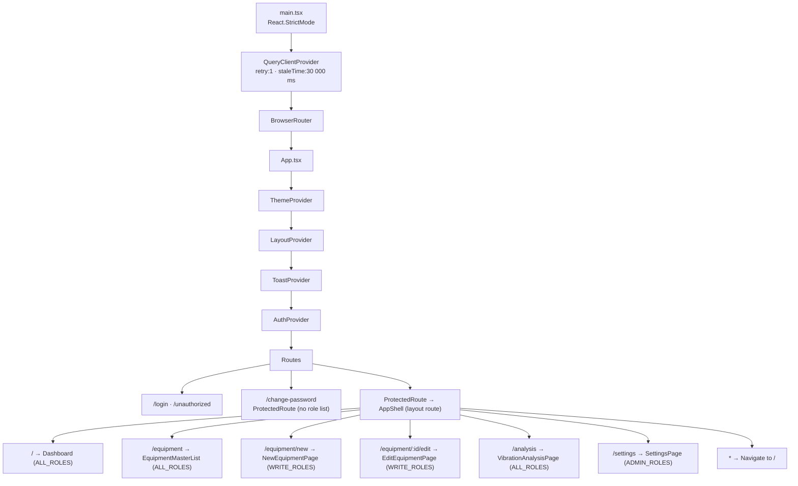

**Provider ordering is deliberate**: `AuthProvider` sits *inside* `ToastProvider` because `AuthContext` calls `useToast()` to raise the "Session expired" toast, and inside `BrowserRouter` because it calls `useNavigate()` on logout.

### 2.3.1 Layered module responsibilities

| Layer | Directory | Rule observed by the code |
|-------|-----------|---------------------------|
| Pages | `src/pages` | Own routing-level state and orchestrate queries/mutations; contain no DSP or formatting maths |
| Feature components | `src/components/<feature>` | Presentational + local UI state; receive data via props |
| Shared chart shell | `src/components/charts` | Chart chrome (toolbar, fullscreen, statistics slot) with a render-prop child; chart-library-agnostic at the shell level |
| Hooks | `src/hooks` | Compose React Query calls and derive view models |
| Lib | `src/lib` | Pure functions only — maths, option builders, formatters, tokens |
| Types | `src/types` | Interfaces plus the constant catalogues that drive UI (`PLOT_TYPES`, `ANALYSIS_TABS`, `THRESHOLD_PARAMETERS`) |
| API | `src/api` | The only place `axios` is referenced (except `Login.tsx`, which imports `axios` solely for `axios.isAxiosError`) |

## 2.4 Backend Architecture

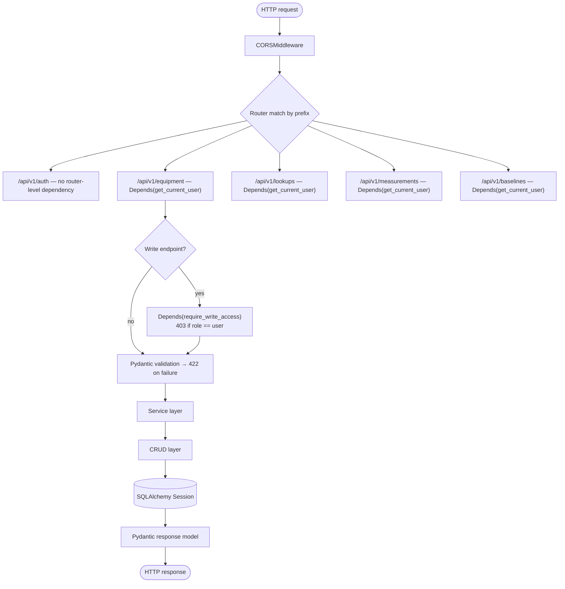

### 2.4.1 Application startup sequence

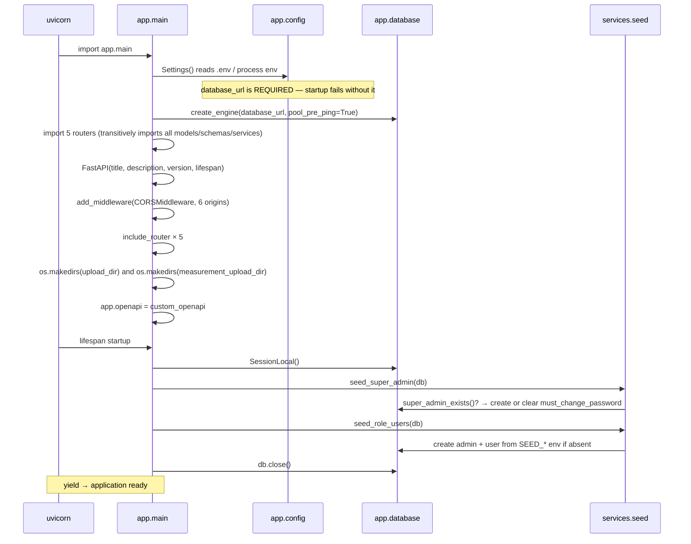

`os.makedirs(..., exist_ok=True)` runs at **import time**, not inside `lifespan`, so the upload directories exist before the first request even if lifespan were skipped.

## 2.5 Database Architecture

Seventeen tables in four functional clusters:

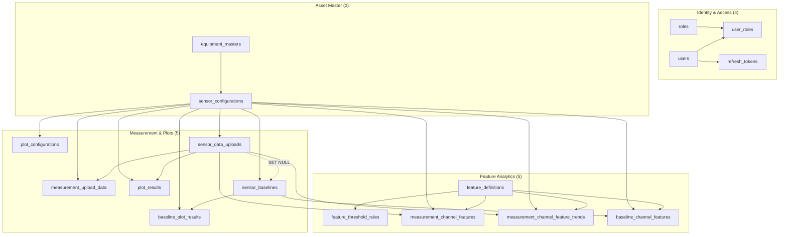

**Cascade policy.** Every foreign key that points at `sensor_configurations`, `sensor_data_uploads`, `sensor_baselines`, `users`, or `roles` uses `ON DELETE CASCADE`, with a single exception: `sensor_baselines.source_upload_id` uses `ON DELETE SET NULL` so that deleting an upload never destroys the baseline derived from it.

Full column-level documentation is in **Section 6.0**.

## 2.6 Authentication Flow

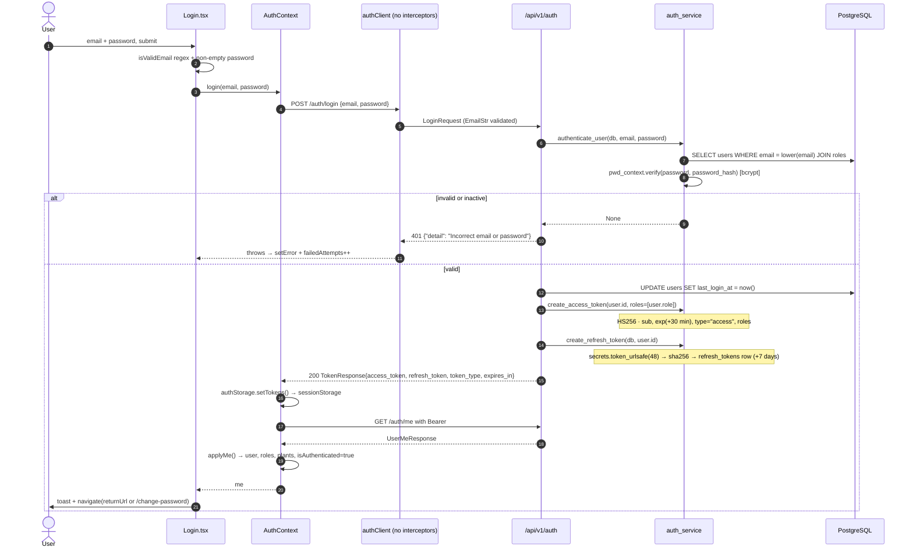

### 2.6.1 Silent refresh with request queueing

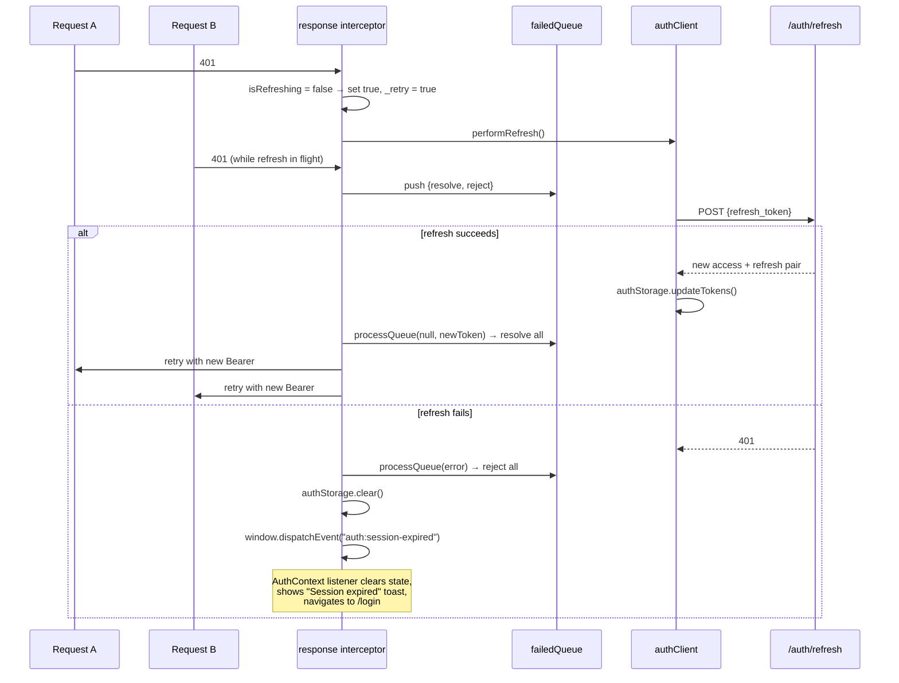

Guards that make this safe:
* `shouldSkipRefresh(url)` skips `/auth/login`, `/auth/logout`, `/auth/refresh`.
* `originalRequest._retry` ensures each request is retried at most once.
* `authClient` has **no** interceptors, so the refresh call itself can never recurse.

### 2.6.2 Refresh-token rotation

`POST /auth/refresh` (`routers/auth.py:66-75`) does the following in order:
1. `validate_refresh_token` — hash lookup, `revoked_at is None`, not expired, `user.is_active`.
2. `revoke_refresh_token(record)` — sets `revoked_at = now()` on the **presented** token.
3. `_issue_tokens(db, record.user)` — issues a brand-new access token *and* a brand-new refresh token row.

This is full rotation: a refresh token is single-use.

## 2.7 API Communication Flow

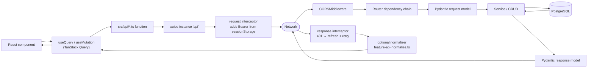

### 2.7.1 React Query cache keys in use

| Key pattern | Producer | Invalidated by |
|-------------|----------|----------------|
| `["equipment", page, filterType, filterCriticality]` | `EquipmentMasterList` | `deleteMutation` → `invalidateQueries(["equipment"])` |
| `["equipment", id]` | `EditEquipmentPage` | — |
| `["equipment", "count"]` | `AssetIntelligencePanel` | — |
| `["equipment-list-analysis"]` | `VibrationAnalysis` | — |
| `["equipment-detail", equipmentId]` | `VibrationAnalysis` | — |
| `["plot-config", sensorId]` | `VibrationAnalysis` | `saveConfigMutation` |
| `["sensor-uploads", sensorId]` | `VibrationAnalysis` | `uploadMutation` |
| `["sensor-uploads-timeline", sensorId, fromDate, toDate, refreshKey]` | `CaptureTimelinePanel` | `uploadMutation` + `refreshKey` bump |
| `["plots", plotSource, uploadId, baselineId, channel]` | `VibrationAnalysis` | upload/select/load handlers |
| `["primary-baseline", sensorId]`, `["baseline-list", sensorId]` | `VibrationAnalysis` | `saveBaselineMutation`, `setPrimaryMutation` |
| `["upload-features", uploadId, channel]` | `useFeatureHealthDashboard` | upload/select handlers |
| `["upload-features-compare", uploadId, channel, baselineId]` | `useFeatureHealthDashboard` | — |
| `["upload-factor-trends", uploadId, channel]` | `useUploadFactorTrends` | upload/select handlers; self-polls every 3 s while `features_status ∉ {ready, failed}` |
| `["upload-features-for-trends", …]`, `["upload-features-compare-for-trends", …]` | `useUploadFactorTrends` | — |
| `["health-status-plots", uploadId, channel]` | `useHealthStatusData` | — |
| `["trend-uploads", …]`, `["trend-upload-plots", …]`, `["trend-baseline-plots", …]` | `useHistoricalTrendData` (unused) | — |

## 2.8 Data Flow

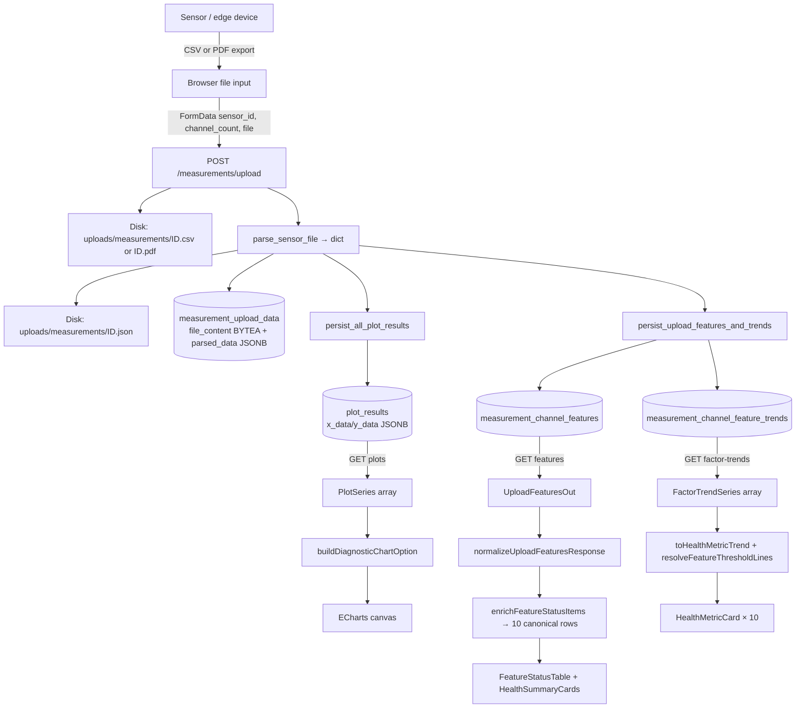

### 2.8.1 Parsed-data document shape

`parse_measurement_text` returns and `measurement_upload_data.parsed_data` / `sensor_baselines.parsed_data` store:

```json
{
  "timestamps": [1777747212.0, 1777747212.0, "..."],
  "channels": { "ch0": [0.0123, -0.0087, "..."], "ch1": ["..."] },
  "sample_count": 4096,
  "channel_count": 7,
  "detected_channel_count": 7
}
```

`channel_count` is the **effective** count actually used; `detected_channel_count` is what the header scan found (`null` when no header was present). When a header declares `ch0…ch6`, the detected value (7) overrides a user-supplied `channel_count` of 8.

## 2.9 Request Lifecycle

Worked example: `GET /api/v1/measurements/uploads/{upload_id}/features?channel=0`

| # | Stage | Code |
|---|-------|------|
| 1 | Browser attaches `Authorization: Bearer …` | `client.ts` request interceptor |
| 2 | CORS preflight (cross-origin) then actual request | `CORSMiddleware` |
| 3 | Route match on prefix `/api/v1/measurements` | `router = APIRouter(prefix=…, dependencies=[Depends(get_current_user)])` |
| 4 | `get_db()` opens a `SessionLocal` | `database.py` |
| 5 | `HTTPBearer(auto_error=False)` extracts credentials; `None`/non-bearer → 401 | `dependencies/auth.py` |
| 6 | `decode_access_token` verifies HS256 signature, `exp`, and `type == "access"` | `auth_service.py` |
| 7 | `UUID(payload["sub"])`; `JWTError`/`ValueError`/`KeyError` → 401 | `dependencies/auth.py` |
| 8 | `get_user_by_id` with `joinedload(User.roles)`; missing or `is_active == False` → 401 | `crud/user.py` |
| 9 | Path/query params coerced: `upload_id: UUID`, `channel: int | None` with `ge=0, le=31` → 422 on violation | FastAPI |
| 10 | Handler loads the upload; 404 if absent; 422 if `parse_status != "parsed"` | `routers/measurements.py` |
| 11 | `_resolve_config` reads `plot_configurations` or falls back to defaults | `crud/measurement.py` |
| 12 | `ensure_upload_features_ready` returns early if features exist, else computes and persists them | `services/feature_storage.py` |
| 13 | Rows read, mapped to `ChannelFeatureOut`, summarised, overview derived | handler helpers |
| 14 | `UploadFeaturesOut` serialised to JSON | Pydantic |
| 15 | `finally: db.close()` in the `get_db` generator | `database.py` |

## 2.10 Response Lifecycle

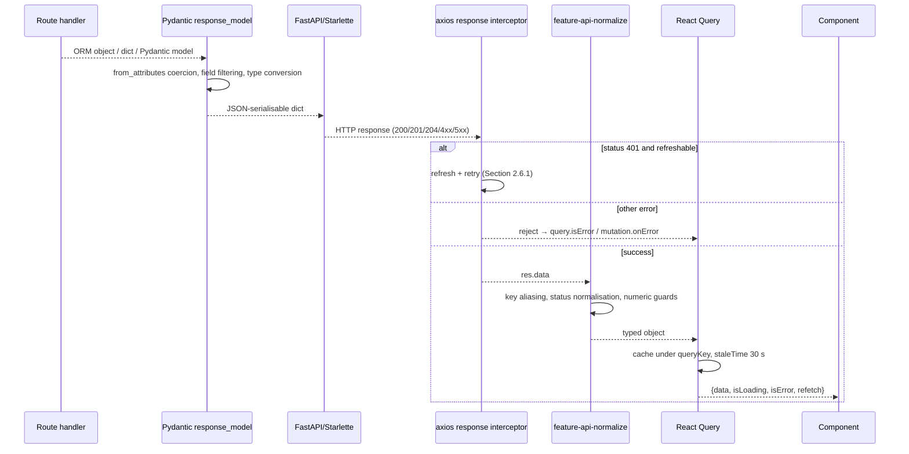

**Status codes emitted by the backend**

| Code | Where |
|------|-------|
| 200 | All successful `GET`, `PUT`, `PATCH`, and `POST /auth/*` |
| 201 | `POST /equipment/`, `POST /equipment/{id}/sensors`, `POST /measurements/upload`, `POST /baselines/upload`, `POST /baselines/from-upload/{id}` |
| 204 | `DELETE /equipment/{id}`, `DELETE /equipment/{id}/image`, `DELETE .../sensors/{id}`, `POST /auth/logout` |
| 400 | Bad file type, oversized image, invalid plot type, `from_date > to_date` |
| 401 | Missing/invalid/expired token, inactive user, bad credentials, invalid refresh token |
| 403 | `require_write_access` rejects role `user` |
| 404 | Entity not found, image missing on disk, lookup name unknown, no primary baseline |
| 409 | Duplicate `machine_id` on create |
| 422 | Pydantic validation failure; parse failure; unparsed upload; feature-compute failure; baseline plot-compute failure |
