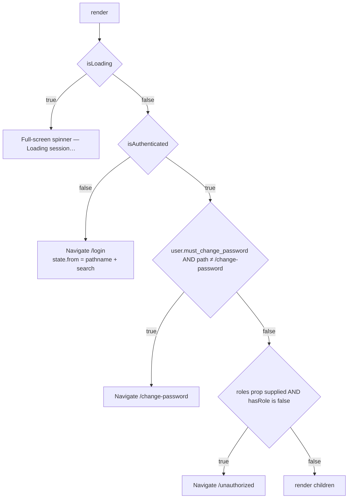
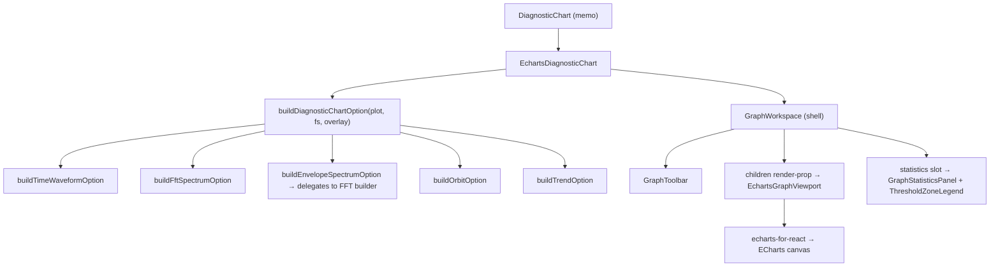

---

# 3.0 Frontend Documentation

## 3.1 Project Structure — folder by folder

| Folder | Purpose | Contents |
|--------|---------|----------|
| `src/api` | The only network boundary in the app | `client.ts` (axios + interceptors), `auth.ts`, `equipment.ts`, `measurements.ts`, `baselines.ts` |
| `src/components/analysis` | Vibration Analysis feature components | timeline, chart wrappers, plot selector, baseline modal, layout tokens |
| `src/components/analysis/charts` | ECharts diagnostic chart + 3 deprecated re-exports | `EchartsDiagnosticChart.tsx`, `ChartContainer.tsx`, `ChartToolbar.tsx`, `FftSpectrumChart.tsx` |
| `src/components/analysis/baseline` | Baseline browsing UI | `BaselineManagementPanel`, `BaselineDetailCard`, `baseline-utils.tsx` |
| `src/components/analysis/health` | Status (Health) tab — 13 components | summary cards, overview card, feature tables, comparison, trend cards, badges, banners |
| `src/components/analysis/workspace` | Analysis tab shell and tab bodies | `AnalysisWorkspace`, `AnalysisTabNav`, `DetailedAnalysisTab`, `StatisticsTab`, `TrendAnalysisTab`, `SelectedCapturePanel`, `BaselineSelectionPanel` |
| `src/components/auth` | Route protection | `ProtectedRoute.tsx` |
| `src/components/brand` | Decorative SVG backdrops and animations | `HeroIntelligenceBg`, `LoginIntelligenceBg`, `SensorPulseRings`, `VibrationWave`, `VibrationIntelligenceBg` (deprecated shim) |
| `src/components/charts` | Reusable, chart-agnostic shells | `GraphWorkspace`, `GraphToolbar`, `GraphStatisticsPanel`, `GraphChannelSelector`, `ThresholdZoneLegend`, `EchartsGraphViewport`, `index.ts` barrel |
| `src/components/equipment` | Equipment Master feature | form shell, stepper, digital-twin header, visualisation, intelligence panels |
| `src/components/equipment/industrial` | Small industrial UI atoms | `ProgressRing`, `CriticalityIndicator`, `IndustrialEmptyState` |
| `src/components/equipment/tabs` | The 6 wizard steps | Basic, Mechanical, Rotating, Operating, Sensors, Review |
| `src/components/layout` | App chrome | `AppShell`, `Sidebar`, `TopNav`, `PageHero`, `ComingSoon`, `nav-config.ts` |
| `src/components/settings` | Settings shell + vibration module | `SettingsSectionCard`, `SettingsTabNav`, `ToggleSwitch`, `vibration/*` |
| `src/components/ui` | Design-system primitives + written contracts | `Button`, `FormField`, `GlassCard`, `MultiSelect`, `SectionCard`, `Toast`, `CARD_HOVER.md`, `CARD_SIZING.md` |
| `src/contexts` | Cross-cutting React context | `AuthContext`, `LayoutContext`, `ThemeContext` |
| `src/hooks` | Data-composition hooks | 6 hooks |
| `src/images` | Static assets + typed barrel | logo, mark, favicon, empty state, 2 accent SVGs |
| `src/lib` | Pure functions: maths, chart options, formatters, tokens | 30 modules |
| `src/pages` | Route-level components | 9 files |
| `src/types` | Interfaces + constant catalogues | 9 modules |

## 3.2 Entry Points

### 3.2.1 `index.html`

```html
<html lang="en" class="light">
```
The `light` class is applied statically, and `ThemeContext` swaps it for `dark` at runtime. `<div id="root">` is the mount node; `/src/main.tsx` is loaded as an ES module.

### 3.2.2 `main.tsx`

```ts
const queryClient = new QueryClient({
  defaultOptions: { queries: { retry: 1, staleTime: 30_000 } },
});
```
Every query therefore retries once on failure and treats data as fresh for 30 seconds unless a hook overrides `staleTime` (`useUploadFactorTrends` uses 30 s + `gcTime` 300 s + `refetchOnMount: "always"`; `useHistoricalTrendData`'s per-upload plot queries use 60 s).

Render tree: `React.StrictMode` → `QueryClientProvider` → `BrowserRouter` → `App`.

### 3.2.3 `App.tsx`

Declares the provider stack and all eight routes (see §2.3). Route protection is applied at three levels:

1. **Shell level** — the layout route is wrapped in a bare `<ProtectedRoute>` (authentication only).
2. **Page level** — each child route is *additionally* wrapped in `<ProtectedRoute roles={[...]}>`.
3. **Navigation level** — `Sidebar` filters `NAV_ITEMS` by `hasRole(item.roles)` so unauthorised destinations are not even rendered.

## 3.3 Routing

| Path | Element | Guard | Notes |
|------|---------|-------|-------|
| `/login` | `LoginPage` | none | Redirects to `returnUrl` if already authenticated |
| `/unauthorized` | `UnauthorizedPage` | none | Offers "Return to Dashboard" and "Sign Out" |
| `/change-password` | `ChangePasswordPage` | authenticated | Reached automatically when `must_change_password` is true |
| `/` (layout) | `AppShell` | authenticated | Renders `Sidebar` + `TopNav` + `<Outlet/>` |
| `/` | `Dashboard` | `ALL_ROLES` | Coming-soon placeholder |
| `/equipment` | `EquipmentMasterList` | `ALL_ROLES` | |
| `/equipment/new` | `NewEquipmentPage` | `WRITE_ROLES` | |
| `/equipment/:id/edit` | `EditEquipmentPage` | `WRITE_ROLES` | Loads via `useParams` + `useQuery` |
| `/analysis` | `VibrationAnalysisPage` | `ALL_ROLES` | Write actions disabled for role `user` |
| `/settings` | `SettingsPage` | `ADMIN_ROLES` | |
| `*` | `Navigate to="/" replace` | inherits shell | Catch-all inside the protected shell |

### 3.3.1 `ProtectedRoute` decision order



The `state.from` value is consumed by `Login.tsx` (`returnUrl`), producing deep-link-preserving login.

## 3.4 State Management

The application deliberately uses **no global store library**. State is split three ways:

| Kind | Mechanism | Examples |
|------|-----------|----------|
| Server state | TanStack Query cache | equipment lists, uploads, plots, features, baselines |
| Cross-cutting UI state | React Context | auth session, sidebar collapse + plant, theme, toasts |
| Local state | `useState` / `useRef` inside components | selected channel, active tab, modal open, zoom range, file input ref |

### 3.4.1 `AuthContext` (`contexts/AuthContext.tsx`)

Exposed value:

| Member | Type | Source |
|--------|------|--------|
| `user` | `UserMeResponse \| null` | `GET /auth/me` |
| `roles` | `string[]` | `me.roles` |
| `plants` | `string[]` | `me.plants` (backend always returns `[]`) |
| `accessToken`, `refreshToken` | `string \| null` | mirrored from `sessionStorage` |
| `isAuthenticated` | `boolean` | set by `applyMe`, cleared by `clearSession` |
| `isLoading` | `boolean` | true until `bootstrap()` settles |
| `login(email, password)` | `Promise<UserMeResponse>` | `loginApi` → `setTokens` → `getMeApi` → `applyMe` |
| `logout()` | `Promise<void>` | best-effort `logoutApi`, then `clearSession`, then `navigate('/login', {replace:true})` |
| `refreshSession()` | `Promise<void>` | `refreshApi` → `updateTokens` → `getMeApi` → `applyMe` |
| `hasRole(role \| roles)` | `boolean` | `hasAnyRole(roles, required)`; empty array ⇒ `true` |

Two `useEffect` hooks:
* **Bootstrap** — if `authStorage.hasTokens()`, call `getMeApi()`. On failure, try `refreshSession()`. On failure again, `clearSession()`. `isLoading` is cleared in `finally`.
* **Session-expired listener** — subscribes to the `auth:session-expired` window event dispatched by the axios interceptor; clears session, shows an error toast, navigates to `/login`.

`applyMe` and `clearSession` are module-level functions taking a memoised `setters` object, which keeps the `useCallback` dependency arrays stable.

### 3.4.2 `LayoutContext`

`{ sidebarCollapsed, toggleSidebar, selectedPlant, setSelectedPlant }`. Default plant is `"All Plants"`. Not persisted; resets on reload.

### 3.4.3 `ThemeContext`

Lazily initialises from `localStorage["vibration-theme"]` (default `"light"`). On change it removes both `light`/`dark` classes from `document.documentElement`, adds the current one, and writes back to `localStorage`. `toggleTheme` exists but **no component currently calls it** — the toggle UI has not been built.

### 3.4.4 `Toast` context (`components/ui/Toast.tsx`)

`showToast(message, type)` where `type ∈ {"success","error"}`. Toasts auto-dismiss after 4000 ms and render bottom-right in a fixed stack with `AnimatePresence`. Success uses `machine-healthy` colouring with `CheckCircle`; error uses `destructive` with `AlertCircle`.

> Implementation note: the id counter is declared as `let counter = 0` inside the component body, so it resets on every render. IDs can therefore repeat, which React uses as `key`. In practice the 4-second lifetime plus low toast volume makes collisions unlikely, but this is a latent duplicate-key risk.

## 3.5 Custom Hooks

### 3.5.1 `useEchartsResize(getInstance, deps)`

Keeps an ECharts instance sized to its container. On every dependency change it resizes immediately, again inside `requestAnimationFrame`, and again after a 150 ms timeout; then subscribes to `window.resize` and a `ResizeObserver` on the instance's parent element. All three are needed because fullscreen transitions and CSS layout settle asynchronously.

### 3.5.2 `useHealthStatusData({uploadId, channel, samplingRateHz, enabled})`

Queries `getAllPlots(uploadId, channel)` and derives a `HealthStatusSnapshot` via `computeHealthMetrics`. Returns the full query object plus `snapshot`. Used by `StatusHealthSection` (which is not currently mounted).

### 3.5.3 `useFeatureHealthDashboard({sensorId, uploadId, channel, primaryBaseline, baselineList, enabled})`

The engine behind the Status (Health) tab.

* **Baseline auto-selection** — an effect tracks `{uploadId, channel}` in a ref; when the upload changes (or nothing is selected), it prefers `primaryBaseline.id`, else the first baseline, else `""`.
* **Two queries** — `getUploadFeatures(uploadId, channel)` and `compareUploadFeatures(uploadId, compareBaselineId, channel)` (only when a baseline is selected).
* **Enrichment** — `enrichFeatureStatusItems` / `enrichFeatureCompareItems` map API rows onto the canonical 10-feature catalogue, filling absent features with `no_baseline` placeholders. The table therefore always shows exactly 10 rows.
* **Summary fallback** — if the API summary has `total === 0`, it recomputes counts client-side via `summarizeFeatureItems`.
* **Overview fallback** — prefers the API `channel_overview`, then the compare response's, then a locally derived one from `deriveHealthState(summary)`.

Derived flags returned: `isLoading`, `hasFeatureData` (at least one non-null value), `hasFeatureTable`, `usesApiFeatures`, `usesApiCompare`, `compareIsLoading`, `compareHasApiError`.

### 3.5.4 `useUploadFactorTrends({uploadId, channel, baselineId, enabled})`

Three queries:
1. `getUploadFactorTrends` — **self-polling**: `refetchInterval` returns `3000` while `features_status` is neither `ready` nor `failed`, otherwise `false`. This is how the UI waits out a first-time feature computation.
2. `getUploadFeatures` — supplies channel RMS for `percent_rms` threshold rules.
3. `compareUploadFeatures` — supplies per-feature baseline values for `percent_baseline` rules.

`toHealthMetricTrend` converts each `FactorTrendSeries` into a `HealthMetricTrend`, resolving the display threshold lines through `resolveFeatureThresholdLines(featureCode, {channelRms, baselineValue})` and mapping `critical→danger`, `warning→warning`, `normal→healthy`, other→`neutral`. Units are normalised: `scaled_eng → "scaled"`, `scaled_eng_sq → "scaled²"`, `dimensionless`/`-` → `""`.

### 3.5.5 `useHistoricalTrendData(...)` — implemented, not mounted

Builds cross-capture trends: lists uploads in a date range (default last 30 days), fires one `getAllPlots` query **per upload** via `useQueries`, extracts the time waveform, computes six metrics per capture with `computeScalarFromSamples`, sorts by `created_at`, and optionally appends the primary baseline as a final point labelled `"<Metric> Trend (incl. baseline)"`.

### 3.5.6 `useVibrationSettings()`

A local-storage-backed settings store with draft/saved separation.

| Concern | Implementation |
|---------|----------------|
| Storage key | `sensovibe-vibration-settings` |
| Load | 180 ms `setTimeout` (simulated latency), then `migrateSettings(stored ?? defaults)` |
| Migration | `migrateThresholds` rebuilds the full `channels × THRESHOLD_PARAMETERS` grid, preserving values whose parameter still exists; channels are clamped to `device.maxChannelCount` |
| Dirty tracking | `settingsStatesEqual` = `JSON.stringify(a) === JSON.stringify(b)` |
| Row-level editing | `editingChannels: Set<number>`, `editingThresholds: Set<string>` where the key is `` `${channelNo}-${parameter}` `` |
| Mutators | `updateChannel`, `updateThreshold`, `resetChannelRow`, `resetThresholdRow`, `addChannelRow` (respects max), `removeChannelRow` (renumbers), `toggleChannelEdit`, `toggleThresholdEdit` |
| Commit | `save()` copies draft→saved, persists, clears both editing sets |
| Revert | `cancel()` / `resetAll()` copy saved→draft |

## 3.6 API Layer

### 3.6.1 `api/client.ts` — axios configuration

Two instances:

| Instance | Interceptors | Used by |
|----------|--------------|---------|
| `api` (default export) | request: inject Bearer; response: 401 → refresh + retry | every non-auth call |
| `authClient` (named export) | **none** | `loginApi`, `refreshApi`, `logoutApi`, and the interceptor's own `performRefresh` |

Module-level state: `isRefreshing: boolean` and `failedQueue: Array<{resolve, reject}>`. `processQueue(error, token)` drains the queue and resets it.

`emitSessionExpired()` dispatches `new CustomEvent("auth:session-expired")` on `window` — the decoupling mechanism that lets a non-React module notify React state.

### 3.6.2 `api/auth.ts`

| Function | Call |
|----------|------|
| `loginApi(data)` | `authClient.post("/api/v1/auth/login", data)` |
| `getMeApi()` | `api.get("/api/v1/auth/me")` |
| `refreshApi(refresh_token)` | `authClient.post("/api/v1/auth/refresh", {refresh_token})` |
| `logoutApi(refresh_token)` | `authClient.post("/api/v1/auth/logout", {refresh_token})` |

### 3.6.3 `api/equipment.ts`

| Function | Method + path |
|----------|---------------|
| `createEquipment(data)` | `POST /api/v1/equipment/` |
| `updateEquipment(id, data)` | `PATCH /api/v1/equipment/{id}` |
| `getEquipment(id)` | `GET /api/v1/equipment/{id}` |
| `listEquipment(params)` | `GET /api/v1/equipment/` with `page`, `page_size`, `plant_name`, `machine_type`, `machine_criticality` |
| `deleteEquipment(id)` | `DELETE /api/v1/equipment/{id}` |
| `uploadEquipmentImage(id, file)` | `POST /api/v1/equipment/{id}/image` (FormData) |
| `addSensor / updateSensor / deleteSensor` | `POST/PUT/DELETE /api/v1/equipment/{id}/sensors[/{sensorId}]` |
| `getAIReadiness(id)` | `GET /api/v1/equipment/{id}/ai-readiness` |
| `getLookup(name)` | `GET /api/v1/lookups/{name}` → returns `res.data.values` |
| `getAllLookups()` | `GET /api/v1/lookups/` |

### 3.6.4 `api/measurements.ts`

Beyond the plain wrappers, three functions carry logic:

* **`savePlotConfig(sensorId, data, hasExisting)`** — if `hasExisting` it goes straight to `PUT`; otherwise it tries `POST /configure` and falls back to `PUT` on HTTP 409. (The backend's `POST /configure` actually upserts, so the 409 branch is defensive.)
* **`listUploads(sensorId, filters)`** — tolerates both a bare array and the paginated envelope, defaulting `page_size` to 200.
* **`getUploadFeatures` / `compareUploadFeatures`** — pass `timeout: 120_000` and run the response through the normaliser.

### 3.6.5 `api/baselines.ts`

`listBaselines`, `getPrimaryBaseline` (returns `null` on 404 rather than throwing), `createBaselineFromUpload`, `setBaselinePrimary`, `getBaselinePlots`.

### 3.6.6 Response normalisation — `lib/feature-api-normalize.ts`

A defensive adapter between backend payloads and UI types:

| Concern | Behaviour |
|---------|-----------|
| Key aliasing | Accepts `items`/`features`/`parameters`/`comparisons`; `feature_key`/`featureKey`/`feature_code`/`feature`/`name`/`parameter`; `computed_at`/`computedAt`; `no_baseline`/`noBaseline` |
| Status mapping | `ok`/`healthy`→`normal`; `caution`→`warning`; `danger`/`alarm`→`critical`; anything unknown→`no_baseline` |
| Numeric guard | `readNumber` returns `null` unless `typeof value === "number" && Number.isFinite(value)` |
| Feature identity | `resolveVibrationFeatureKey` maps `fft_band_energy_0_500` → `fft_band_energy`, `1x`/`amplitude1x` → `amplitude_1x`, etc. |
| `formatDifferencePercent(v)` | `"+37%"` / `"-12%"` / `"—"` |

## 3.7 Styling Strategy

### 3.7.1 Approach

Tailwind CSS utility classes plus a hand-written component layer in `index.css` (1015 lines). No CSS-in-JS. No CSS modules. The `cn()` helper (`clsx` + `tailwind-merge`) resolves conflicting utilities so later classes win predictably.

### 3.7.2 Design tokens

All colours are HSL triples in `:root` and are surfaced to Tailwind through `hsl(var(--token))` in `tailwind.config.js`.

| Token | Value | Meaning |
|-------|-------|---------|
| `--background` | `40 100% 99%` (#FFFDF8) | Warm white page background |
| `--foreground` | `214 67% 25%` (#15366D) | Brand navy — all primary text |
| `--signal-light` | `38 90% 55%` (#F5A623) | Focus rings, current step, highlights |
| `--signal-dark` | `38 100% 43%` (#D98C00) | Metrics, completed states |
| `--signal-deep` | `33 100% 36%` (#B86E00) | Hover / critical actions |
| `--cta` | `24 100% 50%` (#FF6B00) | Primary call-to-action |
| `--machine-healthy` | `142 71% 45%` | Green |
| `--machine-warning` | `38 90% 55%` | Amber |
| `--machine-critical` | `0 84% 60%` | Red |
| `--sensor-offline` | `215 16% 65%` | Grey |
| `--radius` | `0.5rem` | Base radius; `md` = −2px, `sm` = −4px |
| `--orange-border-gradient` | `linear-gradient(90deg,#ff6b00,#ffb26b,#ffe3c5)` | The signature gradient hairline |

Typography scale is **deliberately enlarged** for control-room readability (`tailwind.config.js`): `xs = 0.875rem`, `sm = 1rem`, `base = 1.125rem`, `lg = 1.25rem`, `xl = 1.375rem`, `2xl = 1.75rem`, … `5xl = 3rem`, plus a custom `overline` size with `0.05em` tracking and weight 600. Font family is Inter, imported from Google Fonts at the top of `index.css`.

### 3.7.3 Component classes defined in `index.css`

| Group | Classes |
|-------|---------|
| Signal accents | `.signal-gradient`, `.signal-gradient-v`, `.signal-indicator`, `.signal-nav-rail`, `.brand-divider`, `.brand-divider-wide` |
| Sidebar | `.sidebar-shell` (+`::before`/`::after` gradient edges), `.sidebar-nav-item`, `.sidebar-nav-item-active`, `.sidebar-logo-divider`, `.logo-zone` |
| Cards | `.content-card` (+`::before`/`::after` gradient ring), `.card-auto`, `.card-equal`, `.card-grid-equal`, `.card-kpi-body`, `.card-scroll-region`, `.card-scroll-region-sm`, `.card-scroll-fill`, `.card-state-center` |
| Hover system | `.card-hover`, `.card-hover-soft`, `.card-hover-kpi`, `.card-hover-interactive`, `.panel-hover`, `.card-hover-upload` + gradient-ring intensification rules |
| Gradient borders | `.orange-gradient-border`, `.orange-gradient-border-subtle`, `.orange-gradient-border-top` |
| Typography | `.text-overline`, `.text-helper`, `.text-kpi-value`, `.text-table-header`, `.text-card-title`, `.text-section-title`, `.text-page-title`, `.metric-value` |
| Buttons | `.btn-cta`, `.btn-cta-outline` (+ hover/focus-visible/disabled) |
| Forms | `.field-label`, `.required-star`, `.input-unit`, `.input-focus`, `.form-actions-bar` |
| Login page | 20+ classes: `.login-form-panel`, `.login-field-box`, `.login-field-input`, `.login-submit-btn`, `.login-features-panel`, `.login-form-alert--error/--warning`, autofill overrides, … |
| Animations | `@keyframes sensor-pulse`, `sensor-pulse-slow`, `login-pulse-ring`, `login-fft-peak`, `login-sensor-node`, `login-sensor-ring`, `login-wave-drift`, `login-link-flow`, `login-gauge-needle` |
| Misc | `.page-bg`, `.scrollbar-thin`, `.diagnostic-chart-shell:fullscreen`, `.tab-active/.tab-completed/.tab-inactive` |

### 3.7.4 Accessibility and motion

`index.css` contains two `@media (prefers-reduced-motion: reduce)` blocks: one disables card lift on hover (background/shadow/border still transition), the other stops all nine login-background animations. `SensorPulseRings` uses an 18-second cycle specifically to stay unobtrusive.

### 3.7.5 The card contracts

Two Markdown files inside `components/ui` are treated as normative by the code:

* **`CARD_SIZING.md`** — three height modes: *auto* (default), *equal height* (opt-in, requires `cardSizing.gridEqual` on the parent grid), *scrollable* (opt-in for tables and long lists). The tokens live in `lib/card-sizing.ts`.
* **`CARD_HOVER.md`** — four hover modes with a table mapping surface type → token. Tokens live in `lib/card-hover.ts`. `GlassCard` picks `interactive` → `kpi` (when `equalHeight`) → `passive`; `SectionCard` picks `interactive` → `soft`.

## 3.8 Responsive Design

| Breakpoint usage | Where |
|------------------|-------|
| `sm:` | Toolbar dividers, KPI grids (`grid-cols-2 sm:grid-cols-4`), settings action bar |
| `md:` | TopNav search (`hidden md:block`), metric card grids, form column splits |
| `lg:` | Login split (`flex-col lg:flex-row`, left panel `lg:w-[54%]`), equipment 3-column tab layouts, hero action alignment |
| `xl:` | Analysis tab nav (`xl:grid-cols-4`), equipment form sidebar (`xl:w-[28%] xl:max-w-[300px] xl:sticky`), health summary (`xl:grid-cols-5`) |
| Horizontal scroll | Every wide table wraps in `overflow-x-auto` with an explicit `min-w-[…]` (`min-w-[1080px]` channel table, `min-w-[920px]` threshold table, `min-w-[880px]` coverage matrix, `min-w-[720px]` compare table) |
| Sidebar | Animated width 320 px ↔ 80 px via `framer-motion`; labels and the "Coming Soon" hints are hidden when collapsed |

## 3.9 Charts

### 3.9.1 Chart architecture



### 3.9.2 `GraphWorkspace` — the reusable shell

Props of note: `variant` (`primary` 580 px / `compact` 220 px), `toolbarActions`, `statistics`, `headerExtra`, `channelSlot`, `hint`, and the render-prop `children({height, isFullscreen})`.

Fullscreen is handled with a two-tier strategy:
1. Try the native Fullscreen API on the shell element.
2. If `requestFullscreen()` throws, fall back to a `createPortal(shell, document.body)` overlay with `position:fixed inset-0 z-[200]`, `document.body.style.overflow = "hidden"`, and an `Escape` key handler.

In both modes `scheduleChartResize` fires the resize callback four times (immediately, next animation frame, +100 ms, +300 ms) and a `ResizeObserver` watches the chart area, because ECharts cannot infer a size change from a CSS-only layout transition.

### 3.9.3 `GraphToolbar` — 10 possible actions

`zoomIn`, `zoomOut`, `pan`, `reset`, `crosshair`, `thresholds`, `autoscale`, `refresh`, `export`, `fullscreen`. Buttons render only when listed in `actions` **and** disable themselves when the corresponding handler is undefined. Toggle buttons (`pan`, `crosshair`, `thresholds`, `fullscreen`) show an active ring.

### 3.9.4 `EchartsGraphViewport`

Wraps `<ReactECharts notMerge lazyUpdate opts={{renderer:"canvas"}}/>` and wires three ECharts events:

| Event | Behaviour |
|-------|-----------|
| `datazoom` | Reads the zoom range, applies adaptive line width, calls `onDataZoom` (which drives the live statistics recomputation) |
| `dblclick` | `resetChartZoom` then resets the range to 0–100 % |
| `finished` | Re-applies adaptive line width after render completes |

**Adaptive line width** (`lib/graph-interactions.ts`): `width = clamp(0.35, baseWidth / sqrt(1/visibleFraction), baseWidth)`. Zooming in therefore thins the trace so dense waveforms stay legible.

### 3.9.5 Per-plot-type option builders

| Builder | Key behaviours |
|---------|----------------|
| `buildTimeWaveformOption` | Replaces the X axis with a frontend-generated millisecond axis (`withGeneratedTimeAxis`); min/max bucket downsampling to 8192 points (`downsampleWaveformSeries`) so peaks survive; **symmetric zero-centred Y axis** (`computeSymmetricYAxisBounds`, ±10 % padding); tooltip shows time, amplitude+unit, sample rate, sample count, and record length |
| `buildFftSpectrumOption` | Uniform decimation to 2000 points; Y axis floored at 0; X axis capped at Nyquist when the sample rate is known; mark-lines for Nyquist, 1×/2×/3× harmonics (when `rpm` metadata exists), and the dominant peak; a highlighted peak mark-point; tooltip adds Δf and Nyquist |
| `buildEnvelopeSpectrumOption` | Delegates entirely to the FFT builder (identical frequency/magnitude structure); the trace colour differs because `INDUSTRIAL_TRACE_COLORS.envelope_spectrum` is `#C2410C` |
| `buildOrbitOption` | Square symmetric bounds derived from both X and Y (`computeOrbitAxisBounds`); waveform-style downsampling |
| `buildTrendOption` | Shows symbols (`symbolSize: 5`) because trend points are sparse; standard padded Y bounds |
| `buildHealthTrendOption` | Compact grid (44/12/16/48), hidden X labels, smoothed line with a navy gradient area fill, Y padding of 12 % expanded to include threshold values |

### 3.9.6 Threshold overlay system (`lib/threshold-overlay.ts`)

Three levels with fixed visual language:

| Level | Colour | Line | Shade |
|-------|--------|------|-------|
| `normal` | `#2E7D32` green | solid | `rgba(46,125,50,0.06)` |
| `warning` | `#D98C00` amber | dashed | `rgba(217,140,0,0.10)` |
| `critical` | `#DC2626` red | dotted | `rgba(220,38,38,0.12)` |

Four artefacts are generated per chart:
1. **`markLine`** — horizontal lines labelled `"<Level> Threshold: <value>"`.
2. **`markArea`** — shaded bands from each threshold up to `computeShadeUpperBound` (max of data max and threshold max, ×1.12 + 0.001).
3. **`markPoint`** — threshold crossings found by linear interpolation between consecutive samples, capped at 24 per level with an index step so long series stay cheap.
4. **`ThresholdZoneLegend`** — the green/amber/red key rendered under the statistics panel.

Threshold values are resolved from plot metadata by `resolveGraphThresholds`, which accepts `normal_threshold`/`healthy_threshold`, `warning_threshold`/`caution_threshold`/`caution_limit`, and `danger_threshold`/`critical_threshold`/`alarm_threshold`/`warning_limit`.

For feature trend cards the values instead come from `lib/feature-threshold-lines.ts`, which mirrors the backend's seeded `feature_threshold_rules` and converts rule types into display values:

| Rule type | Display conversion |
|-----------|--------------------|
| `absolute_max`, `absolute_db`, `range` | Use `normalMax` / `warningMax` directly; critical = `warning × 1.25` (or `warning + max(|warning|×0.1, 4)` for dB) |
| `percent_rms` | `normal = channelRms × normalMax/100`, `warning = channelRms × warningMax/100` |
| `percent_baseline` | `normal = baseline × normalMax/100`, `warning = baseline × warningMax/100`, `critical = baseline × criticalPercent/100` |

If the required context (channel RMS or baseline value) is missing, the function returns `{}` and no overlay is drawn.

### 3.9.7 Chart statistics

`computeChartStatistics(values, context)` returns RMS, peak, peak-to-peak, mean, min, max, crest factor, sampling rate, RPM, and sensor status. `sliceValuesByZoomPercent` slices the series to the visible zoom window first, so **the statistics panel updates live as the user zooms**. `GraphStatisticsPanel` renders 10 tiles, emphasising RMS / Peak / Peak-to-Peak / Crest Factor with a ring and larger type.

## 3.10 Tables

| Table | Component | Features |
|-------|-----------|----------|
| Equipment register | `EquipmentMasterList` | 7 columns, per-row `motion.tr` stagger (`delay: i*0.03`), hover row highlight, role-gated edit/delete, `AnimatePresence` on removal |
| Feature status | `FeatureStatusTable` | Grouped into 4 collapsible categories, row tinting by status, badge column |
| Feature comparison | `FeatureComparisonSection` | 5 columns including signed % difference, same category grouping |
| Health thresholds | `HealthThresholdsTable` | 7 columns: parameter, latest, delta vs prior, range, caution, warning, status |
| Statistics | `StatisticsTab` | 12 parameter/value rows computed client-side |
| Channel configuration | `ChannelConfigurationSection` | Sticky header, per-row edit mode, inline selects/toggles, add/remove rows |
| Threshold configuration | `ThresholdConfigurationSection` | Sticky header, numeric inputs, inline validation ("Danger must exceed warning") |
| Threshold coverage matrix | `ThresholdCoverageMatrix` | Sticky first column, 8 channels × 10 parameters colour-coded cells |
| Sensor mounting | `SensorsOrientationTab` | 6 fixed rows with mounting/orientation selects feeding the SVG diagram |

## 3.11 Forms and Validation

### 3.11.1 The equipment wizard

`react-hook-form` with `zodResolver(equipmentSchema)` and `mode: "onChange"`. All six tab panels stay mounted (`style={{display: activeTab === n ? undefined : "none"}}`) — the code comments this explicitly: *"Keep all tabs mounted so uncontrolled inputs never lose their values."*

**Zod schema highlights** (`types/equipment.ts`):
* Almost every field is `.optional().nullable()` — the wizard is intentionally permissive so partial drafts can be saved.
* `z.coerce.number()` converts string inputs from `<input type="number">`.
* Constrained numerics: `rated_power_kw`, `rated_rpm`, `gearbox_ratio`, `gear_teeth`, `fan_blades`, `pump_vanes` are `.positive()`; integers use `.int()`.
* `sensors` is an array of `sensorSchema` where `sensor_type`, `mounting_location`, and `orientation` are `.min(1)` required, and `is_active` defaults to `true`.

**Conditional fields** (`RotatingComponentsTab`): pole count appears only for Motor/Generator/DG Set; fan blades for Fan/Blower; pump vanes for Pump; gearbox ratio + gear teeth when `machine_type === "Gearbox"` **or** `drive_type === "Gear Drive"`.

**Dynamic sensor rows**: `useFieldArray({name: "sensors"})` with `append` seeding an empty sensor and `remove(idx)` deleting one. Custom sampling rate and frequency range inputs appear only when the corresponding select is `"Custom"`.

### 3.11.2 Login validation

Client-side only, in `Login.tsx`: `isValidEmail` regex `^[^\s@]+@[^\s@]+\.[^\s@]+$` plus a non-empty password. Field errors clear on the next keystroke. Caps Lock detection uses `e.getModifierState("CapsLock")` on both keydown and keyup. After five failures a persistent warning banner appears (no lockout is enforced).

### 3.11.3 Settings validation

`isThresholdValid(row)` returns `true` when the row is disabled; otherwise both thresholds must be present and `danger > warning`. `VibrationSettingsModule.handleSave` blocks the save and raises an error toast when any enabled row is invalid; the offending row is tinted and shows an inline `AlertTriangle` message.

### 3.11.4 Server-side validation surfaced to the user

`EquipmentForm.onSubmit` catches the axios error and shows `err?.response?.data?.detail` (for example the 409 `"Machine ID 'X' already exists"`), falling back to a generic message.

## 3.12 Error Handling (frontend)

| Layer | Mechanism |
|-------|-----------|
| Network 401 | axios interceptor → refresh → retry; terminal failure → `auth:session-expired` → toast + redirect |
| Query failure | `isError` renders a message; several panels add a `Retry` button calling `refetch()` (`BaselineManagementPanel`, `FeatureComparisonSection`) |
| Mutation failure | `onError` → `showToast(..., "error")` (equipment delete/save) |
| API detail extraction | `(err as {response?:{data?:{detail?:string}}})?.response?.data?.detail` pattern used in `DetailedAnalysisTab`, `FeatureTrendCardsSection`, `EquipmentForm` |
| Empty vs error distinction | Separate branches: loading skeleton → error → empty state → data (see `StatusHealthTab`, `BaselineManagementPanel`) |
| Storage failures | `useVibrationSettings` wraps `JSON.parse` in try/catch and falls back to defaults with a visible banner |
| Missing-data guards | `getPrimaryBaseline` converts 404 to `null`; `computeChartStatistics` returns all-`null` for an empty series; `formatFeatureValue` returns `"—"` |

There is **no React error boundary** in the tree — a render-time exception would blank the page.

## 3.13 Loading States

| Pattern | Example |
|---------|---------|
| Full-screen spinner | `ProtectedRoute` while `isLoading` |
| Rotating square | `EquipmentMaster` `LoadingState`, `EquipmentMasterList` table loader |
| Skeleton blocks | `HealthSummaryCardsSkeleton`, `ChannelHealthOverviewSkeleton`, `FeatureStatusTableSkeleton`, `BaselineListSkeleton` |
| Inline text | "Loading analysis data…", "Loading statistics…", "Loading health metrics…" |
| Spinner in button | `Login` submit shows `Loader2` + "Signing in…" |
| Progressive computation notice | `FeatureTrendCardsSection` shows "Computing factor trends for this capture (first load may take a few seconds)…" while the 3-second poll runs |
| Disabled + spinner | `BaselineManagementPanel` "Set as Primary" swaps its star icon for a spinning `Loader2` for the specific row being mutated |

## 3.14 Pagination, Search, Filtering, Sorting

| Concern | Implementation |
|---------|----------------|
| Pagination | Server-side on equipment (`page`, `page_size=20`); Previous/Next buttons appear only when `total > 20`; label reads `Showing X–Y of N` |
| Search | Client-side on the current equipment page (`machine_name`, `machine_id`, `plant_name`, case-insensitive `includes`); client-side on baselines (name + formatted date) |
| Filtering | Server-side `machine_type` and `machine_criticality` (both included in the query key so a change refetches); client-side baseline status filter (`all`/`primary`/`ready`/`pending`/`failed`); date-range filter on uploads (server-side `from_date`/`to_date`); day-chip filter on the timeline (client-side) |
| Sorting | No user-facing sort control. Server sorts equipment and uploads by `created_at DESC`, baselines by `created_at DESC`. The timeline re-sorts ascending for chronological display; historical trend points sort ascending by `created_at`; factor trends sort by the backend `sort_order` of each feature definition |

## 3.15 Exports and Imports

**Export.** PNG only, per chart, via `instance.getDataURL({type:"png", pixelRatio:2, backgroundColor:"#FFFDF8"})` and a synthetic `<a download>` click. Filenames: `sensovibe-{plot_type}-ch{channel}.png` for diagnostic charts and `sensovibe-health-{metric.key}-{channelLabel}.png` for health cards. There is no CSV/PDF/Excel export.

**Import.** Two paths: equipment images (`image/jpeg|png|webp|gif`, ≤10 MB) and measurement files (`.csv`/`.pdf`, ≤50 MB). The measurement input declares `accept=".pdf,.csv,application/pdf,text/csv"`; the selected file is previewed with name, size (`formatFileSize`), and MIME type, and can be removed before upload.

## 3.16 Environment Variables and Build

| Variable | Consumer | Default |
|----------|----------|---------|
| `VITE_API_BASE_URL` | `api/client.ts` | `http://localhost:8000` |
| `import.meta.env.DEV` | `lib/auth-debug.ts` | Vite built-in — gates `[Auth]` console logging |

Build configuration:

| File | Key settings |
|------|--------------|
| `vite.config.ts` | React plugin; `@` → `./src`; dev port 5173; `/api` proxy to `http://localhost:8000` with `changeOrigin`; `optimizeDeps.include` still lists `plotly.js-dist-min` and `react-plotly.js` although neither package is installed or imported (a leftover from a previous charting library) |
| `tsconfig.json` | `target: ES2020`, `strict: true`, `noEmit`, `jsx: react-jsx`, `moduleResolution: bundler`, `noFallthroughCasesInSwitch: true`, `noUnusedLocals/Parameters: false`, path alias `@/*` |
| `package.json` scripts | `dev` = `vite`; `build` = `tsc && vite build` (type errors fail the build); `preview` = `vite preview` |
| `Dockerfile` | `base` (npm ci + copy) → `dev` (vite --host 0.0.0.0) or `build` (`ARG VITE_API_BASE_URL` baked at build time) → `preview` (nginx serving `/app/dist`) |

Because `VITE_API_BASE_URL` is inlined at build time, the compose file passes it as a build arg (`http://localhost:8000`), not as a runtime environment variable.

## 3.17 Screen-by-Screen Documentation

---

### 3.17.1 Login (`/login`)

**Purpose.** Authenticate the user and establish the session.

**UI components.** Two-panel layout. Left: `LoginIntelligenceBg variant="left"` (animated dark canvas with drifting waveforms, an animated sensor mesh with travelling link pulses, FFT bars, and a gauge needle), the "Sensovibe" wordmark, tagline, headline, brand divider, and a six-item capability grid (`Real-Time Monitoring`, `FFT Spectrum Analysis`, `Time Waveform Analysis`, `Predictive Maintenance`, `Anomaly Detection`, `Equipment Health Scoring`) with `framer-motion` stagger of 0.04 s. Right: `LoginIntelligenceBg variant="right"`, heading "Welcome Back", email field with `Mail` icon, password field with `Lock` icon and an `Eye`/`EyeOff` toggle, alerts, and the submit button.

**Data source.** None on load. `POST /api/v1/auth/login` then `GET /api/v1/auth/me` on submit.

**APIs used.** `/auth/login`, `/auth/me` (via `AuthContext.login`).

**Workflow.** validate → `login()` → `setTokens` → `getMeApi` → `applyMe` → clear password → success toast → navigate to `/change-password` if `must_change_password`, else to `returnUrl`.

**Navigation.** Entry point for unauthenticated users; redirects away immediately if already authenticated.

**Business logic.** Failed-attempt counter; Caps Lock warning; deep-link preservation through `location.state.from`.

**Validation.** Email format, password presence; errors clear on input.

**Error handling.** Extracts `detail` from an axios error; otherwise "Sign in failed. Please check your credentials."

**Screenshot placeholder.** `[SCREENSHOT: Login — dual-panel with animated intelligence backdrop]`

---

### 3.17.2 Dashboard (`/`)

**Purpose.** Landing page; currently a placeholder.

**UI components.** `ComingSoon` (icon tile, "Coming Soon" heading, four feature chips, CTA to Equipment Master); a "Fleet Overview" heading with a `Preview` chip; four `GlassCard` KPI tiles (Fleet Health, AI Predictions, Anomaly Score, Uptime) all displaying `"—"`; a bottom CTA card linking to Equipment Master.

**Data source / APIs.** None.

**Screenshot placeholder.** `[SCREENSHOT: Dashboard — coming-soon state with four placeholder KPI tiles]`

---

### 3.17.3 Equipment Master List (`/equipment`)

**Purpose.** Browse, search, filter, and manage the machine register.

**UI components.**
* `PageHero` with breadcrumbs, `vibrationBg`, live equipment count, and an "Add Equipment" button (write roles only).
* Four KPI `GlassCard`s: Total Equipment (from `data.total`), Critical Assets, High Priority, Active Status (the last three counted from the **current page** only).
* Filter card: search input with `Search` icon, machine-type select, criticality select.
* Table card: 7 columns — Machine (icon + name + manufacturer), ID (monospace chip), Type, Plant/Area (two lines), Criticality (dot + coloured pill), Status (pill), Actions.
* Pagination row and an "AI Tip" hint strip.

**Data source.** `useQuery(["equipment", page, filterType, filterCriticality])` → `listEquipment`.

**APIs used.** `GET /api/v1/equipment/`, `DELETE /api/v1/equipment/{id}`.

**Workflow.** Filter/paginate → server refetch; search filters the fetched page in memory; Edit navigates to `/equipment/{id}/edit`; Delete opens `window.confirm` then mutates and invalidates `["equipment"]`.

**Business logic.** `canWrite = hasRole(WRITE_ROLES)` hides Add/Edit/Delete for role `user`. Criticality and status colours come from `CRITICALITY_COLORS`, `CRITICALITY_DOT`, `ASSET_STATUS_COLORS` in `types/equipment.ts`.

**Error handling.** Distinct loading, error ("Make sure the backend is running on port 8000"), and empty (`empty-equipment.svg` + CTA) states.

**Screenshot placeholder.** `[SCREENSHOT: Equipment Master — KPI row, filters, register table]`

---

### 3.17.4 Equipment Create / Edit (`/equipment/new`, `/equipment/:id/edit`)

**Purpose.** Build or maintain the machine digital twin.

**UI components.** Breadcrumb → `DigitalTwinHeader` (hero backdrop, "Create/Edit Digital Twin", machine name · ID) → `FormStepper` (progress bar + six clickable step nodes with completed/active/upcoming/locked states) → the active tab panel → an action bar (Back / Continue or Save & Finish) → a sticky `MachineVisualizationPanel` aside.

**The six steps:**

| Step | Component | Fields |
|------|-----------|--------|
| 1 Basic | `BasicDetailsTab` | Location Hierarchy (plant, area, line) · Machine Identification (name, ID, type, criticality with colour dot) · Manufacturer & Model (manufacturer, model, serial) · Equipment Image (drop zone + preview + clear) |
| 2 Mechanical | `MechanicalDetailsTab` | rated_power_kw (kW), rated_rpm (RPM), drive_type, load_type, foundation_type, coupling_details |
| 3 Rotating | `RotatingComponentsTab` | bearing_details, bearing_number_de/nde + conditional motor_pole_count / fan_blades / pump_vanes / gearbox_ratio + gear_teeth, direction_of_rotation |
| 4 Operating | `OperatingProcessTab` | speed range, load range, normal load, process details, operating environment (`MultiSelect`), lubrication type, installation & last-maintenance dates, maintenance notes |
| 5 Sensors | `SensorsOrientationTab` | 6 fixed mounting rows feeding `SensorMountingDiagram`; dynamic "Additional Sensors" list with 7 fields each |
| 6 Review | `ReviewSaveTab` | Read-only summary in 5 sections + Asset Configuration (status select + 3 readiness checkboxes) |

**Data source.** `EditEquipmentPage` loads via `useQuery(["equipment", id])` and normalises dates by splitting on `"T"`.

**APIs used.** `GET /equipment/{id}`, `POST /equipment/`, `PATCH /equipment/{id}`, `POST /equipment/{id}/image`.

**Workflow.** Wizard navigation marks the previous step complete; step nodes beyond `maxReachableStep` are disabled; submit persists the equipment, then uploads the pending image if one was chosen, then marks all six steps complete and navigates back to the list after 1200 ms.

**Business logic.** `MachineVisualizationPanel` selects one of nine hand-drawn SVG machine illustrations by `machine_type` (case-insensitive), falling back to a dashed placeholder, behind `SensorPulseRings`.

**Validation.** Zod on submit; server 409 for duplicate `machine_id` surfaced as a toast.

**Screenshot placeholders.** `[SCREENSHOT: Wizard step 1 — Basic Details]` `[SCREENSHOT: Wizard step 5 — Sensors & mounting diagram]` `[SCREENSHOT: Wizard step 6 — Review & Save]`

---

### 3.17.5 Vibration Analysis (`/analysis`)

**Purpose.** The analytical workspace: select an asset and sensor, upload or select a capture, and analyse it.

**Page composition (top to bottom):**

1. `PageHero` — "Vibration Analysis".
2. `SaveBaselineModal` — rendered always, visible when `baselineModalOpen`.
3. **Equipment & Sensor card** — two selects; changing equipment clears the sensor; changing the sensor clears the selected upload.
4. **`BaselineManagementPanel`** — search, status filter, baseline cards with Primary/Loaded badges, "Set as Primary" and "Load for Analysis" actions, and a collapsible detail card.
5. **Upload Sensor Data card** — file input or selected-file chip with size/type and a Remove button; upload button; a read-only notice for role `user`.
6. **`CaptureTimelineSection`** — date-range bar + horizontal timeline.
7. **`SelectedCapturePanel`** — capture label plus five metric tiles (Samples, Channels, Parse Status, Plots Status, Features Status).
8. **`AnalysisWorkspace`** — four-tab nav and four panels rendered with `hidden` rather than unmounting.

**The capture timeline** (`CaptureTimeline.tsx`) deserves specific description: two summary tiles (Total Files in Range, Selected Date Range), day chips derived from `groupUploadsByDay`, a gradient rail on which each upload is positioned by `((created_at − rangeStart) / rangeSpan) × 100 %`, selected dots enlarged with an orange halo, failed parses outlined in red, hover tooltips, and a Previous/Next navigator showing `n of N`.

**The four tabs:**

| Tab | Component | Contents |
|-----|-----------|----------|
| Status (Health) | `StatusHealthTab` | Channel selector · 5 summary cards · Channel Health Overview · Feature Status Table (4 categories × 10 features) · Feature Comparison vs Baseline · 10 Feature Trend cards |
| Trend | `TrendAnalysisTab` | Notice that factor trends moved to Status (Health) |
| Detailed Analysis | `DetailedAnalysisTab` | Sampling rate / FFT lines / channel count inputs + Save Plot Configuration · summary + channel buttons · `GraphChannelSelector` · `PlotSelector` (5 tabs) · the full `DiagnosticChart` |
| Statistics | `StatisticsTab` | 12-row statistics table computed from the time waveform |

**APIs used.** `GET /equipment/`, `GET /equipment/{id}`, `GET /measurements/configure/{sensorId}`, `GET /measurements/uploads`, `POST /measurements/upload`, `GET /measurements/uploads/{id}/plots`, `.../features`, `.../features/compare`, `.../factor-trends`, `GET /baselines`, `GET /baselines/primary`, `GET /baselines/{id}/plots`, `POST /baselines/from-upload/{id}`, `PATCH /baselines/{id}/primary`, `POST|PUT /measurements/configure`.

**Business logic.**
* `plotSource` switches the plot query between `getAllPlots(uploadId)` and `getBaselinePlots(baselineId)`.
* `plotChannelCount` prefers the selected upload's or baseline's `channel_count` over the form value.
* An effect clamps `activeChannel` whenever `plotChannelCount` shrinks.
* After a successful upload the page selects the new upload, resets to channel 0, bumps `timelineRefreshKey`, invalidates five query keys, switches to the Trend tab, clears the file input, and refetches plots after 100 ms.

**Error handling.** Per-section: plot errors show the API `detail`; feature errors show a channel-specific message; trend errors distinguish "computing", "failed", and "no data".

**Screenshot placeholders.** `[SCREENSHOT: Analysis — equipment/sensor + baseline management]` `[SCREENSHOT: Capture timeline with day chips]` `[SCREENSHOT: Status (Health) tab — summary cards + feature table]` `[SCREENSHOT: Detailed Analysis — FFT spectrum with threshold overlay]` `[SCREENSHOT: Chart fullscreen mode]`

---

### 3.17.6 Settings (`/settings`)

**Purpose.** Configure the vibration acquisition device: channel mapping and alarm thresholds.

**UI components.** `PageHero` → `SettingsTabNav` (Vibration Settings / Platform — the latter disabled) → `VibrationSettingsModule`, which renders:

1. Header block with title, brand divider, description.
2. Error banner when settings could not be loaded.
3. `DeviceInfoCard` — device label, MAC-style ID in monospace, and mode (`MEMS`).
4. `ChannelConfigurationSection` — "N of M channels configured", Add Channel Row, and a 7-column table (Channel No, Axis, Data Type, Engineering Unit, Measurement Point Name, Active toggle, Actions) where fields are disabled until the row's Edit is pressed.
5. `ChannelMappingOverview` — a legend plus auto-fill grid of channel tiles coloured by readiness (Configured / Partial / Not Configured).
6. `ThresholdConfigurationSection` — 6-column table over `channels × 10 parameters` with warning/danger numeric inputs, an Enabled toggle, and inline validation.
7. `ThresholdCoverageMatrix` — 8 × 10 dot matrix with a four-state legend (Saved / Incomplete / Disabled / Not Configured).
8. `SettingsPageActions` — a sticky bottom bar with Save Changes / Reset / Cancel, all disabled unless `isDirty`, and a status line.

**Data source.** `localStorage["sensovibe-vibration-settings"]` via `useVibrationSettings`. **No API calls.**

**Business logic.** Defaults seed five configured channels (MDE, DE, NDE, Motor Drive End, Pump Housing) and threshold values for channels 1–4. The threshold parameter list is derived from `VIBRATION_FEATURE_CATALOG`, so the Settings page automatically stays in sync with the ten features analysed on the Status tab.

**Validation.** Save is blocked while any enabled row violates `danger > warning`.

**Screenshot placeholders.** `[SCREENSHOT: Settings — channel configuration table]` `[SCREENSHOT: Settings — threshold coverage matrix]`

---

### 3.17.7 Unauthorized (`/unauthorized`)

Centred `GlassCard` over `HeroIntelligenceBg` at 30 % opacity: `ShieldAlert` icon, "Access Restricted", divider, explanation, and two actions — "Return to Dashboard" (link to `/`) and "Sign Out" (calls `logout()`).

`[SCREENSHOT: Unauthorized]`

---

### 3.17.8 Change Password (`/change-password`)

Centred `GlassCard`: `KeyRound` icon, "Password Change Required", the signed-in email, the explicit notice *"Password change API is not yet available. Contact your administrator."*, and a Sign Out button. **There is no password form** — the screen is a terminal state until the backend endpoint exists.

`[SCREENSHOT: Change Password — placeholder state]`

---

### 3.17.9 Application shell (all authenticated routes)

**`AppShell`** — `flex h-screen overflow-hidden`; `Sidebar` (fixed) + a column containing `TopNav` (sticky) and a scrollable `<main class="page-bg">` wrapping `<Outlet/>` in a fade-in `motion.div` with `px-6 lg:px-8 py-6`.

**`Sidebar`** — animated width 320 ↔ 80 px; logo zone showing the full JPEG logo + a superscript "TM" + tagline when expanded and the SVG mark when collapsed; a "Modules" overline; role-filtered nav items with an active orange rail, an icon tile, and a "Coming Soon" sub-label for items whose `active` flag is false (currently only Dashboard); a Collapse toggle at the bottom.

**`TopNav`** — search input (`hidden md:block`, widens on focus, non-functional), plant dropdown over `PLANTS`, notification bell with a hard-coded badge of 3, and a user menu showing full name, role badge (`roleLabel(primaryRole(roles))`), email, and Sign Out. Both dropdowns use a full-screen transparent click-catcher plus `AnimatePresence`.

`[SCREENSHOT: Sidebar expanded]` `[SCREENSHOT: Sidebar collapsed]` `[SCREENSHOT: TopNav user menu]`

## 3.18 Complete Frontend Component Reference

### 3.18.1 `components/ui`

| Component | Props | Behaviour |
|-----------|-------|-----------|
| `Button` | `variant` (primary/secondary/ghost/danger/warning), `size` (sm/md/lg), `icon`, all button attrs | `motion.button` with `whileTap: scale 0.98`; `primary`/`warning` → `.btn-cta`, `secondary` → `.btn-cta-outline` |
| `FormField` | `label`, `required`, `error`, `hint`, `compact`, `className` | Compact mode renders a small uppercase label; `hint` renders an info panel; `error` renders red helper text |
| `TextInput` | `unit`, `error` + input attrs | Optional right-aligned unit suffix with `pr-16` padding |
| `SelectInput` | `options`, `placeholder`, `error` | Renders `<option>` list with optional empty placeholder |
| `TextareaInput` | `error` | `resize-none` |
| `RangeInput` | `unit`, `valueMin/Max`, `onChangeMin/Max`, `type` | Two inputs separated by an em dash |
| `GlassCard` | `hover`, `interactive`, `delay`, `equalHeight`, `scrollable` | Entrance animation (`opacity 0→1`, `y 8→0`, 0.35 s); picks the hover token per §3.7.5 |
| `SectionCard` | `title`, `description`, `icon`, `equalHeight`, `scrollBody`, `hover`, `interactive` | Header with an amber gradient-ring icon tile + `p-8` body |
| `MultiSelect` | `options`, `value`, `onChange`, `placeholder`, `error` | Chip-based multi-select with outside-click close and a custom checkbox |
| `Toast` / `ToastProvider` / `useToast` | — | 4 s auto-dismiss, bottom-right stack |

### 3.18.2 `components/charts`

| Component | Role |
|-----------|------|
| `GraphWorkspace` | Chart shell: header, controls slot, toolbar, measured chart area, statistics slot, hint; owns fullscreen (native + portal fallback) |
| `GraphToolbar` | 10 configurable actions with active-state rings |
| `GraphStatisticsPanel` | 10 statistic tiles; primary four emphasised |
| `GraphChannelSelector` | Segmented `CH-n` control |
| `ThresholdZoneLegend` | Green/amber/red legend, hidden when thresholds are off |
| `EchartsGraphViewport` | `ReactECharts` + resize hook + zoom/dblclick/finished handlers + adaptive line width |

### 3.18.3 `components/analysis`

| Component | Role |
|-----------|------|
| `AnalysisSectionHeader` | Icon tile + title + optional subtitle + bottom rule |
| `AnalysisSummaryPanel` | Capture metrics, channel buttons, "Save as baseline" (write-only) |
| `CaptureTimeline` | The timeline visualisation described in §3.17.5 |
| `CaptureTimelinePanel` | Owns date range + day filter; queries uploads; renders the bar and timeline |
| `CaptureTimelineSection` | `GlassCard` + header wrapper around the panel |
| `ChartHeader` | Title + `ch{n}` badge (used by legacy chart layouts) |
| `CompactDateRangeBar` | From/To date inputs with reciprocal min/max clamping |
| `DiagnosticChart` | `memo` wrapper delegating to `EchartsDiagnosticChart` |
| `PlotChart` | Deprecated alias of `DiagnosticChart` |
| `PlotSelector` | Five plot-type tabs; unavailable types render disabled at 40 % opacity |
| `SaveBaselineModal` | Name, description, "set as primary" checkbox; resets on open; disables Save while the name is blank |
| `analysis-layout.ts` | Shared spacing/typography tokens for the analysis dashboard |

### 3.18.4 `components/analysis/health`

| Component | Role |
|-----------|------|
| `StatusHealthTab` | Orchestrates the whole Status tab through `useFeatureHealthDashboard` |
| `HealthChannelSelector` | `CH-n` select (default 8 channels) + current-channel badge |
| `HealthSummaryCards` (+ skeleton) | Total / Normal / Warning / Critical / No Baseline counts |
| `ChannelHealthOverviewCard` (+ skeleton) | Health state, feature count, last computation, baseline used |
| `FeatureStatusTable` (+ skeleton) | Category-grouped collapsible feature table |
| `FeatureStatusBadge` | Status pill with fixed colour mapping; exports `featureStatusLabel` |
| `FeatureComparisonSection` | Baseline select + comparison table + retry on error |
| `FeatureTrendCardsSection` | 10 `HealthMetricCard`s from `useUploadFactorTrends`; distinguishes computing/failed/no-data |
| `HealthMetricCard` | Compact `GraphWorkspace` + ECharts trend + status pill + refresh |
| `HealthThresholdsTable` | 7-column threshold/latest/delta/range table |
| `HealthInfoBanner` | Green when thresholds exist, neutral otherwise |
| `HealthEmptyState` | Dashed empty panel |
| `SensorThresholdConfig` | Caution/warning limit display |
| `StatusHealthSection` | Alternative plots-derived health view (implemented, not mounted) |

### 3.18.5 `components/equipment`

| Component | Role |
|-----------|------|
| `EquipmentForm` | `FormProvider` + wizard state + submit orchestration |
| `EquipmentPageShell` | Thin positioning wrapper |
| `DigitalTwinHeader` | Hero header with backdrop |
| `FormStepper` | Progress bar + 6 step nodes with reachability rules |
| `MachineVisualizationPanel` | 9 machine SVGs + pulse rings |
| `SensorMountingDiagram` | DE/NDE/shaft schematic with orientation arrows and markers |
| `AssetHealthPanel` | 5 `ProgressRing`s (AI, sensor, data, diagnostic, PM readiness) — not mounted |
| `AssetIntelligencePanel` | Sticky live-analysis sidebar with score, completion, fleet count, alerts, actions — not mounted |
| `CompletenessEngine` | 5 per-section completion bars — not mounted |
| `industrial/ProgressRing` | SVG ring with `strokeDasharray/offset` and a centred percentage |
| `industrial/CriticalityIndicator` | Criticality banner with reliability-impact text |
| `industrial/IndustrialEmptyState` | Amber-ruled empty notice |

### 3.18.6 `components/settings`

| Component | Role |
|-----------|------|
| `SettingsSectionCard` | Card shell with icon tile, title, description, configurable body padding |
| `SettingsTabNav` | Two module tabs; `platform` disabled |
| `ToggleSwitch` | Accessible peer-checked CSS switch |
| `vibration/DeviceInfoCard` | Device identity + mode |
| `vibration/ChannelConfigurationSection` | Editable channel table |
| `vibration/ChannelMappingOverview` | Readiness tiles |
| `vibration/ThresholdConfigurationSection` | Editable threshold table with validation |
| `vibration/ThresholdCoverageMatrix` | Channel × parameter status matrix |
| `vibration/SettingsPageActions` | Sticky Save/Reset/Cancel bar |
| `vibration/VibrationSettingsModule` | Composes all of the above around `useVibrationSettings` |

### 3.18.7 `components/brand`

| Component | Role |
|-----------|------|
| `HeroIntelligenceBg` | Page-header backdrop: waveform paths, a 6-node sensor mesh with 6 links, 16 FFT bars, orange depth washes; uses `useId()` to namespace SVG gradient IDs |
| `LoginIntelligenceBg` | 610-line animated login canvas: 10 sensor nodes, 10 links with 20 travelling pulses, 5 + 2 drifting waves, 24 FFT bars, a gauge needle; `variant` selects the left or right composition |
| `SensorPulseRings` | Three concentric amber rings on an 18 s cycle |
| `VibrationWave` | Two-stroke decorative sine accent |
| `VibrationIntelligenceBg` | Deprecated shim: `variant="page"` renders `null`, otherwise delegates to `HeroIntelligenceBg` |

## 3.19 Complete `lib/` Reference

| Module | Exports | Purpose |
|--------|---------|---------|
| `auth-storage.ts` | `authStorage` | `sessionStorage` wrapper for `sv_access_token` / `sv_refresh_token` |
| `auth-debug.ts` | `authLog` | `[Auth]` console logging gated on `import.meta.env.DEV` |
| `role-access.ts` | `ALL_ROLES`, `WRITE_ROLES`, `ADMIN_ROLES`, `ROLE_LABELS`, `primaryRole`, `roleLabel`, `hasAnyRole` | Role constants and helpers |
| `utils.ts` | `cn` | `twMerge(clsx(...))` |
| `card-hover.ts` / `card-sizing.ts` | `cardHover`, `cardSizing` | Design-token maps for the two card contracts |
| `chart-constants.ts` | `GRAPH_PRIMARY_HEIGHT` 580, `GRAPH_COMPACT_HEIGHT` 220, `GRAPH_FULLSCREEN_MIN_HEIGHT` 400 | Chart heights |
| `chart-layout.ts` | `computeFullscreenChartHeight` | `max(round(vh × 0.92) − 132, 360)` |
| `chart-data.ts` | `downsampleSeries`, `downsampleWaveformSeries`, `resolveSpectrumPeak`, `findSpectrumPeak` | Decimation (uniform vs min/max bucket) and peak detection |
| `chart-bounds.ts` | `computeYAxisBounds`, `expandBoundsForThresholds`, `computeSymmetricYAxisBounds`, `computeOrbitAxisBounds` | Axis range maths |
| `chart-statistics.ts` | `computeChartStatistics`, `sliceValuesByZoomPercent`, `formatStatValue` | Live statistics for the visible window |
| `chart-hints.ts` | `chartHintFor`, `autoscaleTitleFor` | Per-plot-type interaction hints |
| `chart-thresholds.ts` | `getPlotThresholds`, `thresholdValues`, `plotThresholdsFromSet`, `echartsThresholdMarkLineConfig` (deprecated), `echartsThresholdValues` | Legacy two-level API bridged onto `threshold-overlay` |
| `chart-reference-lines.ts` | `buildNyquistReferenceLine`, `buildHarmonicReferenceLines`, `mergeSpectrumReferenceLines` | Vertical spectrum markers |
| `threshold-overlay.ts` | 14 exports incl. `THRESHOLD_LEVEL_META`, `buildThresholdSeriesOverlay`, `computeShadeUpperBound`, `mergeMarkLineConfigs` | The complete three-level overlay engine |
| `feature-threshold-lines.ts` | `resolveFeatureThresholdLines`, `graphThresholdsToHealthMetric` | Mirrors backend threshold rules into display values |
| `industrial-viz-standards.ts` | `INDUSTRIAL_AXIS_GRID`, `INDUSTRIAL_TRACE_COLORS`, `INDUSTRIAL_REFERENCE_LINE`, `ISO_10816_VELOCITY_ZONES_REFERENCE`, `CREST_FACTOR_DISPLAY_GUIDE`, `KURTOSIS_DISPLAY_GUIDE`, `nyquistFrequencyHz`, `frequencyResolutionHz`, `rpmToHz`, `parseUnitFromAxisLabel`, `formatAmplitudeWithUnit`, `readMetadataNumber`, `buildVizContextFromPlot` | Documented visualisation standards; ISO zones are explicitly *not* auto-applied |
| `echarts-theme.ts` | `ECHARTS_BRAND`, `CHART_GRID`, `CHART_TOOLBOX_OFF`, `CHART_X_AXIS_DATA_ZOOM`, `fixedYAxisConfig`, `baseAxisStyle`, `industrialAxisConfig`, `baseTooltip`, `formatFrequencyHz`, `formatMagnitude` | Shared ECharts theme; X-axis-only zoom by design |
| `echarts-diagnostic-option.ts` | `buildDiagnosticChartOption` | Switch over `plot_type` |
| `waveform-option.ts`, `fft-spectrum-option.ts`, `envelope-spectrum-option.ts`, `orbit-option.ts`, `trend-option.ts`, `health-trend-option.ts` | Per-type builders | See §3.9.5 |
| `waveform-time-axis.ts` | `DEFAULT_SAMPLE_RATE_HZ` 25600, `resolveSampleRateHz`, `generateTimeAxisMs`, `buildTimeWaveformChartPairs`, `withGeneratedTimeAxis`, `analyzeTimeAxis`, `formatTimeMs` | Display-only time-axis regeneration + a diagnostics report explaining *why* the backend axis was rejected |
| `graph-interactions.ts` | `adaptiveLineWidth`, `readDataZoomRange`, `zoomChart`, `resetChartZoom`, `autoscaleChart`, `applyAdaptiveLineWidth`, `setCrosshairEnabled` | Imperative ECharts control |
| `health-metrics.ts` | `rms`, `peak`, `crestFactor`, `skewness`, `kurtosisExcess`, `computeHealthMetrics`, `computeScalarFromSamples`, `buildThresholdRows`, `channelLabel`, `extractWaveformSamples` | Client-side DSP for the plots-derived health view |
| `health-feature-fallback.ts` | `mapHealthLevelToFeatureStatus`, `buildFallbackFeatureItems`, `summarizeFeatureItems`, `deriveHealthState`, `buildFallbackChannelOverview` | Fallbacks when the feature API returns nothing |
| `health-feature-compare-fallback.ts` | `buildCompareItemsFromPlots` | Client-side baseline comparison from raw plots |
| `vibration-features.ts` | `VIBRATION_FEATURE_CATALOG` (10), `FEATURE_CATEGORY_ORDER/LABELS`, `resolveVibrationFeatureKey`, `getFeatureDefinition`, `formatFeatureUnit` | The canonical feature catalogue and alias resolver |
| `feature-display.ts` | `enrichFeatureStatusItems`, `enrichFeatureCompareItems`, `groupFeatureStatusItems`, `groupFeatureCompareItems`, `formatFeatureValue`, `formatCompareValue` | Guarantees all 10 features render, grouped by category |
| `feature-api-normalize.ts` | `normalizeUploadFeaturesResponse`, `normalizeFeatureCompareResponse`, `formatDifferencePercent` | Defensive API adaptation |
| `vibration-settings-defaults.ts` | `DEFAULT_DEVICE`, `createDefaultChannels`, `createDefaultThresholds`, `createDefaultVibrationSettings` | Seeded settings state |
| `vibration-settings-utils.ts` | `channelLabel`, `formatThresholdParameterLabel`, `isChannelFullyConfigured`, `isChannelPartiallyConfigured`, `getChannelReadinessStatus`, `isThresholdValid`, `getThresholdCoverageStatus`, `settingsStatesEqual`, `findThresholdRow`, `createEmptyChannel`, `renumberChannels`, `getDeviceMaxChannelCount`, `canAddChannelRow`, `canRemoveChannelRow` | Settings domain logic |
| `form-intelligence.ts` | `FORM_STEPS`, `getStepCompletion`, `getFormCompletion`, `getDataCompleteness`, `getSensorCoverage`, `getDiagnosticReadiness`, `getPMReadiness`, `getAIReadinessScore`, `getMissingAlerts`, `getSensorStatus`, `getRecommendedActions`, `getAssetStatusLabel` | Client-side readiness scoring |
| `industrial-metadata.ts` | `CRITICALITY_IMPACT`, `FIELD_HINTS` (17 entries), `COMPLETENESS_SECTIONS`, `MACHINE_SPECS` (10 machine types + default), `EMPTY_STATE_MESSAGES` | Domain copy and guidance |
| `upload-format.ts` | `getUploadFilename`, `formatCaptureDate`, `formatCaptureTime`, `formatCaptureSelection`, `formatShortDayLabel`, `formatRangeLabel`, `toDateKey`, `groupUploadsByDay` | Capture labelling with `date-fns` and native fallbacks |

## 3.20 Complete `types/` Reference

| Module | Contents |
|--------|----------|
| `auth.ts` | `LoginRequest`, `TokenResponse`, `UserMeResponse` |
| `equipment.ts` | `sensorSchema`, `equipmentSchema` (Zod), inferred `SensorFormData`/`EquipmentFormData`, `EquipmentListItem`, `EquipmentOut`, `AIReadiness`, `PaginatedEquipment`, `CRITICALITY_COLORS`, `CRITICALITY_DOT`, `ASSET_STATUS_COLORS` |
| `measurements.ts` | `PLOT_TYPES` (5), `PlotType`, `PLOT_LABELS`, `PlotConfig`, `PlotConfigInput`, `SensorDataUpload`, `PlotSeries`, `AllPlotsResponse` |
| `baseline.ts` | `Baseline`, `BaselineListResponse`, `BaselineCreateFromUpload` |
| `features.ts` | `FeatureMonitorStatus`, `FeatureStatusItem`, `FeatureSummaryCounts`, `ChannelHealthOverviewData`, `FeatureCompareItem`, `UploadFeaturesResponse`, `FeatureCompareResponse` |
| `factor-trends.ts` | `FactorTrendSeries`, `UploadFactorTrendsResponse` |
| `health-status.ts` | `HEALTH_CHANNEL_COUNT` 8, `HealthMetricKey` (10), `HealthStatusCardKey` (7), `HEALTH_STATUS_CARD_KEYS`, `TREND_TAB_METRIC_KEYS` (6), `HealthStatusLevel`, `HealthMetricTrend`, `HealthThresholdRow`, `HealthStatusSnapshot` |
| `vibration-settings.ts` | `VIBRATION_CHANNEL_COUNT` 8, `ChannelAxis`, `ChannelDataType`, `EngineeringUnit`, `ThresholdParameter` (= `VibrationFeatureKey`), `THRESHOLD_PARAMETERS` (derived from the feature catalogue), `ChannelConfig`, `ThresholdConfig`, `VibrationDeviceInfo`, `VibrationSettingsState`, `ChannelReadinessStatus`, `ThresholdCoverageStatus`, `SettingsModuleId` |
| `analysis-tabs.ts` | `AnalysisTabId`, `ANALYSIS_TABS` (4 entries with Lucide icons) |
