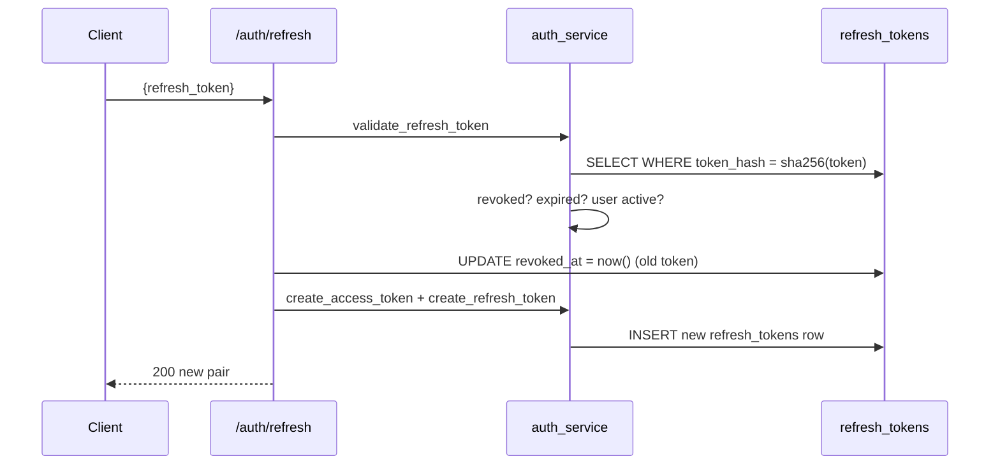
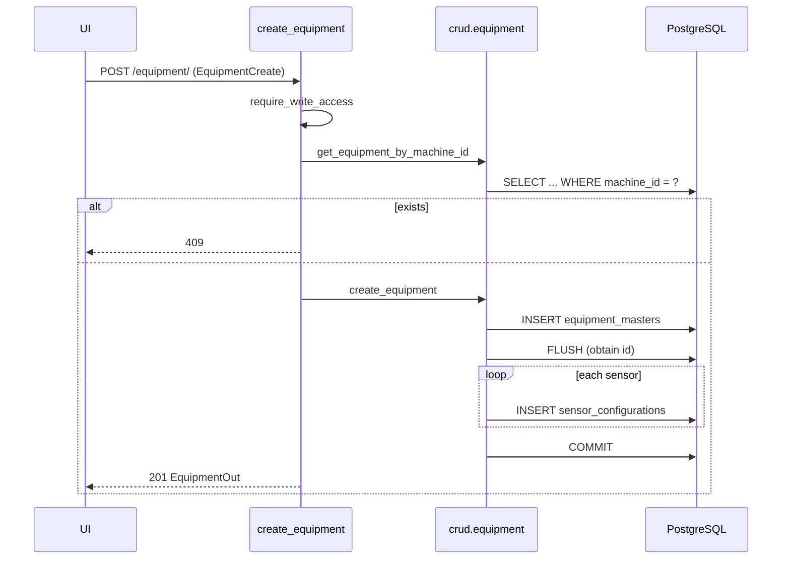
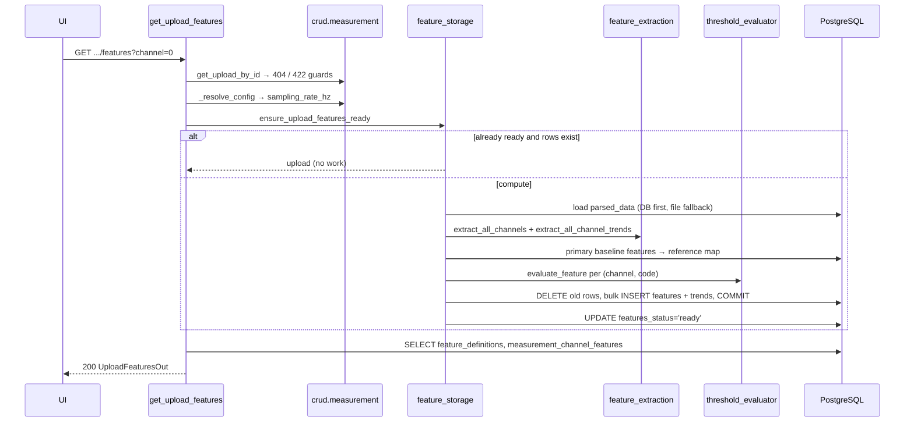
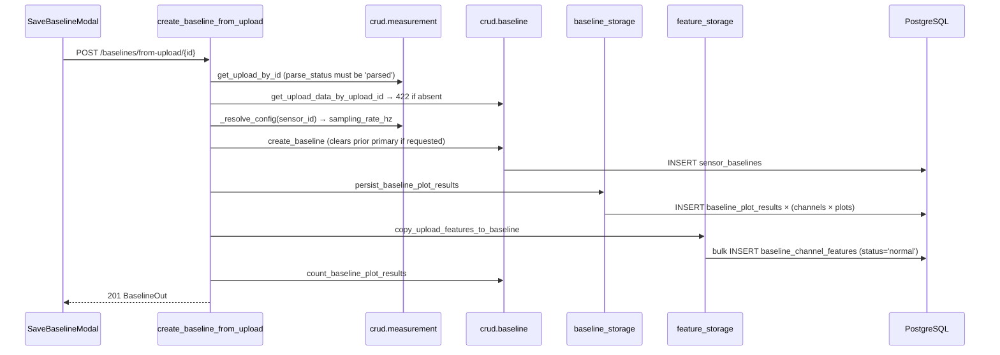

---

# 5.0 REST API Documentation

## 5.1 Conventions

| Aspect | Value |
|--------|-------|
| Base URL | `http://<host>:8000` |
| API prefix | `/api/v1` |
| Auth header | `Authorization: Bearer <access_token>` |
| Content type | `application/json` unless a table says `multipart/form-data` |
| Interactive docs | `/docs` (Swagger UI), `/redoc`, `/openapi.json` |
| Error body | `{"detail": "<string>"}` for `HTTPException`; `{"detail": [{loc, msg, type}, …]}` for Pydantic 422 |

**Authentication column legend.** *Public* = no token. *Auth* = any valid token. *Write* = `super_admin` or `admin` only (role `user` receives 403).

## 5.2 Complete Endpoint Index (46 endpoints)

| # | Method | Path | Auth | Purpose |
|---|--------|------|------|---------|
| 1 | GET | `/health` | Public | Liveness probe |
| 2 | POST | `/api/v1/auth/login` | Public | JSON login |
| 3 | POST | `/api/v1/auth/token` | Public | OAuth2 form login (Swagger) |
| 4 | POST | `/api/v1/auth/refresh` | Public | Rotate token pair |
| 5 | POST | `/api/v1/auth/logout` | Public | Revoke a refresh token |
| 6 | GET | `/api/v1/auth/me` | Auth | Current user profile |
| 7 | POST | `/api/v1/equipment/` | Write | Create equipment (+ nested sensors) |
| 8 | GET | `/api/v1/equipment/` | Auth | Paginated, filtered list |
| 9 | GET | `/api/v1/equipment/{equipment_id}` | Auth | Full equipment record |
| 10 | PUT | `/api/v1/equipment/{equipment_id}` | Write | Update (partial semantics) |
| 11 | PATCH | `/api/v1/equipment/{equipment_id}` | Write | Update (partial semantics) |
| 12 | DELETE | `/api/v1/equipment/{equipment_id}` | Write | Delete + cascade |
| 13 | POST | `/api/v1/equipment/{equipment_id}/image` | Write | Upload equipment image |
| 14 | GET | `/api/v1/equipment/{equipment_id}/image` | Auth | Download image file |
| 15 | DELETE | `/api/v1/equipment/{equipment_id}/image` | Write | Delete image |
| 16 | GET | `/api/v1/equipment/{equipment_id}/sensors` | Auth | List sensors |
| 17 | POST | `/api/v1/equipment/{equipment_id}/sensors` | Write | Add sensor |
| 18 | PUT | `/api/v1/equipment/{equipment_id}/sensors/{sensor_id}` | Write | Update sensor |
| 19 | DELETE | `/api/v1/equipment/{equipment_id}/sensors/{sensor_id}` | Write | Delete sensor |
| 20 | GET | `/api/v1/equipment/{equipment_id}/ai-readiness` | Auth | Readiness score |
| 21 | GET | `/api/v1/lookups/` | Auth | All 18 lookup lists |
| 22 | GET | `/api/v1/lookups/{lookup_name}` | Auth | One lookup list |
| 23 | POST | `/api/v1/measurements/configure` | Write | Upsert plot configuration |
| 24 | GET | `/api/v1/measurements/configure/{sensor_id}` | Auth | Read plot configuration |
| 25 | PUT | `/api/v1/measurements/configure/{sensor_id}` | Write | Update plot configuration |
| 26 | GET | `/api/v1/measurements/acquisition` | Auth | Edge config by `device_id` query |
| 27 | GET | `/api/v1/measurements/acquisition/by-sensor/{sensor_id}` | Auth | Edge config by sensor UUID |
| 28 | GET | `/api/v1/measurements/acquisition/{device_id}` | Auth | Edge config by `device_id` path |
| 29 | POST | `/api/v1/measurements/upload` | Write | Upload + parse + plots + features |
| 30 | GET | `/api/v1/measurements/uploads` | Auth | List uploads for a sensor |
| 31 | GET | `/api/v1/measurements/uploads/{upload_id}` | Auth | Single upload record |
| 32 | GET | `/api/v1/measurements/uploads/{upload_id}/plots` | Auth | All plots for a channel |
| 33 | GET | `/api/v1/measurements/uploads/{upload_id}/plots/{plot_type}` | Auth | One plot |
| 34 | GET | `/api/v1/measurements/plot-types` | Auth | Supported plot types |
| 35 | GET | `/api/v1/measurements/uploads/{upload_id}/features` | Auth | 10 scalar features + summary |
| 36 | GET | `/api/v1/measurements/uploads/{upload_id}/factor-trends` | Auth | Per-feature segment trends |
| 37 | GET | `/api/v1/measurements/uploads/{upload_id}/features/compare` | Auth | Features vs baseline |
| 38 | GET | `/api/v1/baselines` | Auth | List baselines for a sensor |
| 39 | GET | `/api/v1/baselines/primary` | Auth | Primary baseline |
| 40 | GET | `/api/v1/baselines/{baseline_id}` | Auth | Single baseline |
| 41 | PATCH | `/api/v1/baselines/{baseline_id}/primary` | Write | Set/clear primary flag |
| 42 | POST | `/api/v1/baselines/upload` | Write | Upload a file directly as a baseline |
| 43 | POST | `/api/v1/baselines/from-upload/{upload_id}` | Write | Promote an upload to a baseline |
| 44 | GET | `/api/v1/baselines/{baseline_id}/plots` | Auth | Baseline plots |
| 45 | GET | `/api/v1/baselines/{baseline_id}/plots/{plot_type}` | Auth | One baseline plot |
| 46 | GET | `/api/v1/baselines/{baseline_id}/features` | Auth | Baseline feature values |

---

## 5.3 Health

### 5.3.1 `GET /health`

Liveness probe for orchestrators. No authentication (explicitly excluded from the OpenAPI security sweep).

**Response 200**
```json
{ "status": "ok", "service": "AI Vibration Intelligence Platform" }
```

---

## 5.4 Authentication API

### 5.4.1 `POST /api/v1/auth/login`

| Property | Value |
|----------|-------|
| Purpose | Exchange email + password for a token pair |
| Auth | Public |
| Headers | `Content-Type: application/json` |
| Controller | `routers/auth.py::login` |
| Service | `auth_service.authenticate_user`, `create_access_token`, `create_refresh_token` |
| Repository | `crud/user.get_user_by_email`, `update_last_login`, `create_refresh_token_record` |
| Tables | `users`, `roles`, `user_roles` (read), `refresh_tokens` (insert) |

**Request body — `LoginRequest`**

| Field | Type | Rules |
|-------|------|-------|
| `email` | `EmailStr` | Must be a syntactically valid address (422 otherwise) |
| `password` | `string` | `min_length=1` |

**Response 200 — `TokenResponse`**

| Field | Type | Notes |
|-------|------|-------|
| `access_token` | string | JWT HS256 |
| `refresh_token` | string | Opaque, 48-byte URL-safe |
| `token_type` | string | Always `"bearer"` |
| `expires_in` | int | Access-token lifetime in seconds (1800 by default) |

**Errors** — 401 `"Incorrect email or password"` (unknown email, wrong password, or inactive user); 422 on schema violation.

**Business logic** — the three failure causes are deliberately collapsed into one message to avoid account enumeration. `last_login_at` is updated **before** tokens are issued.

**Request example**
```bash
curl -X POST http://localhost:8000/api/v1/auth/login \
  -H "Content-Type: application/json" \
  -d '{"email":"admin@vibration.com","password":"Admin@2024"}'
```

**Response example**
```json
{
  "access_token": "eyJhbGciOiJIUzI1NiIsInR5cCI6IkpXVCJ9...",
  "refresh_token": "9Kx3q7...W2",
  "token_type": "bearer",
  "expires_in": 1800
}
```

**Sequence diagram** — see §2.6.

---

### 5.4.2 `POST /api/v1/auth/token`

OAuth2-password-flow variant used by the Swagger **Authorize** dialog. Body is `application/x-www-form-urlencoded` with `username` (the email) and `password`. Behaviour and responses are otherwise identical to `/login`.

---

### 5.4.3 `POST /api/v1/auth/refresh`

| Property | Value |
|----------|-------|
| Purpose | Rotate a refresh token into a fresh token pair |
| Auth | Public (the refresh token is the credential) |
| Body | `{"refresh_token": "<string, min_length 1>"}` |
| Response 200 | `TokenResponse` (both tokens are new) |
| Errors | 401 `"Invalid refresh token"` / `"Refresh token revoked"` / `"Refresh token expired"` / `"User inactive"` |

**Business logic.** Validate → revoke the presented token → issue a new pair. Single-use rotation; a replayed token fails with `"Refresh token revoked"`.



---

### 5.4.4 `POST /api/v1/auth/logout`

Body `{"refresh_token": "..."}`. Returns **204 No Content**. Validation errors are swallowed (`except ValueError: pass`), so logout is idempotent and always succeeds — an already-revoked or unknown token still yields 204. Access tokens are **not** invalidated and remain usable until they expire.

---

### 5.4.5 `GET /api/v1/auth/me`

| Property | Value |
|----------|-------|
| Auth | Auth (Bearer) |
| Response 200 | `UserMeResponse`: `id`, `email`, `full_name`, `is_active`, `must_change_password`, `roles[]`, `plants[]`, `last_login_at` |
| Errors | 401 for missing/invalid/expired token or inactive user |

`plants` is always `[]` — `user_to_me_dict` hard-codes it because plant scoping is not yet modelled.

```json
{
  "id": "3f2a...",
  "email": "admin@vibration.com",
  "full_name": "Platform Administrator",
  "is_active": true,
  "must_change_password": false,
  "roles": ["super_admin"],
  "plants": [],
  "last_login_at": "2026-07-25T09:14:22.113Z"
}
```

---

## 5.5 Equipment API

All routes inherit `Depends(get_current_user)`; write routes add `Depends(require_write_access)`.

### 5.5.1 `POST /api/v1/equipment/` — create

| Property | Value |
|----------|-------|
| Auth | Write · Status 201 |
| Controller | `create_equipment` |
| Repository | `crud.get_equipment_by_machine_id`, `crud.create_equipment` |
| Tables | `equipment_masters` (insert), `sensor_configurations` (insert) |

**Request body — `EquipmentCreate`** — all 40 `EquipmentBase` fields plus `sensors: SensorConfigCreate[]`.

Validation rules:

| Field | Rule |
|-------|------|
| `machine_id` | `""` is coerced to `null` by `normalize_machine_id`; a non-null duplicate returns **409** |
| `rated_power_kw`, `gearbox_ratio`, `load_range_*`, `normal_operating_load` | Decimal |
| `operating_environment` | Array of strings → Postgres `text[]` |
| `installation_date`, `last_maintenance_date` | ISO `YYYY-MM-DD` |
| Each sensor | `sensor_type`, `mounting_location`, `orientation` required; `device_id` ≤ 64 chars |

**Business logic.** Logs the four identity fields; performs the duplicate check only when `machine_id` is truthy; delegates to `crud.create_equipment`, which flushes to obtain the parent ID before inserting sensors so both land in one transaction.

**Responses** — 201 `EquipmentOut` (includes `id`, `sensors[]`, `created_at`, `updated_at`); 409 `"Machine ID 'X' already exists"`; 401; 403; 422.

**Request example**
```json
{
  "plant_name": "Pune Plant", "area": "Utilities", "line": "Cooling Water Line",
  "machine_name": "Cooling Water Pump P-204", "machine_id": "PUMP-P204",
  "machine_type": "Pump", "machine_criticality": "Critical",
  "manufacturer": "KSB", "model": "Etanorm SYT 100-250",
  "rated_power_kw": 75, "rated_rpm": 1480,
  "drive_type": "Direct Drive", "load_type": "Constant Load",
  "bearing_number_de": "6205", "bearing_number_nde": "6204", "pump_vanes": 7,
  "operating_speed_min": 1400, "operating_speed_max": 1500,
  "operating_environment": ["Indoor", "Wet Area"],
  "asset_status": "Active",
  "sensors": [
    { "sensor_type": "IEPE Accelerometer", "mounting_location": "Bearing Housing DE",
      "orientation": "Horizontal", "mounting_method": "Stud Mounted",
      "sensitivity": 100.0, "sensitivity_unit": "mV/g",
      "sampling_rate": "25600 Hz", "frequency_range": "0-10000 Hz",
      "is_active": true, "device_id": "11:AA:BB:CC:DD:EE" }
  ]
}
```



---

### 5.5.2 `GET /api/v1/equipment/` — list

**Query parameters**

| Name | Type | Default | Rules |
|------|------|---------|-------|
| `page` | int | 1 | `ge=1` |
| `page_size` | int | 20 | `ge=1, le=100` |
| `plant_name` | string? | — | Case-insensitive partial (`ILIKE %v%`) |
| `machine_type` | string? | — | Exact |
| `machine_criticality` | string? | — | Exact |

**Response 200 — `PaginatedEquipment`**: `{total, page, page_size, items: EquipmentListItem[]}` where each item carries `id`, `plant_name`, `area`, `line`, `machine_name`, `machine_id`, `machine_type`, `machine_criticality`, `manufacturer`, `asset_status`, `equipment_image_path`, `created_at`. Ordered `created_at DESC`.

`GET /api/v1/equipment/?page=1&page_size=20&machine_type=Pump&machine_criticality=Critical`

---

### 5.5.3 `GET /api/v1/equipment/{equipment_id}`

Path parameter `equipment_id: UUID` (non-UUID → 422). Returns the full `EquipmentOut` including the nested `sensors[]`. 404 `"Equipment not found"`.

---

### 5.5.4 `PUT` and `PATCH /api/v1/equipment/{equipment_id}`

Both call the same handler logic (`crud.update_equipment`) with `EquipmentUpdate`, and both use `exclude_unset=True` — so `PUT` behaves as a partial update, not a replace. Response 200 `EquipmentOut`; 404 when the id is unknown; 403 for role `user`.

> Note: unlike create, update does **not** check `machine_id` uniqueness in application code. A colliding value is rejected by the database's `uq_equipment_machine_id` constraint, surfacing as a 500 rather than a 409.

---

### 5.5.5 `DELETE /api/v1/equipment/{equipment_id}`

Status 204. Removes the equipment row; ORM `delete-orphan` plus database `ON DELETE CASCADE` remove sensors and, transitively, plot configurations, uploads, upload data, plot results, baselines, baseline plots, and all feature/trend rows for those sensors. 404 when absent.

---

### 5.5.6 `POST /api/v1/equipment/{equipment_id}/image`

| Property | Value |
|----------|-------|
| Auth | Write · `multipart/form-data` · field `file` |
| Allowed MIME | `image/jpeg`, `image/png`, `image/webp`, `image/gif` |
| Max size | `settings.max_image_size_mb` = 10 MB |
| Storage | `{upload_dir}/{equipment_id}.{ext}` — the extension is taken from the original filename, defaulting to `jpg` |
| Response 200 | `EquipmentOut` with the updated `equipment_image_path` |
| Errors | 404 equipment not found; 400 wrong type; 400 `"Image exceeds 10MB limit"` |

Because the filename is deterministic, re-uploading replaces the previous image — unless the extension differs, in which case the old file is orphaned on disk while the path column points at the new one.

---

### 5.5.7 `GET /api/v1/equipment/{equipment_id}/image`

Returns a `FileResponse` streaming the stored file. 404 when the equipment is missing, when `equipment_image_path` is null, or when the path no longer exists on disk (`"Image file not found on disk"`).

### 5.5.8 `DELETE /api/v1/equipment/{equipment_id}/image`

Status 204. Removes the file when present, then sets `equipment_image_path = NULL`. 404 when the equipment is unknown.

---

### 5.5.9 Sensor endpoints

| Endpoint | Auth | Behaviour |
|----------|------|-----------|
| `GET /{equipment_id}/sensors` | Auth | 404 if the equipment does not exist, else `SensorConfigOut[]` |
| `POST /{equipment_id}/sensors` | Write | 201 `SensorConfigOut`; 404 if the parent is missing |
| `PUT /{equipment_id}/sensors/{sensor_id}` | Write | Partial update via `SensorConfigUpdate` + `exclude_unset`; 404 `"Sensor not found"`. **The handler does not verify the sensor belongs to `equipment_id`** — the path segment is contextual only |
| `DELETE /{equipment_id}/sensors/{sensor_id}` | Write | 204; cascades to that sensor's plot config, uploads, plots, baselines, and features |

---

### 5.5.10 `GET /api/v1/equipment/{equipment_id}/ai-readiness`

**Response 200 — `AIReadinessOut`**

| Field | Meaning |
|-------|---------|
| `equipment_id` | Echoed UUID |
| `score_percent` | `int(sum(checks)/5 × 100)` → one of 0, 20, 40, 60, 80, 100 |
| `machine_train_configured` | The stored boolean |
| `asset_status_set` | `asset_status not in (None, "")` |
| `sensor_coverage` | `len(sensors) > 0` |
| `bearing_database_mapped` | The stored boolean |
| `operating_mode_configured` | Both `operating_speed_min` and `operating_speed_max` are set |

```json
{ "equipment_id":"3f2a...", "score_percent":80,
  "machine_train_configured":true, "asset_status_set":true,
  "sensor_coverage":true, "bearing_database_mapped":false,
  "operating_mode_configured":true }
```

> The frontend's `getAIReadinessScore` in `lib/form-intelligence.ts` uses a **different**, four-dimension formula (data completeness, sensor coverage, diagnostic readiness, PM readiness). The two scores are independent and will not agree.

---

## 5.6 Lookups API

### 5.6.1 `GET /api/v1/lookups/`

Returns the entire `LOOKUPS` dictionary — a static, in-code catalogue with no database access.

| Key | Count | Values |
|-----|-------|--------|
| `machine-types` | 13 | Motor, Pump, Fan, Blower, Compressor, Gearbox, Turbine, Generator, DG Set, Conveyor, Crusher, Mixer, Agitator |
| `machine-criticality` | 4 | Low, Medium, High, Critical |
| `drive-types` | 6 | Direct, Belt, Gear, Chain, VFD, Hydraulic Drive |
| `load-types` | 5 | Constant, Variable, Intermittent, Cyclic, Shock Load |
| `foundation-types` | 5 | Concrete Foundation, Steel Structure, Skid Mounted, Base Frame, Suspended Structure |
| `coupling-types` | 9 | Flexible, Grid, Gear, Jaw, Disc, Tyre, Chain, Fluid, Direct |
| `motor-pole-counts` | 6 | 2, 4, 6, 8, 10, 12 (integers) |
| `direction-of-rotation` | 3 | Clockwise, Counter-Clockwise, Bidirectional |
| `operating-environments` | 13 | Indoor … Food Grade Area |
| `lubrication-types` | 6 | Grease, Oil Bath, Oil Mist, Forced Oil, Splash, Automatic |
| `sensor-types` | 14 | IEPE Accelerometer … RPM Sensor |
| `mounting-locations` | 11 | Bearing Housing DE … Custom |
| `sensor-orientations` | 5 | Horizontal, Vertical, Axial, Radial, Tangential |
| `mounting-methods` | 9 | Stud Mounted … Custom |
| `sensitivity-units` | 5 | mV/g, mV/mm/s, mV/µm, mA, V |
| `sampling-rates` | 9 | 512 Hz … 65536 Hz, Custom |
| `frequency-ranges` | 7 | 0-500 Hz … 0-20000 Hz, Custom |
| `asset-status` | 4 | Active, Inactive, Under Maintenance, Decommissioned |

### 5.6.2 `GET /api/v1/lookups/{lookup_name}`

Returns `{"lookup": "<name>", "values": [...]}`; 404 `"Lookup '<name>' not found"` for an unknown key.

> The frontend currently hard-codes the same option lists inside its tab components rather than calling these endpoints, although `getLookup`/`getAllLookups` exist in `api/equipment.ts`. Keeping both in sync is a maintenance obligation.

---

## 5.7 Measurements API

### 5.7.1 `POST /api/v1/measurements/configure`

| Property | Value |
|----------|-------|
| Purpose | Create **or update** (upsert) the processing profile for a sensor |
| Auth | Write |
| Body | `PlotConfigCreate` |
| Tables | `plot_configurations` |

**Body fields**

| Field | Type | Default | Rules |
|-------|------|---------|-------|
| `sensor_id` | UUID | — | Must exist (404 otherwise) |
| `channel_count` | int | — | 1–32 |
| `active_channel` | int | 0 | ≥ 0 and `< channel_count` (model validator) |
| `sampling_rate_hz` | float | 25600 | > 0 |
| `fft_lines` | int | 1600 | 64–65536 |
| `frequency_max_hz` | float? | null | > 0 |
| `data_type` | string | `acceleration` | ∈ {acceleration, velocity, displacement} |
| `enabled_plots` | string[] | all 5 | Aliases canonicalised, unknowns dropped, must be non-empty after normalisation |

Response 200 `PlotConfigOut` (adds `id`, `created_at`, `updated_at`).

### 5.7.2 `GET /api/v1/measurements/configure/{sensor_id}`

200 `PlotConfigOut`; 404 `"Plot configuration not found for this sensor"`. Read-time repair applies: legacy plot names are canonicalised and an out-of-range `active_channel` is clamped.

### 5.7.3 `PUT /api/v1/measurements/configure/{sensor_id}`

Write. Body `PlotConfigUpdate` (all optional). 404 when the sensor or the configuration is missing. Sets `updated_at`.

---

### 5.7.4 Edge acquisition endpoints (26–28)

Three shapes of the same operation:

| Endpoint | Lookup key | Intended use |
|----------|-----------|--------------|
| `GET /acquisition?device_id=11:AA:BB:CC:DD:EE` | `sensor_configurations.device_id` | **Recommended** — safe for MAC addresses containing `:` |
| `GET /acquisition/{device_id}` | same | Path form; awkward when the ID contains `:` |
| `GET /acquisition/by-sensor/{sensor_id}` | `sensor_configurations.id` | Testing before a `device_id` is assigned |

**Response 200 — `EdgeAcquisitionConfigOut`**

```json
{
  "acquisitionFormula": {
    "frequencyResolutionHz": 16.0, "blockTimeSeconds": 0.0625,
    "sampleRateHz": 25600.0, "requiredSamples": 1600.0,
    "overlapDecimal": 0.0, "totalAcquisitionTimeSeconds": 0.0625,
    "averageCount": 1.0, "fmaxHz": 15000.0, "lor": 1600.0,
    "stepSizeSamples": 1600.0
  },
  "minutes": "1", "averaging": 1, "sensitivityMvPerG": 100.0,
  "totalChannelCount": 8, "averageCount": 1,
  "lastAveraging": null, "lastOverlapping": null,
  "lor": "1600", "fmax": "15000", "windowType": "HANNING",
  "sensorId": "11:AA:BB:CC:DD:EE",
  "channels": [
    {"transducerType":"IEPE Accelerometer","signalType":"VIBRATION","channelIndex":1,"machineAxis":"HORIZONTAL"}
  ],
  "success": true, "overlapping": 0, "ksps": "25",
  "id": 1, "overlapPercentage": 0,
  "platformSensorId": "9c1d..."
}
```

**Errors** — 404 for `/acquisition` and `/acquisition/{device_id}`: *"No sensor found with device_id 'X'. Set device_id on the sensor via equipment API, then save plot config."*; 404 `"Sensor not found"` for the by-sensor form.

**Note.** These routes inherit the router's `get_current_user` dependency, so an edge device must present a bearer token.

---

### 5.7.5 `POST /api/v1/measurements/upload`

| Property | Value |
|----------|-------|
| Purpose | Upload a capture and run the full processing pipeline |
| Auth | Write · Status 201 |
| Content type | `multipart/form-data` |
| Tables written | `sensor_data_uploads`, `measurement_upload_data`, `plot_results`, `measurement_channel_features`, `measurement_channel_feature_trends` |
| Files written | `{measurement_upload_dir}/{upload_id}.csv|pdf`, `{upload_id}.json` |

**Form fields**

| Field | Type | Rules |
|-------|------|-------|
| `sensor_id` | UUID | Must exist → 404 with guidance on where to find a real id |
| `channel_count` | int | `ge=1, le=32` |
| `file` | file | `.csv`/`.pdf` by extension **or** MIME ∈ {application/pdf, text/csv, application/csv, text/plain}; ≤ 50 MB |

**Accepted file layouts**

```
timestamp_,ch0,ch1,ch2,ch3,ch4,ch5,ch6
1777747212,0.01234,-0.00871,0.00042,...
```
Also accepted: header `timestamp`; tab-, semicolon-, comma-, or whitespace-separated values; PDFs whose pages contain extractable tables or text.

**Response 201 — `SensorDataUploadOut`**

| Field | Meaning |
|-------|---------|
| `id`, `sensor_id`, `original_filename`, `source` | Identity (`source` is always `"manual"` for this endpoint) |
| `channel_count`, `sample_count` | Capture dimensions |
| `parse_status` / `parse_error` | `pending` → `parsed` \| `failed` |
| `plots_status` / `plots_error` / `plots_computed_at` | `pending` → `ready` \| `failed` |
| `features_status` / `features_error` / `features_computed_at` | `pending` → `ready` \| `failed` |
| `created_at`, `parsed_at` | Timestamps |
| `has_stored_data` | `true` — the bytes are in `measurement_upload_data` |

**Errors** — 404 sensor; 400 file type; 400 `"File exceeds 50MB limit"`; 422 `"PDF parsing failed: <detail>"`.

**Full sequence diagram** — see §1.8.1.

```bash
curl -X POST http://localhost:8000/api/v1/measurements/upload \
  -H "Authorization: Bearer $TOKEN" \
  -F "sensor_id=9c1d..." -F "channel_count=8" -F "file=@capture.csv"
```

---

### 5.7.6 `GET /api/v1/measurements/uploads`

**Query parameters**

| Name | Type | Default | Rules |
|------|------|---------|-------|
| `sensor_id` | UUID | **required** | 404 when unknown |
| `from_date` | date? | — | Inclusive from 00:00:00 |
| `to_date` | date? | — | Inclusive to 23:59:59.999999 |
| `parse_status` | string? | — | Exact match |
| `plots_status` | string? | — | Exact match |
| `page` | int | 1 | `ge=1` |
| `page_size` | int | 50 | `ge=1, le=200` |

**Response 200 — `PaginatedUploadListOut`**: `{items, total, page, page_size}`, newest first. `has_stored_data` is resolved for the whole page with **one** `IN` query (`get_stored_upload_ids`) rather than per row.

**Errors** — 400 `"from_date must be on or before to_date"`; 404 sensor.

### 5.7.7 `GET /api/v1/measurements/uploads/{upload_id}`

Single `SensorDataUploadOut`; 404 `"Upload not found"`.

---

### 5.7.8 `GET /api/v1/measurements/uploads/{upload_id}/plots`

| Property | Value |
|----------|-------|
| Query | `channel: int?` with `ge=0, le=31` — overrides the saved `active_channel` |
| Response 200 | `AllPlotsOut`: `{upload_id, sensor_id, channel, available_channels[], plots[]}` |
| Errors | 404 upload; 422 `"Upload not parsed: <error or status>"`; 422 from `ValueError` (e.g. `"Upload has no parsed data"`) |

Each `plots[]` entry is a `PlotSeriesOut`: `{plot_type, title, x_label, y_label, x[], y[], channel, metadata}`. Plots are returned in the order given by `enabled_plots`.

**Cache-or-compute behaviour** — see §4.9.6. A first request after a configuration change recomputes and persists before responding.

```json
{
  "upload_id": "6d2b...", "sensor_id": "9c1d...", "channel": 0,
  "available_channels": [0,1,2,3,4,5,6,7],
  "plots": [
    { "plot_type":"time_waveform","title":"Time Waveform",
      "x_label":"Time (s)","y_label":"Amplitude",
      "x":[0.0,0.0000390625,"..."],"y":[0.0123,-0.0087,"..."],
      "channel":0,"metadata":{"plot_style":"line"} },
    { "plot_type":"fft_spectrum","title":"FFT Spectrum",
      "x_label":"Frequency (Hz)","y_label":"Magnitude",
      "x":[0.0,16.0,32.0,"..."],"y":[0.0001,0.0342,"..."],
      "channel":0,
      "metadata":{"plot_style":"line","fft_lines":1600,"sampling_rate_hz":25600.0} }
  ]
}
```

### 5.7.9 `GET /api/v1/measurements/uploads/{upload_id}/plots/{plot_type}`

`plot_type` must be one of the five canonical values, else 400 `"Invalid plot type. Allowed: [...]"`. Returns a single `PlotSeriesOut`.

### 5.7.10 `GET /api/v1/measurements/plot-types`

`{"plot_types": ["time_waveform","circular_time_waveform","fft_spectrum","envelope_spectrum","trend_plot"]}`

---

### 5.7.11 `GET /api/v1/measurements/uploads/{upload_id}/features`

| Property | Value |
|----------|-------|
| Query | `channel: int?` (`ge=0, le=31`) — omit for all channels |
| Response 200 | `UploadFeaturesOut` |
| Errors | 404 upload; 422 not parsed; 422 `"Feature compute failed: <detail>"` |
| Tables | `sensor_data_uploads`, `feature_definitions`, `feature_threshold_rules`, `sensor_baselines`, `baseline_channel_features`, `measurement_channel_features` |

**Business logic.** Resolves the plot configuration for the sampling rate, calls `ensure_upload_features_ready` (which computes on demand for legacy uploads whose `features_status` is still `pending`), then reads rows, builds `items`, `summary`, and `channel_overview`.

`channel_overview.health_state` is the worst status present: any `critical` → `Critical`; else any `warning` → `Warning`; else all `normal` → `Normal`; else `status_to_health_level(first)`.

```json
{
  "upload_id":"6d2b...", "sensor_id":"9c1d...", "channel":0,
  "features_status":"ready", "features_error":null,
  "features_computed_at":"2026-07-25T09:20:11.442Z",
  "items":[
    {"channel":0,"feature_code":"rms","feature_name":"RMS","value":0.00841,
     "unit":"scaled_eng","status":"normal","metadata":{},
     "computed_at":"2026-07-25T09:20:11.442Z"},
    {"channel":0,"feature_code":"amplitude_1x","feature_name":"1X Amplitude",
     "value":0.00219,"unit":"scaled_eng","status":"normal",
     "metadata":{"estimated_shaft_hz":24.6,"sampling_rate_hz":25600.0,"sample_count":4096},
     "computed_at":"2026-07-25T09:20:11.442Z"}
  ],
  "summary":{"normal":9,"warning":1,"critical":0,"no_baseline":0,"total":10},
  "channel_overview":{"health_state":"Warning","feature_count":10,
                      "computed_at":"2026-07-25T09:20:11.442Z",
                      "baseline_name":null,"baseline_id":null}
}
```



---

### 5.7.12 `GET /api/v1/measurements/uploads/{upload_id}/factor-trends`

| Property | Value |
|----------|-------|
| Query | `channel: int` default **0**, `ge=0, le=31` (required semantics — a single channel only) |
| Response 200 | `UploadFactorTrendsOut` |
| Errors | 404 upload; 422 not parsed; 422 feature-compute failure |

Merges the scalar row and the ordered trend rows for each feature code, then sorts the result by `feature_definitions.sort_order` (unknown codes sort last with key 999).

```json
{
  "upload_id":"6d2b...", "sensor_id":"9c1d...", "channel":0,
  "features_status":"ready", "sampling_rate_hz":25600.0,
  "factors":[
    {"feature_code":"rms","feature_name":"RMS","unit":"scaled_eng",
     "value":0.00841,"status":"normal",
     "trend_x":[0.0025,0.0075,"…32 values…"],
     "trend_y":[0.0081,0.0086,"…32 values…"]}
  ]
}
```

---

### 5.7.13 `GET /api/v1/measurements/uploads/{upload_id}/features/compare`

| Property | Value |
|----------|-------|
| Query | `baseline_id: UUID?` (falls back to the sensor's primary baseline), `channel: int?` |
| Response 200 | `FeatureCompareOut` |
| Errors | 404 upload; 404 `"No primary baseline for this sensor"`; 404 `"Baseline not found"`; 422 feature-compute failure |

`percent_of_baseline = 100 × upload_value / baseline_value`, computed only when the baseline value exists and exceeds `1e-30`; otherwise `null`. Baseline values are keyed by `(channel, feature_code)`, so a channel mismatch yields `null` rather than a wrong comparison.

```json
{
  "upload_id":"6d2b...", "baseline_id":"1a7f...", "channel":0,
  "items":[
    {"channel":0,"feature_code":"rms","feature_name":"RMS","unit":"scaled_eng",
     "upload_value":0.00841,"baseline_value":0.00612,
     "percent_of_baseline":137.4,"status":"warning"}
  ],
  "summary":{"normal":9,"warning":1,"critical":0,"no_baseline":0,"total":10}
}
```

---

## 5.8 Baselines API

### 5.8.1 `GET /api/v1/baselines`

Query `sensor_id: UUID` (required). Returns `BaselineListOut`: `{sensor_id, total, primary_baseline_id, items[]}`, newest first. 404 `"Sensor not found"`.

Each item's `plots_status` is **derived**, not stored:

```
expected = channel_count × 5
plot_count ≥ expected and expected > 0 → "ready"
plot_count > 0                          → "partial"
otherwise                               → "pending"
```

### 5.8.2 `GET /api/v1/baselines/primary`

Query `sensor_id: UUID`. 200 `BaselineOut`; 404 `"No primary baseline set for this sensor"`. The frontend converts this 404 into `null`.

### 5.8.3 `GET /api/v1/baselines/{baseline_id}`

200 `BaselineOut`; 404 `"Baseline not found"`.

### 5.8.4 `PATCH /api/v1/baselines/{baseline_id}/primary`

Write. Body `{"is_primary": true}` (default `true`). When setting to true, all other baselines for the same sensor are cleared first, guaranteeing at most one primary per sensor. Returns the updated `BaselineOut`. **No baseline is deleted.**

### 5.8.5 `POST /api/v1/baselines/upload`

| Property | Value |
|----------|-------|
| Auth | Write · 201 · `multipart/form-data` |
| Fields | `sensor_id` UUID, `channel_count` int (1–32), `name` string, `description` string?, `set_as_primary` bool (default false), `file` |
| Behaviour | Writes a temp file → parses → **always deletes the temp file in `finally`** → creates the baseline with the raw bytes and parsed data → computes and persists baseline plots |
| Errors | 404 sensor; 422 `"Parse failed: …"`; 422 `"Baseline plot compute failed: …"` |

Unlike the upload endpoint, this route stores **no** row in `sensor_data_uploads` and computes **no** feature rows — a directly uploaded baseline has plots but no `baseline_channel_features`.

### 5.8.6 `POST /api/v1/baselines/from-upload/{upload_id}`

| Property | Value |
|----------|-------|
| Auth | Write · 201 |
| Body | `BaselineCreateFromUpload`: `name` (1–200), `description?`, `labels: string[]`, `set_as_primary` (default false), `captured_at?` |
| Errors | 404 `"Parsed upload not found"`; 422 `"Upload file data not in DB. Re-upload the file after migration 007."`; 422 `"Baseline plot compute failed: …"` |

**Business logic.** Reads `measurement_upload_data` (bytes + parsed JSON) — never the filesystem — so the baseline is durable. Copies both into a new `sensor_baselines` row, persists baseline plot results, then calls `copy_upload_features_to_baseline`, which copies the upload's feature values into `baseline_channel_features` with `status` forced to `normal`.



### 5.8.7 `GET /api/v1/baselines/{baseline_id}/plots`

Query `channel: int?`. Resolves the sensor's configuration, computes the fingerprint, and reads stored rows; if none exist it computes and persists them, then re-reads. Returns `AllPlotsOut` — note that `upload_id` in the payload carries the **baseline id** (schema reuse). 404 baseline; 422 on compute failure.

### 5.8.8 `GET /api/v1/baselines/{baseline_id}/plots/{plot_type}`

Validates the plot type (400), delegates to the previous endpoint, and filters. 404 `"Plot {plot_type} not found"`.

### 5.8.9 `GET /api/v1/baselines/{baseline_id}/features`

Query `channel: int?`. Returns `BaselineFeaturesOut` with `items` and a `summary` counted directly from the rows. 404 baseline. Baselines created via `POST /baselines/upload` return an empty list because that path never populates features.

---

## 5.9 Cross-Cutting API Behaviour

### 5.9.1 Which endpoints require write access

| Router | Write endpoints |
|--------|-----------------|
| Equipment | create, PUT, PATCH, DELETE, image upload, image delete, sensor add/update/delete |
| Measurements | `POST /configure`, `PUT /configure/{sensor_id}`, `POST /upload` |
| Baselines | `PATCH /{id}/primary`, `POST /upload`, `POST /from-upload/{id}` |
| Auth / Lookups | none |

Everything else is readable by all three roles.

### 5.9.2 Validation-rule summary

| Constraint | Endpoints |
|------------|-----------|
| `page ≥ 1`; `page_size` 1–100 (equipment) / 1–200 (uploads) | list endpoints |
| `channel` 0–31 | all plot/feature/trend endpoints |
| `channel_count` 1–32 | configure, upload, baseline upload |
| `fft_lines` 64–65536 | configure |
| `sampling_rate_hz > 0`, `frequency_max_hz > 0` | configure |
| `active_channel < channel_count` | configure (create) |
| `data_type ∈ {acceleration, velocity, displacement}` | configure |
| `enabled_plots` non-empty after canonicalisation | configure |
| `name` 1–200 chars | baseline from-upload |
| `password` min length 1; `email` valid address | login |
| `refresh_token` min length 1 | refresh, logout |
| Image ≤ 10 MB, MIME in the allow-list | equipment image |
| Measurement file ≤ 50 MB, `.csv`/`.pdf` | upload, baseline upload |
| `from_date ≤ to_date` | uploads list |

### 5.9.3 Endpoint → table matrix

| Endpoint group | Tables read | Tables written |
|----------------|-------------|----------------|
| Auth | `users`, `roles`, `user_roles`, `refresh_tokens` | `users.last_login_at`, `refresh_tokens` |
| Equipment | `equipment_masters`, `sensor_configurations` | both |
| Lookups | — | — |
| Configure | `sensor_configurations` | `plot_configurations` |
| Acquisition | `sensor_configurations`, `plot_configurations` | — |
| Upload | `sensor_configurations`, `plot_configurations`, `feature_definitions`, `feature_threshold_rules`, `sensor_baselines`, `baseline_channel_features` | `sensor_data_uploads`, `measurement_upload_data`, `plot_results`, `measurement_channel_features`, `measurement_channel_feature_trends` |
| Plots | `sensor_data_uploads`, `plot_configurations`, `plot_results` | `plot_results` (on cache miss) |
| Features / trends / compare | as above + feature tables + baselines | feature tables (on demand) |
| Baselines | `sensor_baselines`, `baseline_plot_results`, `baseline_channel_features`, `measurement_upload_data` | all three baseline tables |
