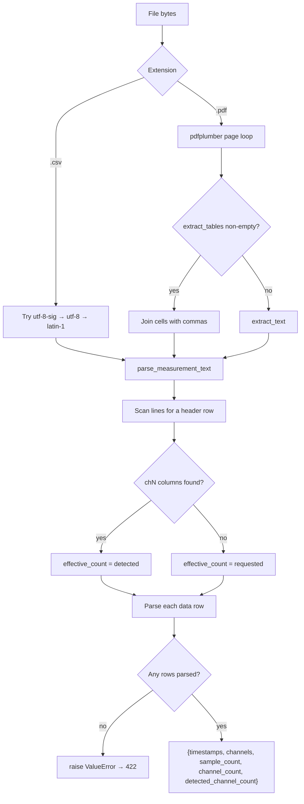
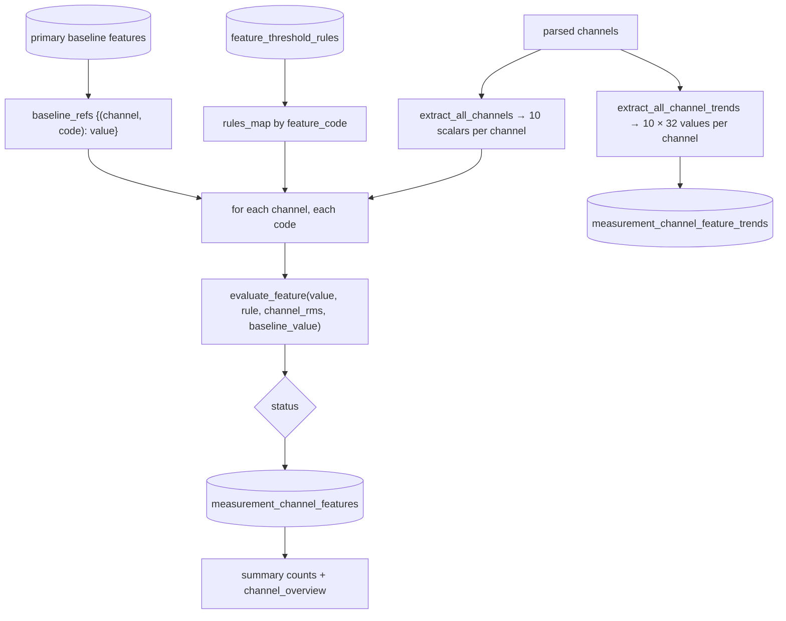
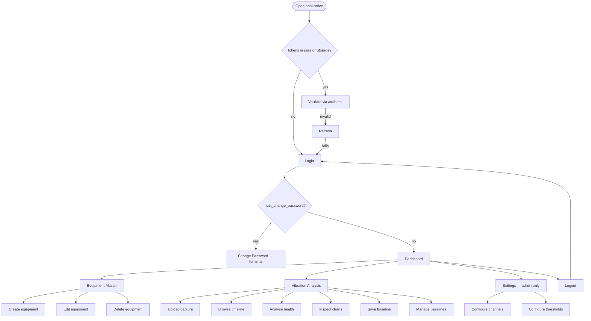
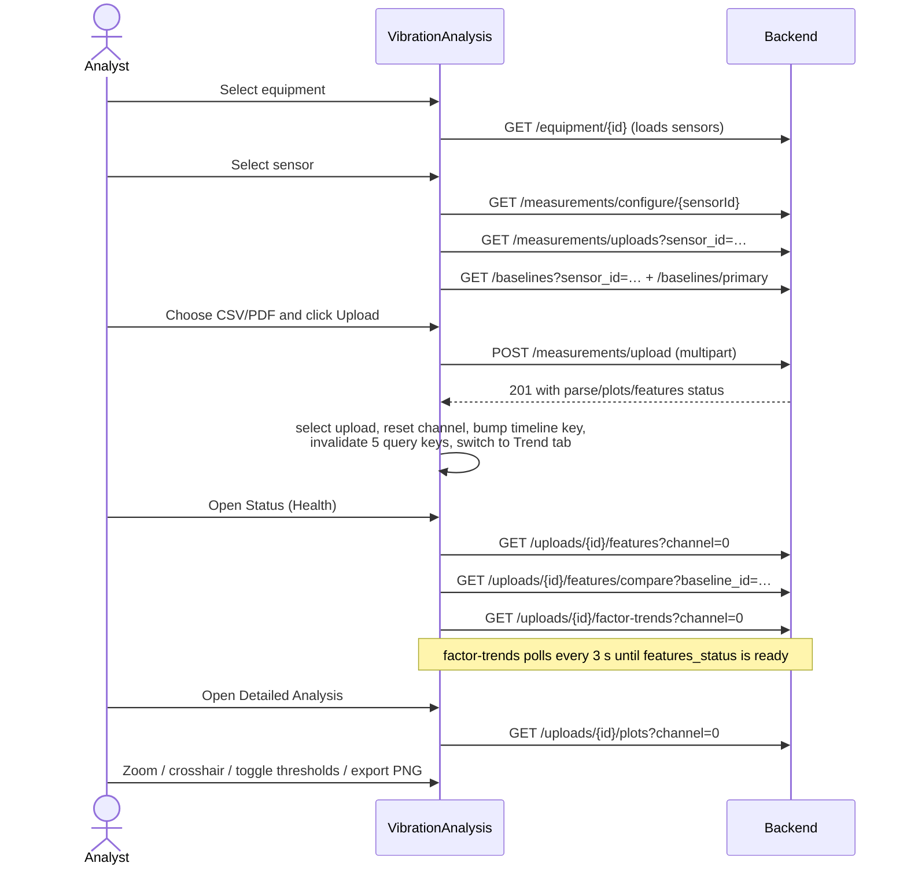
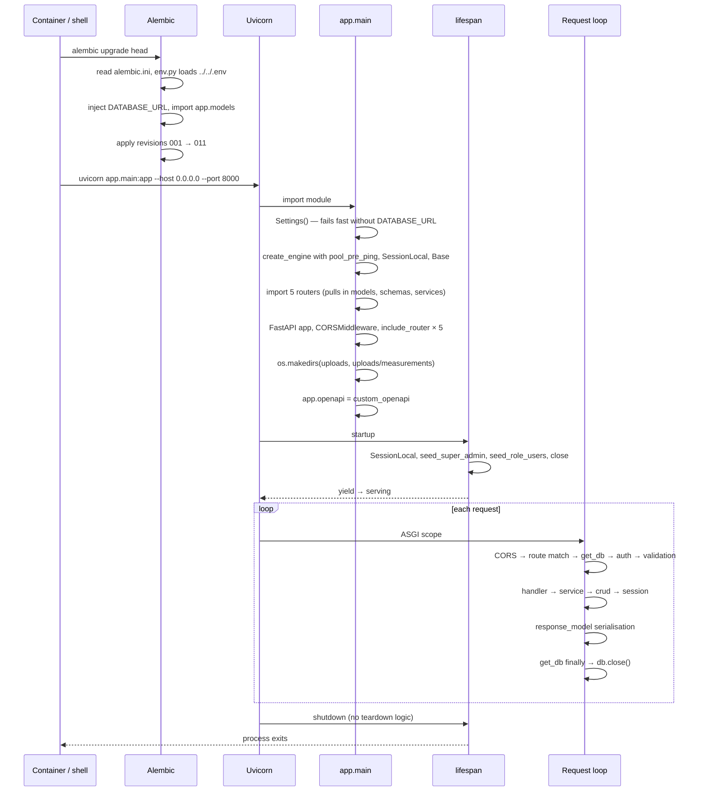
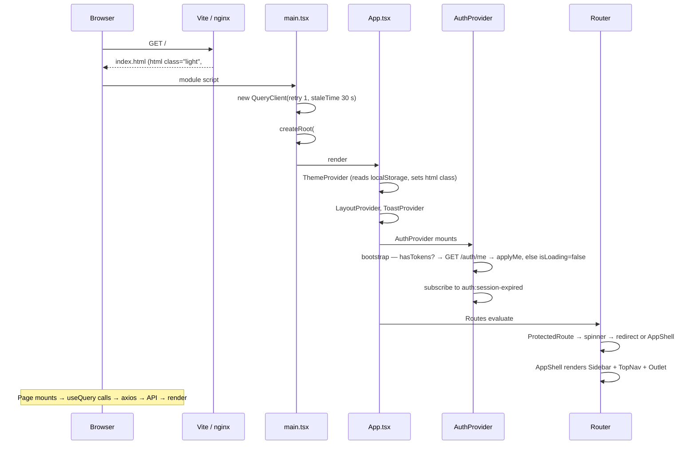

---

# 8.0 Business Logic Documentation

This section documents each functional module in the terms requested: purpose, workflow, business rules, dependencies, data flow, user interaction, backend processing, database operations, and response generation.

## 8.1 Module BL-1 — Identity and Session Management

**Purpose.** Establish and maintain an authenticated, role-scoped session.

**Workflow.**
1. The user submits email and password.
2. The server authenticates, updates `last_login_at`, and issues an access/refresh pair.
3. The client stores both in `sessionStorage` and immediately fetches `/auth/me`.
4. On any 401 the client silently refreshes and retries the original request once.
5. Logout revokes the refresh token server-side and clears client state.

**Business rules.**

| # | Rule | Enforced in |
|---|------|-------------|
| BR-1.1 | Email comparison is case-insensitive (stored and queried lower-case) | `crud/user.py` |
| BR-1.2 | An inactive user cannot authenticate and cannot use an existing access token | `authenticate_user`, `get_current_user` |
| BR-1.3 | Unknown email, wrong password, and inactive user all return the same 401 message | `routers/auth.py::login` |
| BR-1.4 | A refresh token is single-use: presenting it revokes it and mints a new pair | `routers/auth.py::refresh_token` |
| BR-1.5 | Only tokens carrying `type == "access"` are accepted as access tokens | `decode_access_token` |
| BR-1.6 | Logout is idempotent — an invalid or already-revoked token still returns 204 | `routers/auth.py::logout` |
| BR-1.7 | `must_change_password` forces navigation to `/change-password` and blocks every other route | `ProtectedRoute` |
| BR-1.8 | The user record is re-read from the database on every request; the JWT `roles` claim is never trusted | `get_current_user` |

**Dependencies.** `auth_service`, `crud/user`, `dependencies/auth`; client-side `AuthContext`, `api/client.ts`, `auth-storage.ts`.

**Data flow.** `Login.tsx` → `AuthContext.login` → `authClient` → `/auth/login` → `users` + `refresh_tokens` → `TokenResponse` → `sessionStorage` → `/auth/me` → context state → route guards and nav filtering.

**Database operations.** `SELECT users JOIN roles`; `UPDATE users SET last_login_at`; `INSERT refresh_tokens`; `UPDATE refresh_tokens SET revoked_at`.

**Response generation.** `TokenResponse` on login/refresh; `UserMeResponse` on `/me`; 204 on logout.

---

## 8.2 Module BL-2 — Equipment Master Data

**Purpose.** Maintain the machine digital twin that gives every vibration measurement its engineering context.

**Workflow.** Six-step wizard → validate → create or update → optionally upload an image → return to the register.

**Business rules.**

| # | Rule | Enforced in |
|---|------|-------------|
| BR-2.1 | `machine_id` must be unique when supplied; an empty string is stored as `NULL` so multiple blanks are allowed | `normalize_machine_id` validator + `uq_equipment_machine_id` + the 409 pre-check |
| BR-2.2 | `plant_name`, `area`, `line`, `machine_name`, `machine_type`, `machine_criticality` are `NOT NULL` in the database but default to `""` in the schema, so partial drafts are accepted | `EquipmentBase`, migration 001 |
| BR-2.3 | Sensors supplied in the create payload are inserted in the same transaction as the equipment | `crud.create_equipment` (`flush` then insert) |
| BR-2.4 | Update semantics are partial for both `PUT` and `PATCH` (`exclude_unset=True`) | `crud.update_equipment` |
| BR-2.5 | Deleting equipment cascades to sensors and, transitively, to every measurement artefact of those sensors | ORM `delete-orphan` + DB `ON DELETE CASCADE` |
| BR-2.6 | Rotating-component fields are shown only when relevant to the machine type or drive type | `RotatingComponentsTab` |
| BR-2.7 | Equipment images are limited to four MIME types and 10 MB, and are stored as `{equipment_id}.{ext}` | `upload_image` |
| BR-2.8 | AI readiness is five equally weighted checks, each worth 20 % | `compute_ai_readiness` |

**Backend processing.** Duplicate check → `Equipment(**data)` → flush → insert sensors → commit → refresh → serialise with nested sensors.

**Database operations.** `equipment_masters` and `sensor_configurations` INSERT/SELECT/UPDATE/DELETE.

---

## 8.3 Module BL-3 — Sensor and Acquisition Configuration

**Purpose.** Define how a sensor's raw signal is to be processed, and expose that definition to edge acquisition devices.

**Business rules.**

| # | Rule | Enforced in |
|---|------|-------------|
| BR-3.1 | Exactly one `plot_configurations` row per sensor | Unique index + `upsert_plot_config` |
| BR-3.2 | `active_channel` must be less than `channel_count` at creation; on read an out-of-range value is clamped rather than rejected | `PlotConfigCreate.validate_channel_index`, `PlotConfigOut.clamp_channel_on_read` |
| BR-3.3 | Legacy plot names (`psd`, `rms_trend`) are canonicalised on both write and read | `PLOT_TYPE_ALIASES` |
| BR-3.4 | An empty or fully invalid `enabled_plots` list is rejected on write and treated as "all five" on read | `validate_plots`, `normalize_plots_on_read` |
| BR-3.5 | When a sensor has no configuration row, processing uses the documented defaults (25600 Hz, 1600 lines, acceleration, all five plots) | `default_config_dict` |
| BR-3.6 | Edge configuration is resolved by `device_id`; if the sensor has no `device_id`, the payload falls back to the sensor UUID as `sensorId` | `build_edge_acquisition_config` |
| BR-3.7 | Edge channel indices are 1-based; platform channels are 0-based | `build_channels` vs `ch0…chN` |
| BR-3.8 | Changing any fingerprinted configuration field invalidates every cached plot for that sensor's uploads | `compute_config_fingerprint` |

**Acquisition mathematics.**

```
frequencyResolutionHz      = sampleRateHz / LOR
blockTimeSeconds           = LOR / sampleRateHz
totalAcquisitionTimeSeconds= blockTimeSeconds × averageCount
stepSizeSamples            = LOR × (1 − overlapDecimal)   [floored at LOR]
```

---

## 8.4 Module BL-4 — Measurement Ingestion

**Purpose.** Turn a heterogeneous sensor export into validated, queryable, analysis-ready data.

**Workflow.** Validate → persist raw → parse → persist parsed (disk + DB) → compute plots → compute features and trends → return the lifecycle record.

**Business rules.**

| # | Rule | Enforced in |
|---|------|-------------|
| BR-4.1 | Only `.csv`/`.pdf` by extension, or one of four MIME types | `_allowed_upload` |
| BR-4.2 | Maximum file size 50 MB | `settings.max_pdf_size_mb` |
| BR-4.3 | The channel count detected from the file header overrides the user-supplied value | `parse_measurement_text` |
| BR-4.4 | Rows with fewer values than the channel count are zero-padded; unparseable rows are skipped silently | `_parse_numeric_row`, the main loop |
| BR-4.5 | A file that yields zero valid rows is a hard failure (422) and the upload is marked `parse_status='failed'` | `parse_measurement_text` + `mark_upload_failed` |
| BR-4.6 | Plot-computation failure and feature-computation failure are **non-fatal**; the upload still returns 201 with the error recorded | `upload_sensor_data` try/except blocks |
| BR-4.7 | The original bytes and the parsed arrays are always persisted to PostgreSQL, not only to disk | `baseline_crud.save_upload_data` |
| BR-4.8 | Timestamps that look like a shared epoch batch ID are replaced by index-derived time | `resolve_time_seconds` |

**Parsing decision flow.**



---

## 8.5 Module BL-5 — Signal Processing and Plot Generation

**Purpose.** Convert time-series samples into the five diagnostic views used by vibration analysts.

**Business rules.**

| # | Rule | Enforced in |
|---|------|-------------|
| BR-5.1 | Plots are computed for **every** available channel, then read per channel | `persist_all_plot_results` |
| BR-5.2 | A cache entry is valid only when the stored plot-type set exactly equals the enabled set for the current fingerprint | `get_or_load_all_plots` |
| BR-5.3 | The fingerprint excludes `active_channel` and `channel_count` so channel switching never invalidates the cache | `compute_config_fingerprint` |
| BR-5.4 | FFT and envelope spectra apply a Hann window and single-sided `2 / window.sum()` scaling, so the window's coherent gain — not the sample count — sets the amplitude | `compute_fft_spectrum` |
| BR-5.4a | `fft_lines` is a line count: the FFT block is `2 × fft_lines` samples, and a capture longer than one block is averaged over 50 %-overlapping blocks rather than truncated | `compute_fft_spectrum` |
| BR-5.5 | The envelope spectrum removes the envelope's mean before the FFT to suppress the DC pedestal | `compute_envelope_spectrum` |
| BR-5.6 | Circular waveform and trend plots need at least 4 samples; FFT needs at least 4 | `compute_*` guards |
| BR-5.7 | The trend plot uses 32 equal segments with RMS per segment | `compute_trend_plot` |
| BR-5.8 | A requested channel that does not exist falls back to the lowest available channel | `resolve_active_channel` |

**Display-side rules (frontend).**

| # | Rule | Enforced in |
|---|------|-------------|
| BR-5.9 | Time waveforms are displayed on a frontend-generated millisecond axis; amplitudes are never altered | `withGeneratedTimeAxis` |
| BR-5.10 | Waveform and orbit series use min/max bucket decimation so peaks survive; spectra use uniform decimation | `downsampleWaveformSeries`, `downsampleSeries` |
| BR-5.11 | Waveform Y axes are symmetric about zero; spectrum Y axes are floored at zero | `computeSymmetricYAxisBounds`, `fixedYAxisConfig` |
| BR-5.12 | Zoom and pan act on the X axis only; the Y axis stays fixed so amplitude comparisons remain valid | `CHART_X_AXIS_DATA_ZOOM` |
| BR-5.13 | Statistics recompute against the visible zoom window | `sliceValuesByZoomPercent` |
| BR-5.14 | Spectra display a Nyquist marker and, when RPM metadata exists, 1×/2×/3× harmonic markers | `chart-reference-lines.ts` |

---

## 8.6 Module BL-6 — Feature Extraction and Health Evaluation

**Purpose.** Reduce each channel to ten interpretable scalars, classify each against rules and a baseline, and expose intra-capture trends.

**Workflow.**



**Business rules.**

| # | Rule | Enforced in |
|---|------|-------------|
| BR-6.1 | Exactly ten features per channel, in the fixed `FEATURE_CODES` order | `feature_extraction.py` |
| BR-6.2 | Shaft speed is estimated as the strongest FFT bin between 5 Hz and 120 Hz (300–7200 RPM) | `_estimate_shaft_hz` |
| BR-6.3 | 1×/2×/3× amplitudes are read at the nearest bin to the estimated shaft frequency and its multiples | `_magnitude_at_freq` |
| BR-6.4 | Crest factor and kurtosis return 0 when RMS or variance is below `1e-30` (division guard) | `extract_channel_features` |
| BR-6.5 | Channels with fewer than 4 samples are skipped entirely | `extract_all_channels` |
| BR-6.6 | `percent_baseline` rules return `no_baseline` — not `normal` — when no baseline exists, so the UI can distinguish "healthy" from "unknown" | `evaluate_feature` |
| BR-6.7 | Recomputation always deletes existing rows first, so features are never duplicated or partially stale | `persist_upload_features_and_trends` |
| BR-6.8 | Features are computed on demand for legacy uploads whose status is still `pending`, and a `failed` status is reset to `pending` before a retry | `ensure_upload_features_ready` |
| BR-6.9 | A `ready` status with zero rows is treated as not ready | `ensure_upload_features_ready` |
| BR-6.10 | Channel health is the worst status present: critical > warning > normal | `_channel_health_overview` |
| BR-6.11 | Baseline feature rows are always written with `status = normal` | `copy_upload_features_to_baseline` |
| BR-6.12 | The UI always renders all ten features, inserting `no_baseline` placeholders for any the API omitted | `enrichFeatureStatusItems` |

**Threshold evaluation matrix.**

| Feature | Rule type | Normal | Warning | Critical |
|---------|-----------|--------|---------|----------|
| RMS | `absolute_max` | ≤ 0.01 | ≤ 0.02 | > 0.02 |
| Peak | `absolute_max` | ≤ 0.05 | ≤ 0.10 | > 0.10 |
| Crest Factor | `range` | 1.4–3.0 | 3.0–5.0 (via warning bounds) | outside |
| Kurtosis | `absolute_max` | ≤ 3.5 | ≤ 5.0 | > 5.0 |
| FFT Band Energy | `percent_baseline` | ≤ 120 % | ≤ 150 % | > 150 % (or `no_baseline`) |
| 1X Amplitude | `percent_rms` | < 20 % of RMS | < 40 % | ≥ 40 % |
| 2X Amplitude | `percent_rms` | < 10 % | < 20 % | ≥ 20 % |
| 3X Amplitude | `percent_rms` | < 5 % | < 15 % | ≥ 15 % |
| Envelope RMS | `percent_baseline` | ≤ 100 % | ≤ 125 %, and ≤ 150 % still warning | > 150 % |
| Noise Floor | `absolute_db` | ≤ −60 dB | ≤ −54 dB | > −54 dB |

---

## 8.7 Module BL-7 — Baseline Management

**Purpose.** Preserve known-good reference captures and make them the comparison target for health evaluation.

**Business rules.**

| # | Rule | Enforced in |
|---|------|-------------|
| BR-7.1 | Baselines are append-only; there is no delete or update endpoint | `crud/baseline.py`, `routers/baselines.py` |
| BR-7.2 | At most one primary baseline per sensor; setting a new primary clears the previous one | `create_baseline`, `set_baseline_primary` |
| BR-7.3 | Promotion reads bytes and parsed data from `measurement_upload_data`, never from disk | `create_baseline_from_upload` |
| BR-7.4 | An upload without stored data cannot be promoted (422 with a re-upload instruction) | `create_baseline_from_upload` |
| BR-7.5 | Promotion copies the upload's feature values into `baseline_channel_features` with `status = normal` | `copy_upload_features_to_baseline` |
| BR-7.6 | Direct baseline upload computes plots but **not** features | `upload_baseline` |
| BR-7.7 | `plots_status` is derived at read time: `ready` when `plot_count ≥ channel_count × 5`, `partial` when > 0, else `pending` | `_baseline_out` |
| BR-7.8 | Deleting the source upload nulls `source_upload_id` but preserves the baseline | FK `ON DELETE SET NULL` |
| BR-7.9 | The comparison baseline defaults to the primary, then the first in the list, and can be overridden per view | `useFeatureHealthDashboard` |

---

## 8.8 Module BL-8 — Vibration Settings (client-side)

**Purpose.** Let an administrator map device channels to engineering meaning and define per-parameter alarm limits.

**Business rules.**

| # | Rule | Enforced in |
|---|------|-------------|
| BR-8.1 | Channel count cannot exceed `device.maxChannelCount` (default 8) | `canAddChannelRow`, `migrateSettings` |
| BR-8.2 | Removing a channel renumbers the remainder sequentially | `renumberChannels` |
| BR-8.3 | A channel is "configured" only when axis, data type, unit, and measurement point name are all present | `isChannelFullyConfigured` |
| BR-8.4 | An enabled threshold row requires both limits and `danger > warning`; save is blocked otherwise | `isThresholdValid`, `handleSave` |
| BR-8.5 | The threshold parameter list is derived from the shared feature catalogue, so Settings and the Status tab can never diverge | `THRESHOLD_PARAMETERS` from `VIBRATION_FEATURE_CATALOG` |
| BR-8.6 | Persisted settings are migrated against the current parameter catalogue on load; values for surviving parameters are preserved | `migrateThresholds` |
| BR-8.7 | Rows are read-only until explicitly put into edit mode | `editingChannels`, `editingThresholds` |

**Important limitation.** These settings are stored only in `localStorage` and are **not** transmitted to the backend. The thresholds actually applied during evaluation are the seeded rows in `feature_threshold_rules`. The Settings module is therefore a configuration surface awaiting a persistence API.

---

## 8.9 Module BL-9 — Data Visualisation and Interaction

**Purpose.** Present diagnostic data to industrial standards with the interactions an analyst expects.

**Business rules.**

| # | Rule | Enforced in |
|---|------|-------------|
| BR-9.1 | Alarm zones use a fixed visual language: green solid (normal), amber dashed (warning), red dotted (critical) | `THRESHOLD_LEVEL_META` |
| BR-9.2 | Threshold crossings are marked, capped at 24 per level | `findThresholdCrossings` |
| BR-9.3 | ISO 10816 velocity zones are documented but never auto-applied — they depend on machine class and must come from configuration | `ISO_10816_VELOCITY_ZONES_REFERENCE` |
| BR-9.4 | Trace colours are fixed per plot type (navy waveform/orbit, amber FFT/trend, burnt orange envelope) | `INDUSTRIAL_TRACE_COLORS` |
| BR-9.5 | Line width thins as the user zooms in | `adaptiveLineWidth` |
| BR-9.6 | Fullscreen falls back to a portal overlay when the native Fullscreen API is unavailable | `GraphWorkspace` |
| BR-9.7 | Export is PNG at 2× pixel ratio on the warm-white plot background | `handleExport` |

---

# 9.0 Complete User Flows

## 9.1 Flow map



## 9.2 UF-1 — Login

| Step | User action | System response |
|------|-------------|-----------------|
| 1 | Navigates to any protected URL | `ProtectedRoute` redirects to `/login` with `state.from` set |
| 2 | Enters email and password | Field errors clear as they type; Caps Lock warning appears if active |
| 3 | Submits | Client validation → `POST /auth/login` |
| 4 | — | Tokens stored; `GET /auth/me`; context populated |
| 5 | — | Success toast; redirect to the original destination |
| Alt 3a | Invalid credentials | 401 → inline error; failure counter increments; after 5, a warning banner appears |
| Alt 4a | `must_change_password` | Redirect to `/change-password` |

## 9.3 UF-2 — Create equipment

| Step | User action | System response |
|------|-------------|-----------------|
| 1 | Clicks **Add Equipment** (visible only to write roles) | Navigates to `/equipment/new` |
| 2 | Step 1: location, identity, manufacturer, image | Live completeness updates; criticality dot colours the select |
| 3 | Steps 2–4: mechanical, rotating, operating | Step 3 shows only the fields relevant to the machine/drive type |
| 4 | Step 5: sensors | Six mounting rows drive the SVG diagram; additional sensors can be appended |
| 5 | Step 6: review | Read-only summary and asset-configuration checkboxes |
| 6 | **Save & Finish** | Zod validation → `POST /equipment/` → optional image upload → success toast → redirect after 1200 ms |
| Alt 6a | Duplicate `machine_id` | 409 → error toast carrying the server `detail` |
| Alt 6b | Validation failure | react-hook-form blocks submission and surfaces field errors |

## 9.4 UF-3 — Upload and analyse a capture



## 9.5 UF-4 — Browse capture history

1. Select equipment and sensor.
2. The Capture Timeline defaults to the last 30 days.
3. Adjust From/To — the query refetches; day chips rebuild.
4. Click a day chip to filter to that day, or **All** to clear.
5. Click a dot, or use Previous/Next, to select a capture (`n of N` shows the position).
6. The Selected Capture panel and all four analysis tabs update to the chosen capture.

## 9.6 UF-5 — Create and use a baseline

| Step | Action | Result |
|------|--------|--------|
| 1 | Select a parsed capture representing healthy operation | Capture becomes active |
| 2 | Open **Detailed Analysis** → **Save as baseline** | Modal opens with a pre-filled name `Baseline <timestamp>` |
| 3 | Confirm name, description, and "set as primary" | `POST /baselines/from-upload/{uploadId}` |
| 4 | — | Baseline row + baseline plots + copied features are created; baseline queries invalidate |
| 5 | Open **Status (Health)** | Comparison automatically targets the new primary baseline |
| 6 | Optionally switch the comparison baseline in the dropdown | `features/compare` refetches for the chosen baseline |
| 7 | Optionally **Load for Analysis** in Baseline Management | `plotSource` switches to `baseline`; charts render `GET /baselines/{id}/plots` |

## 9.7 UF-6 — Configure vibration settings

1. Open **Settings** (admin roles only; the nav item is hidden for role `user`).
2. Review the device card.
3. Press **Edit** on a channel row, set axis / data type / unit / point name / active, press **Done**.
4. Watch the Channel Mapping Overview change from grey → amber → green.
5. Press **Edit** on a threshold row, enter warning and danger limits, enable it.
6. Invalid rows show "Danger must exceed warning" and block saving.
7. **Save Changes** persists to `localStorage` and clears all edit states.
8. **Reset** or **Cancel** restores the last saved state.

## 9.8 UF-7 — Search, filter, and paginate the register

| Control | Scope | Mechanism |
|---------|-------|-----------|
| Search box | Current page only | Client-side match on name, ID, plant |
| Type filter | Whole dataset | Query key change → server refetch |
| Criticality filter | Whole dataset | Query key change → server refetch |
| Previous / Next | Whole dataset | `page` state → server refetch; shown only when `total > 20` |

## 9.9 UF-8 — Export a chart

Open any chart → adjust zoom and thresholds as desired → click the download icon → the browser saves `sensovibe-{plot_type}-ch{n}.png` (or `sensovibe-health-{metric}-{channel}.png`) rendered at 2× on the `#FFFDF8` background.

## 9.10 UF-9 — Logout

Click the user menu → **Sign Out** → `POST /auth/logout` (best effort) → `sessionStorage` cleared → context reset → redirect to `/login`. The access token remains technically valid until it expires; the refresh token is revoked immediately.

## 9.11 UF-10 — Session expiry during work

1. The access token expires while the analyst is working.
2. The next request returns 401.
3. The interceptor refreshes silently and retries; concurrent requests queue and are released with the new token.
4. If the refresh token is also expired or revoked, `auth:session-expired` fires: state is cleared, a "Session expired" toast appears, and the user is redirected to `/login` — where `state.from` preserves the page they were on.

## 9.12 UF-11 — Read-only user journey

| Capability | Available |
|------------|-----------|
| View dashboard, equipment register, equipment detail | ✔ |
| View analysis: timeline, charts, health, statistics, baselines | ✔ |
| Export chart PNGs | ✔ |
| Add / edit / delete equipment | ✘ (buttons hidden; API returns 403) |
| Upload captures | ✘ (input disabled; explanatory text shown) |
| Save plot configuration | ✘ (button disabled) |
| Save or set primary baselines | ✘ (buttons hidden) |
| Open Settings | ✘ (nav item hidden; direct URL → `/unauthorized`) |

---

# 10.0 Module Documentation

## 10.1 Module inventory

| ID | Module | Frontend files | Backend files | Tables | Endpoints |
|----|--------|----------------|---------------|--------|-----------|
| M-1 | Authentication & Session | `pages/Login`, `pages/Unauthorized`, `pages/ChangePassword`, `contexts/AuthContext`, `components/auth/ProtectedRoute`, `api/auth`, `api/client`, `lib/auth-storage`, `lib/auth-debug`, `lib/role-access`, `types/auth` | `routers/auth`, `services/auth_service`, `services/seed`, `crud/user`, `dependencies/auth`, `models/user`, `schemas/auth` | `users`, `roles`, `user_roles`, `refresh_tokens` | 2–6 |
| M-2 | Equipment Master | `pages/EquipmentMasterList`, `pages/EquipmentMaster`, `components/equipment/**` (18 files), `api/equipment`, `types/equipment`, `lib/form-intelligence`, `lib/industrial-metadata` | `routers/equipment`, `routers/lookups`, `crud/equipment`, `models/equipment`, `models/sensor`, `schemas/equipment` | `equipment_masters`, `sensor_configurations` | 7–22 |
| M-3 | Measurement & Plot Configuration | `components/analysis/workspace/DetailedAnalysisTab`, `api/measurements` | `routers/measurements` (configure + acquisition), `crud/measurement`, `services/acquisition_config`, `schemas/measurement`, `schemas/acquisition` | `plot_configurations`, `sensor_configurations` | 23–28 |
| M-4 | Measurement Ingestion | `pages/VibrationAnalysis` (upload card), `components/analysis/CaptureTimeline*` | `routers/measurements` (upload/list), `services/pdf_parser`, `services/plot_generator`, `crud/measurement`, `crud/baseline` | `sensor_data_uploads`, `measurement_upload_data` | 29–31 |
| M-5 | Signal Processing & Charts | `components/charts/**`, `components/analysis/charts/**`, `lib/*-option.ts`, `lib/chart-*.ts`, `lib/threshold-overlay`, `lib/graph-interactions`, `lib/waveform-time-axis`, `lib/echarts-theme`, `lib/industrial-viz-standards`, `hooks/useEchartsResize` | `services/signal_processing`, `services/plot_generator`, `services/plot_storage` | `plot_results` | 32–34 |
| M-6 | Feature Analytics & Health | `components/analysis/health/**` (13 files), `hooks/useFeatureHealthDashboard`, `hooks/useUploadFactorTrends`, `hooks/useHealthStatusData`, `lib/feature-*`, `lib/health-*`, `lib/vibration-features`, `types/features`, `types/factor-trends`, `types/health-status` | `services/feature_extraction`, `services/feature_storage`, `services/threshold_evaluator`, `crud/feature`, `schemas/feature` | `feature_definitions`, `feature_threshold_rules`, `measurement_channel_features`, `measurement_channel_feature_trends`, `baseline_channel_features` | 35–37 |
| M-7 | Baseline Management | `components/analysis/baseline/**`, `components/analysis/SaveBaselineModal`, `api/baselines`, `types/baseline` | `routers/baselines`, `crud/baseline`, `services/baseline_storage` | `sensor_baselines`, `baseline_plot_results`, `baseline_channel_features` | 38–46 |
| M-8 | Vibration Settings | `pages/Settings`, `components/settings/**` (10 files), `hooks/useVibrationSettings`, `lib/vibration-settings-*`, `types/vibration-settings` | — | — (localStorage) | — |
| M-9 | Application Shell & Design System | `App`, `main`, `components/layout/**`, `components/ui/**`, `components/brand/**`, `contexts/LayoutContext`, `contexts/ThemeContext`, `lib/card-*`, `lib/utils`, `index.css`, `tailwind.config.js` | — | — | — |

## 10.2 M-1 Authentication & Session

**Purpose.** Identity, session lifecycle, and role resolution.
**Workflow.** §2.6, §8.1.
**Business rules.** BR-1.1 … BR-1.8.
**Dependencies.** passlib/bcrypt, python-jose, axios interceptors, React context.
**Notable design.** Two axios instances prevent refresh recursion; a window `CustomEvent` bridges the non-React interceptor to React state.

## 10.3 M-2 Equipment Master

**Purpose.** Asset register and digital twin.
**Workflow.** §9.3.
**Business rules.** BR-2.1 … BR-2.8.
**Notable design.** All six wizard tabs stay mounted so uncontrolled inputs never lose state; `SectionCard`/`GlassCard` enforce the documented card contracts; readiness scoring exists in two independent variants (server: 5 checks; client: 4 dimensions).

## 10.4 M-3 Measurement & Plot Configuration

**Purpose.** Define processing parameters and expose them to edge devices.
**Business rules.** BR-3.1 … BR-3.8.
**Notable design.** Read-time repair of legacy rows (`normalize_plots_on_read`, `clamp_channel_on_read`) means old configurations never break the UI; three URL shapes exist for the same acquisition lookup to accommodate MAC addresses containing colons.

## 10.5 M-4 Measurement Ingestion

**Purpose.** Accept and normalise sensor exports.
**Business rules.** BR-4.1 … BR-4.8.
**Notable design.** Dual persistence (disk + database) with the database as the authority for reproduction; per-stage status columns give the UI a truthful progress model; non-fatal downstream failures keep the capture usable.

## 10.6 M-5 Signal Processing & Charts

**Purpose.** DSP and industrial-standard visualisation.
**Business rules.** BR-5.1 … BR-5.14.
**Notable design.** Content-addressed plot cache; a chart shell that is independent of the charting library; X-only zoom to preserve amplitude comparability; documented references to Randall/Antoni and Smith for every visual convention.

## 10.7 M-6 Feature Analytics & Health

**Purpose.** Ten features, five rule types, four statuses, per-segment trends.
**Business rules.** BR-6.1 … BR-6.12.
**Notable design.** Five distinct rule types cover absolute, ratio-to-RMS, and ratio-to-baseline semantics; `no_baseline` is a first-class status so "unknown" is never displayed as "healthy"; the frontend guarantees a stable ten-row table regardless of API completeness.

## 10.8 M-7 Baseline Management

**Purpose.** Reference captures for comparison and future learning.
**Business rules.** BR-7.1 … BR-7.9.
**Notable design.** Append-only with a display-only `is_primary` flag; self-sufficient rows (bytes + parsed data) so provenance loss is not data loss.

## 10.9 M-8 Vibration Settings

**Purpose.** Channel mapping and alarm limits.
**Business rules.** BR-8.1 … BR-8.7.
**Notable design.** Draft/saved separation with row-level edit mode and forward-compatible migration of persisted state; parameter list derived from the shared feature catalogue.

## 10.10 M-9 Application Shell & Design System

**Purpose.** Consistent chrome, tokens, and interaction language.
**Notable design.** Two written design contracts (`CARD_SIZING.md`, `CARD_HOVER.md`) that components implement through token maps; an enlarged type scale for control-room readability; `prefers-reduced-motion` honoured in two places.

## 10.11 Code Walkthrough — Application Entry to Shutdown

### 10.11.1 Backend



**Shutdown.** The `lifespan` context manager has no code after `yield`, so shutdown is a plain process exit. Open sessions are closed by their `get_db` generators; the SQLAlchemy pool is released by the interpreter.

### 10.11.2 Frontend



**Teardown.** `AuthProvider` removes its window listener on unmount; `useEchartsResize` disconnects its `ResizeObserver` and clears timers; `GraphWorkspace` removes the fullscreen and keydown listeners and restores `document.body.style.overflow`; `MultiSelect` removes its outside-click listener; `ToastProvider` timers are fire-and-forget.

## 10.12 UI Element Catalogue

Cross-reference of UI element types per screen (detailed screen documentation is in §3.17).

| Screen | Cards | Buttons | Forms | Tables | Charts | Dialogs | Filters | Search | Pagination | Responsive behaviour |
|--------|-------|---------|-------|--------|--------|---------|---------|--------|------------|----------------------|
| Login | Form panel, features panel | Submit, password toggle | Email + password | — | Animated SVG backdrop | — | — | — | — | `flex-col` → `lg:flex-row`; left panel `lg:w-[54%]`; features grid 1→2 columns |
| Dashboard | ComingSoon card, 4 KPI cards, CTA card | Go to Equipment Master, Open Equipment Master | — | — | — | — | — | — | — | KPI grid 1→2→4 columns |
| Equipment List | 4 KPI cards, filter card, table card, AI tip strip | Add, Edit, Delete, More, Prev/Next | Search + 2 selects | 7-column register | — | `window.confirm` on delete | Type, Criticality | Name/ID/Plant | Prev/Next with range label | KPI grid 2→4; table scrolls horizontally |
| Equipment Wizard | DigitalTwinHeader, FormStepper, 6 tab card groups, MachineVisualizationPanel | Back, Continue, Save & Finish, step nodes, Add Sensor, Remove Sensor, image clear | 40+ fields, MultiSelect, date pickers, checkboxes, dynamic sensor array | Mounting table, sensors review | Machine SVG, mounting diagram, progress rings | — | — | — | — | 3-column tab layouts collapse to 1; aside becomes full-width above `xl` |
| Vibration Analysis | Equipment/Sensor card, Baseline panel, Upload card, Timeline card, Selected Capture card, Workspace card | Upload, Remove File, Save Config, Save as baseline, Set as Primary, Load for Analysis, Retry, 10 toolbar actions, channel buttons, tab buttons, day chips, Prev/Next | 2 selects, file input, 3 numeric inputs, date range, baseline select | Feature status, comparison, statistics | 5 diagnostic types + 10 health trend cards | SaveBaselineModal | Date range, day chips, baseline status filter | Baseline name/date | Timeline `n of N` | Tab nav 1→2→4 columns; charts fill width; tables scroll |
| Settings | Device card, 4 section cards, sticky action bar | Add Row, Edit/Done, Reset Row, Delete, Save, Reset, Cancel, module tabs | Channel selects + text, threshold numeric inputs, toggles | Channel table, threshold table, coverage matrix | — | — | — | — | — | Tables scroll with sticky headers; action bar sticks to the bottom |
| Unauthorized | GlassCard | Return to Dashboard, Sign Out | — | — | Hero backdrop | — | — | — | — | Centred, max-width card |
| Change Password | GlassCard | Sign Out | — | — | — | — | — | — | — | Centred, max-width card |
| App Shell | — | Collapse, plant dropdown, bell, user menu, Sign Out | Search input (inert) | — | — | Two dropdown menus | Plant (inert) | Global (inert) | — | Sidebar 320↔80 px; search hidden below `md` |
